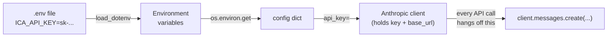

## 📘 Step 1 — Install the SDK & create a client

<!-- pedagogy-header:begin -->
**Phase 1: Foundations** · Step 1 of 22 · ~15 min · $0 in API calls

> **Why this matters:** Every Claude script you ever write starts with these four lines; getting the key out of your source code and into `.env` on day one is what keeps it off GitHub forever.
<!-- pedagogy-header:end -->

### 🎯 What you'll learn

- What an **SDK** is, and what a **client** object actually represents
- How to install a Python package with `pip`
- What `import` and `from ... import ...` do
- What a **dict** (dictionary) is, and how to read a value out of one
- What **keyword arguments** are (the `name=value` style you'll use everywhere)
- Why this course loads secrets from a `.env` file instead of hard-coding them
- Why this course sets a custom `base_url`

---

### 🧠 First, some vocabulary

You'll see these words constantly. Here's what they mean in plain English.

**SDK** — "Software Development Kit". It's just *a Python package somebody
else wrote* so you don't have to talk to a web server by hand. Without the
SDK you'd have to build HTTP requests, set headers, encode JSON, and parse
the response yourself. The SDK wraps all of that in normal Python function
calls.

**Client** — an object that holds your *connection settings* (your API key,
which server to talk to, timeouts, retries). You create it **once**, then
every API call hangs off of it: `client.messages.create(...)`. Think of it as
a configured remote control — you press buttons on it, it knows where to send
the signal.

**API** — "Application Programming Interface". Here it means: a web server
run by Anthropic (or a gateway in front of it) that accepts your question and
sends back Claude's answer.

**Object** — a value that bundles data *and* things you can do with it. You
reach inside an object with a dot: `client.messages`, `message.id`.

Here's the whole picture for this step:



---

### 📦 Installing

The Anthropic Python SDK is one `pip install` away.

```bash
pip install anthropic
```

`pip` is Python's package installer. It downloads the package from the
internet and puts it somewhere Python can `import` it from.

You'll also need `python-dotenv` for this course:

```bash
pip install anthropic python-dotenv
```

Requires **Python 3.10+**.

---

### Theory

You get a `client` object and every API call hangs off of it.

**Option A — the SDK's default/direct pattern.** Good to know for general
SDK knowledge: this talks directly to Anthropic's own servers.

```python
import os
from anthropic import Anthropic

# Implicit: reads ANTHROPIC_API_KEY from the environment. This is the
# default, so you can omit api_key entirely.
client = Anthropic()

# Or explicit: pass the key yourself.
client = Anthropic(api_key=os.environ.get("ANTHROPIC_API_KEY"))
```

#### 🔍 What each Python construct there means

**`import os`** — `import` loads a module (a bundle of ready-made code) and
gives you access to it under that name. `os` is part of Python's standard
library (built in, nothing to install) and lets you talk to the operating
system. We only use it for one thing: reading environment variables.

**`from anthropic import Anthropic`** — a *selective* import. Instead of
importing the whole `anthropic` package and typing `anthropic.Anthropic(...)`,
you pull the single name `Anthropic` straight into your file so you can type
`Anthropic(...)`. Note the capital `A`: `anthropic` (lowercase) is the
package; `Anthropic` (capital) is the client class inside it.

**`os.environ.get("ANTHROPIC_API_KEY")`** — `os.environ` behaves like a
**dict** (see below) of all environment variables. `.get("NAME")` looks up
`"NAME"` and returns its value, or `None` if it isn't set. (Compare
`os.environ["NAME"]`, which *crashes* with a `KeyError` if it's missing —
`.get()` is the safe version.)

**`Anthropic(api_key=...)`** — calling a class creates an object (an
"instance"). The `api_key=` part is a **keyword argument**: instead of
relying on argument *position*, you name it explicitly. Keyword arguments are
everywhere in this SDK (`model=`, `max_tokens=`, `messages=`) because they
make calls self-documenting and order-independent.

---

**Option B — this project's actual pattern.** This course routes requests
through a custom gateway (an IBM `base_url`) instead of Anthropic's default
endpoint, and loads the key from a local `.env` file via `python-dotenv`
instead of a bare shell env var. This is the pattern you'll actually use in
the exercises below:

```python
import os
from dotenv import load_dotenv
from anthropic import Anthropic

load_dotenv()  # reads the .env file in the repo root into the environment
config = {"ICA_API_KEY": os.environ.get("ICA_API_KEY")}

client = Anthropic(
    api_key=config["ICA_API_KEY"],
    base_url="https://api.servicesessentials.ibm.com",
)
```

#### 🔍 New constructs in Option B

**`load_dotenv()`** — a function call. Parentheses mean "run this now". It
finds a file named `.env` in your project and copies every `KEY=value` line
in it into `os.environ`, as if you had typed them into your shell. This is
why `os.environ.get("ICA_API_KEY")` works on the *next* line — `load_dotenv()`
put it there.

**A dict** — short for *dictionary*. A dict stores **key → value** pairs
inside curly braces `{}`, with a colon between key and value:

```python
config = {"ICA_API_KEY": "sk-abc123"}
#         ^^^^^^^^^^^^^  ^^^^^^^^^^^
#         the key        the value
```

You read a value back out with **square brackets** and the key:
`config["ICA_API_KEY"]` → `"sk-abc123"`. Unlike a list (which you index by
*number*), a dict is indexed by *name*. Dicts show up constantly in this
course — every message you send to Claude is a dict.

**Why wrap the key in a `config` dict at all?** Honestly, for one key it's
overkill — but it's the pattern this project uses, and it scales: real
projects collect a dozen settings in one place so there's a single obvious
spot to look. Keep it, because the grader checks for `ICA_API_KEY`.

**`base_url="https://..."`** — another keyword argument. Passing `base_url=`
points the SDK at a proxy/gateway in front of Anthropic's API instead of
hitting `api.anthropic.com` directly. The SDK's request/response shapes stay
identical — only the network destination changes. This is common in
organizations that route model traffic through an internal gateway for
logging, cost tracking, or access control.

**Trailing commas and multi-line calls** — the `Anthropic(...)` call is
spread over several lines. Python allows that freely inside brackets, and the
comma after the last argument is legal and encouraged (it keeps future diffs
clean).

**When to use which:** Option A is what you'll see in most public docs and
tutorials. Option B is what this course (and this project) actually uses —
prefer it here since it matches the real setup you'll be checked against.

---

### 🏋️ Exercise

1. Create a `.env` file in the repo root (copy `.env.example` — it is
   already git-ignored, so it will never get committed) and put your real
   key in it:

   ```bash
   cp .env.example .env
   # then edit .env and set ICA_API_KEY=<your real key>
   ```

2. In this repo, create a new file at **`exercises/practice1.py`** with
   exactly this content:

   ```python
   import os
   import anthropic
   from dotenv import load_dotenv
   from anthropic import Anthropic

   load_dotenv()
   config = {"ICA_API_KEY": os.environ.get("ICA_API_KEY")}

   print("SDK version:", anthropic.__version__)

   client = Anthropic(
       api_key=config["ICA_API_KEY"],
       base_url="https://api.servicesessentials.ibm.com",
   )
   print("Client type:", type(client).__name__)
   ```

#### 📖 Line-by-line walkthrough

| Line | What it does | Why |
|---|---|---|
| `import os` | Loads the standard-library `os` module | Needed for `os.environ.get()` |
| `import anthropic` | Imports the **package** (lowercase) | Gives access to `anthropic.__version__` |
| `from dotenv import load_dotenv` | Pulls in one function from `python-dotenv` | Lets us read the `.env` file |
| `from anthropic import Anthropic` | Pulls the **client class** (capital A) out of the package | So we can write `Anthropic(...)` |
| `load_dotenv()` | Reads `.env` → copies keys into `os.environ` | Without it, the next line finds nothing |
| `config = {...}` | Builds a dict holding the key | Central place for settings |
| `os.environ.get("ICA_API_KEY")` | Looks up the env var, returns `None` if absent | Safe lookup (no crash) |
| `print("SDK version:", anthropic.__version__)` | Prints the label, then the version string | The grader looks for the literal text `SDK version:` |
| `client = Anthropic(...)` | Builds the client object | Holds key + gateway URL for all later calls |
| `api_key=config["ICA_API_KEY"]` | Reads the value back out of the dict by key | Tells the SDK who you are |
| `base_url="https://api.servicesessentials.ibm.com"` | Overrides the default endpoint | This course goes through IBM's gateway |
| `print("Client type:", type(client).__name__)` | Prints the class name of the object | Proves a real `Anthropic` client was built |

**About `print()` with two arguments:** `print("a:", b)` prints `a:` then a
**space** then `b`. That automatic space is why the output reads
`SDK version: 0.40.0` and not `SDK version:0.40.0`. The grader greps for
`"SDK version:"` and `"Client type: Anthropic"` — the single space matters,
so let `print()` insert it for you.

**About `type(client).__name__`:** `type(x)` returns the *class* of `x`.
`.__name__` on a class gives its name as a plain string. So this prints
`Anthropic`. The double-underscore names (`__version__`, `__name__`) are
Python's convention for "metadata the language or library provides" —
sometimes called *dunder* attributes.

---

### ⚠️ What happens if you skip this

| If you omit… | You get… |
|---|---|
| `load_dotenv()` | `os.environ.get("ICA_API_KEY")` returns `None`, so `api_key=None`. Later steps then fail with an `AuthenticationError`. **The grader also greps your source for the literal text `load_dotenv()` and fails immediately without it.** |
| `ICA_API_KEY` (e.g. you used `ANTHROPIC_API_KEY`) | The grader fails: *"Your script doesn't reference ICA_API_KEY."* |
| `base_url=` | Your requests go to `api.anthropic.com`, which does not know your IBM key → `AuthenticationError` / `404`. **The grader greps for `base_url=` and fails without it.** |
| `import anthropic` (keeping only `from anthropic import Anthropic`) | `NameError: name 'anthropic' is not defined` on the `anthropic.__version__` line. You need *both* imports here — one for the package, one for the class. |
| the `print("SDK version:", ...)` line | Grader fails: *"Expected a line starting with 'SDK version:'"* |
| the `print("Client type:", ...)` line | Grader fails: *"Expected a line 'Client type: Anthropic'"* |

> 💡 If you use `os.environ["ICA_API_KEY"]` (square brackets) instead of
> `.get()` **and** forget `load_dotenv()`, you'll see the classic
> `KeyError: 'ICA_API_KEY'`. That error message is Python telling you "that
> key isn't in the dict."

---

3. Run it locally to make sure it works:

   ```bash
   pip install anthropic python-dotenv
   python exercises/practice1.py
   ```

   ✅ **What should happen:** two lines print — `SDK version: 0.x.y` and
   `Client type: Anthropic`. No exceptions.

   Note that **nothing was sent over the network yet**. Creating a client
   only stores settings; it doesn't call the API. That's why this step works
   even with a bogus key — Step 2 is where the key really gets tested.

4. Commit and push your file to `main`:

   ```bash
   git add exercises/practice1.py
   git commit -m "Step 1: install SDK and create client"
   git push
   ```

   > Don't `git add .env` — it's already covered by `.gitignore` and should
   > never be committed. Only `.env.example` (with a placeholder value)
   > lives in the repo.

5. Watch the **Actions** tab. A check called **"Step 1 — Install SDK"** will
   run automatically. If it passes, this issue will close and **Step 2**
   will open within a few seconds. If it fails, read the error in the
   Action's log — fix your file and push again. You can retry as many times
   as you need.

<details>
<summary>Having trouble?</summary>

- Double-check the file path is exactly `exercises/practice1.py` (the
  checker looks for that exact path).
- **`ModuleNotFoundError: No module named 'anthropic'`** — the package isn't
  installed in the Python you're running. Run
  `pip install anthropic python-dotenv`. If you use several Pythons, be
  explicit: `python -m pip install anthropic python-dotenv`.
- **`ModuleNotFoundError: No module named 'dotenv'`** — the package is
  called `python-dotenv` on PyPI but you `import dotenv`. Install
  `python-dotenv`, not `dotenv`.
- **`NameError: name 'anthropic' is not defined`** — you dropped
  `import anthropic`. You need both `import anthropic` (for
  `anthropic.__version__`) and `from anthropic import Anthropic` (for the
  client).
- **`ImportError: cannot import name 'anthropic' from 'anthropic'`** — you
  wrote `from anthropic import anthropic` (lowercase). The class is
  capitalized: `Anthropic`.
- **`KeyError: 'ICA_API_KEY'`** — you used `os.environ["ICA_API_KEY"]` and
  the variable isn't set. Confirm `.env` exists in the **repo root** (not
  inside `exercises/`), contains `ICA_API_KEY=...`, and that you called
  `load_dotenv()` *before* reading it.
- **`TypeError: Anthropic() takes no arguments` / unexpected keyword** —
  usually a typo like `baseurl=` or `base_URL=`. It's exactly `base_url=`.
- **`IndentationError`** — Python cares about leading spaces. The lines
  inside `Anthropic(` are indented for readability, but there must be no
  stray indentation on the top-level lines (`import`, `load_dotenv()`,
  `print`).
- **`SyntaxError: '{' was never closed`** — a missing `}` or `)`. Count your
  brackets; every `{`, `(`, and `"` needs its partner.
- **Prints `Client type: NoneType`** — you assigned something else to
  `client`. Make sure `client = Anthropic(...)`.
- **`.env` shows up in `git status`** — check `.gitignore` contains `.env`.
  Never commit real keys.
- The checker looks for `load_dotenv()`, a reference to `ICA_API_KEY`, and a
  `base_url=` argument in your script — make sure all three are present.
- If the check fails complaining about `ICA_API_KEY`, make sure you added it
  as a repo secret (Settings → Secrets and variables → Actions) — the CI
  checker needs it too, not just your local `.env`.

</details>

<details>
<summary>Stuck? Reveal the solution</summary>

Give it a real attempt first — debugging your own code is where the learning
happens. If you're properly stuck, the complete working reference is here:

**[`solutions/practice1.py`](../../solutions/practice1.py)**

Copy it to `exercises/practice1.py`, run it, then read it line by line and make
sure you can explain *why* each part is there.

</details>
