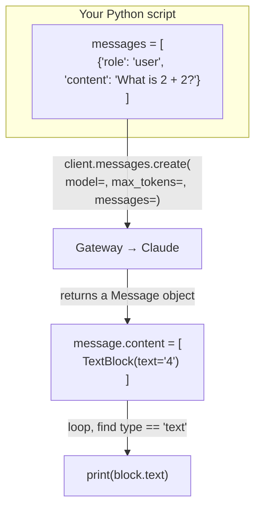

## 📘 Step 2 — Your first `messages.create()` call

<!-- pedagogy-header:begin -->
**Phase 1: Foundations** · Step 2 of 22 · ~15 min · ~$0.002 in API calls

> **Why this matters:** `model`, `max_tokens`, `messages` is the shape of literally every Claude request in production — learn it once and every other feature is just extra keyword arguments.
<!-- pedagogy-header:end -->

### 🎯 What you'll learn

- What `messages.create()` is and why *every* Claude feature goes through it
- The three required parameters: `model`, `messages`, `max_tokens`
- What a **list** is, and what a **list of dicts** is
- What the `role` / `content` shape of a message means
- What a **for-loop** is, what `if` does, and what `break` does
- Why you must never assume `content[0]` is the text

---

### 🧠 The mental model

A single API call is a round trip. You hand the SDK a **list of messages**;
it returns **one message object** back.



Notice the asymmetry that confuses everyone at first:

- What you **send** is a plain Python **list of dicts**.
- What you **get back** is an **object** with attributes you access via dots
  (`message.content`), not a dict you index by string.

---

### Theory

`messages.create()` is *the* call — every text generation, tool use, vision
request, and thinking request goes through it. The three **required**
parameters are:

| Parameter | Type | What it does |
|---|---|---|
| `model` | `str` | Which model to hit, e.g. `"claude-sonnet-5"` |
| `messages` | `list[dict]` | The conversation so far (user/assistant turns) |
| `max_tokens` | `int` | Hard ceiling on tokens Claude can generate this turn |

#### 🔍 Reading that type column

**`str`** — a *string*, i.e. text in quotes: `"claude-sonnet-5"`.

**`int`** — an *integer*, a whole number with no quotes: `100`.

**`list`** — an ordered collection in **square brackets** `[]`, items
separated by commas. Lists are indexed by position starting at **zero**:

```python
planets = ["Mercury", "Venus", "Earth"]
planets[0]   # "Mercury"  ← first item is index 0, not 1
len(planets) # 3
```

**`list[dict]`** — "a list whose items are dicts". That's exactly what
`messages=` wants:

```python
messages = [
    {"role": "user", "content": "What is 2 + 2?"},
]
#  ^ a list containing one dict, which has two keys: role and content
```

Each dict is **one turn** in the conversation. `role` is who is speaking —
`"user"` (you) or `"assistant"` (Claude). `content` is what was said. Even
for a single question you must wrap it in a list, because the API is designed
around whole conversations (you'll add more turns in Step 4).

**About `max_tokens`:** a *token* is roughly ¾ of an English word. This is a
**cap on the reply**, not a target — Claude usually stops well before it. If
the cap is hit mid-sentence, the response's `stop_reason` will be
`"max_tokens"` instead of `"end_turn"`. It's required because it protects you
from a runaway (and expensive) generation.

> This course uses **`claude-sonnet-5`** everywhere. Sonnet is fast and much
> cheaper than Opus, and it handles every exercise here comfortably. Don't
> swap it out.

---

Same client setup as Step 1 — load `.env`, read `ICA_API_KEY`, point at the
gateway `base_url`:

```python
import os
from dotenv import load_dotenv
from anthropic import Anthropic

load_dotenv()
config = {"ICA_API_KEY": os.environ.get("ICA_API_KEY")}

client = Anthropic(
    api_key=config["ICA_API_KEY"],
    base_url="https://api.servicesessentials.ibm.com",
)

message = client.messages.create(
    model="claude-sonnet-5",
    max_tokens=100,
    messages=[{"role": "user", "content": "What is 2 + 2?"}],
)

# Some models (e.g. with extended thinking on) put a ThinkingBlock BEFORE
# the TextBlock, so content[0] isn't always text. Search by type instead.
for block in message.content:
    if block.type == "text":
        print(block.text)
        break
```

#### 🔍 The for-loop at the bottom, decoded

```python
for block in message.content:      # 1
    if block.type == "text":       # 2
        print(block.text)          # 3
        break                      # 4
```

1. **`for X in Y:`** is a **for-loop**. It runs the indented body once for
   each item in `Y`, assigning that item to the temporary name `X`.
   `message.content` is a **list of content blocks**, so `block` becomes each
   block in turn. The name `block` isn't special — it's just a variable we
   chose.
2. **`if condition:`** runs its indented body only when the condition is
   true. `==` means "is equal to" (one `=` would be *assignment*, which is a
   different thing — a very common beginner mix-up). `block.type` is a string
   like `"text"` or `"thinking"`.
3. **`block.text`** reaches into the block object with a dot to get its text.
   Only text blocks have `.text`.
4. **`break`** immediately exits the loop. We already found and printed the
   text, so there's no reason to keep looking.

**Indentation is the syntax.** Python has no `{}` or `end` — the four spaces
under `for` say "this belongs to the loop", and the eight spaces under `if`
say "this belongs to the if". Get the indentation wrong and you change the
meaning of the program (or get an `IndentationError`).

**Why not just `message.content[0].text`?** Because `content[0]` is only
*usually* the text block. When a model returns reasoning first, `content[0]`
is a `ThinkingBlock`, which has no `.text` attribute — and you get
`AttributeError: 'ThinkingBlock' object has no attribute 'text'`. Looping and
checking `block.type` is the version that never breaks.

```
message.content is a LIST — its layout can vary:

  usually:            sometimes:
  ┌──────────────┐    ┌────────────────┐
  │ [0] TextBlock│    │ [0] ThinkingBlk│ ← no .text! 💥
  └──────────────┘    ├────────────────┤
                      │ [1] TextBlock  │ ← the one you want
                      └────────────────┘

  ✅ loop + check block.type == "text"   → always correct
  ❌ content[0].text                     → breaks on the right-hand case
```

**When to use this:** This is your bread-and-butter call for any
non-streaming, single-shot request. The `client` construction itself never
changes across steps — you'll reuse this exact same block for every
exercise in this course.

---

### 🏋️ Exercise

1. Create **`exercises/practice_message.py`** with exactly this content:

   ```python
   import os
   from dotenv import load_dotenv
   from anthropic import Anthropic

   load_dotenv()
   config = {"ICA_API_KEY": os.environ.get("ICA_API_KEY")}

   client = Anthropic(
       api_key=config["ICA_API_KEY"],
       base_url="https://api.servicesessentials.ibm.com",
   )

   message = client.messages.create(
       model="claude-sonnet-5",
       max_tokens=100,
       messages=[{"role": "user", "content": "What is 2 + 2?"}],
   )

   # Some models put a ThinkingBlock before the TextBlock in content[],
   # so search by block.type instead of assuming content[0] is text.
   for block in message.content:
       if block.type == "text":
           print(block.text)
           break
   ```

#### 📖 Line-by-line walkthrough

| Line | What it does | Why |
|---|---|---|
| `import os` | Standard-library OS access | For `os.environ.get()` |
| `from dotenv import load_dotenv` | One function from `python-dotenv` | To read `.env` |
| `from anthropic import Anthropic` | The client class | To build the client |
| `load_dotenv()` | Copies `.env` entries into `os.environ` | Makes the key readable |
| `config = {...}` | Dict holding the API key | Project convention; grader checks `ICA_API_KEY` |
| `client = Anthropic(...)` | Builds the client (no network yet) | Stores key + gateway URL |
| `base_url=...` | Points at IBM's gateway | Required by this course |
| `message = client.messages.create(` | **This line does the network call.** Returns a `Message` object | The actual request |
| `model="claude-sonnet-5"` | Which model answers | Sonnet: fast + cheap |
| `max_tokens=100` | Reply length cap | Required parameter |
| `messages=[{...}]` | A list with one user-turn dict | The conversation you're sending |
| `for block in message.content:` | Walk the returned content blocks | Layout can vary |
| `if block.type == "text":` | Keep only the text block | Skips thinking blocks safely |
| `print(block.text)` | Print Claude's answer | Grader checks stdout contains `4` |
| `break` | Stop looping after the first text block | Nothing more to do |

**About `client.messages.create`:** read the dots left to right. `client` is
your configured object → `.messages` is the group of message-related
operations on it → `.create(...)` is the specific function you're calling.
SDKs organize themselves this way so related calls live together
(`.messages.create()`, `.messages.stream()`, `.messages.count_tokens()`).

**`#` starts a comment.** Everything after `#` on that line is ignored by
Python. Keep the comments — they explain *why* the loop exists.

---

### ⚠️ What happens if you skip this

| If you omit / change… | You get… |
|---|---|
| `load_dotenv()` | The key is `None` → `AuthenticationError` from the gateway. **The grader also greps for the literal `load_dotenv()`.** |
| `base_url=` | Requests go to `api.anthropic.com`, which rejects your IBM key → `AuthenticationError`. **Grader greps for `base_url=`.** |
| `model=` | `TypeError: create() missing 1 required argument: 'model'`. **Grader greps for `model=`.** |
| `max_tokens=` | `TypeError: ... missing ... 'max_tokens'`. **Grader greps for `max_tokens=`.** |
| `messages=` | `TypeError: ... missing ... 'messages'`. **Grader greps for `messages=`.** |
| the `[ ]` around the message dict | `messages=` must be a **list**. Passing a bare dict raises a validation error — the API wants a list of turns, even if there's only one. |
| `"role"` or `"content"` (typo'd keys) | `400 Bad Request` — the API validates the shape of every message dict. |
| the loop, using `message.content[0].text` | Works *most* of the time, then one day: `AttributeError: 'ThinkingBlock' object has no attribute 'text'`. |
| `print(...)` entirely | The script exits 0 but prints nothing → grader fails: *"Expected the reply to mention '4'."* |

> 💡 **Why is the reply "4" and not exactly `4`?** Claude might say
> `"2 + 2 = 4"` or `"The answer is 4."`. The grader only checks that the
> character `4` appears somewhere in your output, so any phrasing passes.

---

2. Make sure your `.env` file (created in Step 1) has a real `ICA_API_KEY`,
   then run it locally:

   ```bash
   python exercises/practice_message.py
   ```

   ✅ **What should happen:** a short answer containing "4" prints. Notice
   this call only used the three required params: `model`, `max_tokens`,
   `messages` — plus the same `load_dotenv()` + `ICA_API_KEY` + `base_url`
   client setup from Step 1.

3. Commit and push:

   ```bash
   git add exercises/practice_message.py
   git commit -m "Step 2: first messages.create call"
   git push
   ```

4. The **"Step 2 — First Message"** check will run automatically. On success
   this issue closes and **Step 3** opens.

<details>
<summary>Having trouble?</summary>

- If you see `AttributeError: 'ThinkingBlock' object has no attribute
  'text'`, you indexed `content[0]` directly — some models return a
  thinking block before the text block. Loop and check `block.type ==
  "text"` instead.
- If you get a `TypeError` about a missing argument, double check you kept
  all three required params (`model`, `max_tokens`, `messages`).
- If you get an `AuthenticationError`, your `ICA_API_KEY` is missing or
  wrong — check your local `.env` file, and check the repo secret at
  Settings → Secrets and variables → Actions for CI.
- **`IndentationError: expected an indented block`** — the lines under `for`
  and `if` must be indented. `print(block.text)` sits **eight** spaces in
  (four for the loop, four more for the `if`).
- **`SyntaxError: invalid syntax` on the `if` line** — you probably wrote
  `if block.type = "text":` with one `=`. Comparison needs two: `==`.
- **`NameError: name 'block' is not defined`** — `block` only exists *inside*
  the loop body. You can't use it after the loop unless you saved it to
  another variable.
- **`TypeError: 'Message' object is not iterable`** — you looped over
  `message` instead of `message.content`. The list of blocks lives on
  `.content`.
- **`TypeError: 'Message' object is not subscriptable`** — you wrote
  `message["content"]`. It's an **object**, not a dict: use `message.content`.
- **`NotFoundError` / `404` mentioning the model** — check the model string
  is exactly `"claude-sonnet-5"` (this course does not use Opus).
- **Nothing prints at all** — either no block had `type == "text"` (rare), or
  your `print` is indented outside the `if`. Temporarily add
  `print(message.content)` to see the raw block list.
- **The reply is cut off mid-sentence** — you lowered `max_tokens` too far.
  100 is plenty for this prompt; check `message.stop_reason` (Step 3) — it'll
  say `max_tokens` when that's the cause.
- Make sure your script still calls `load_dotenv()` and sets `base_url=` —
  the checker verifies both, not just that a client got constructed.
- The grading check literally re-runs your script and reads what it prints
  to confirm a real reply came back — it's not just checking the file
  exists.

</details>

<details>
<summary>Stuck? Reveal the solution</summary>

Give it a real attempt first — debugging your own code is where the learning
happens. If you're properly stuck, the complete working reference is here:

**[`solutions/practice_message.py`](../../solutions/practice_message.py)**

Copy it to `exercises/practice_message.py`, run it, then read it line by line and make
sure you can explain *why* each part is there.

</details>
