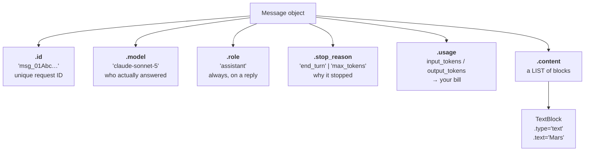

## 📘 Step 3 — Inspect the full response object

<!-- pedagogy-header:begin -->
**Phase 1: Foundations** · Step 3 of 22 · ~15 min · ~$0.002 in API calls

> **Why this matters:** `.usage` is your invoice and `.stop_reason` is your bug report — teams that never read them ship apps that silently truncate answers and blow their budget.
<!-- pedagogy-header:end -->

### 🎯 What you'll learn

- That `messages.create()` returns a rich **object**, not just a string
- What every field on a `Message` means: `id`, `model`, `role`, `stop_reason`,
  `usage`, `content`
- The difference between **attribute access** (`message.id`) and **dict
  access** (`message["id"]`) — and why only one works here
- How to read token usage, which is how you reason about cost
- Why printed **labels** matter to the grader

---

### 🧠 Anatomy of a `Message` object

`messages.create()` doesn't just return text — it returns a `Message` object
with useful metadata. Here's the whole thing:



The key insight: **`.content` is a list; everything else is a single value.**
That's why five fields print with a simple dot, and the sixth needs a loop.

---

### Theory

Same client setup as Steps 1–2 — load `.env`, read
`ICA_API_KEY`, point at the gateway `base_url`:

```python
import os
from dotenv import load_dotenv
from anthropic import Anthropic

load_dotenv()
config = {"ICA_API_KEY": os.environ.get("ICA_API_KEY")}

client = Anthropic(
    api_key=config["ICA_API_KEY"],
    base_url="https://api.servicesessentials.ibm.com",
)

message = client.messages.create(
    model="claude-sonnet-5",
    max_tokens=100,
    messages=[{"role": "user", "content": "Name one planet."}],
)
print("id:", message.id)
print("model:", message.model)
print("role:", message.role)
print("stop_reason:", message.stop_reason)
print("usage:", message.usage)

# Some models put a ThinkingBlock before the TextBlock in content[],
# so search by block.type instead of assuming content[0] is text.
for block in message.content:
    if block.type == "text":
        print("text:", block.text)
        break
```

#### 🔍 Constructs used here

**Attribute access with a dot** — `message.id` means "the `id` attribute of
the object `message`". You are *not* indexing a dict. This is the single most
common beginner error in this step:

```python
message.id        # ✅ correct — Message is an object
message["id"]     # ❌ TypeError: 'Message' object is not subscriptable
```

Compare with what you **sent**, which really is a dict:

```python
{"role": "user", "content": "Name one planet."}["role"]   # ✅ dicts use []
```

So: **dicts go in with `[]`, objects come back with `.`**. Learn that
sentence and half of your SDK confusion disappears.

**`print()` with two arguments** — `print("id:", message.id)` prints the
literal string `id:`, then an automatic space, then the value. The literal
part is called a **label**. The grader greps stdout for these exact labels
(`id:`, `model:`, `role:`, `stop_reason:`, `usage:`, `text:`), so **do not
rename or reword them** — not `ID:`, not `message id:`.

**Nested object** — `message.usage` is itself an object, so printing it shows
something like `Usage(input_tokens=13, output_tokens=8)`. You can drill in
further: `message.usage.input_tokens` gives just the number `13`. Printing
the whole `usage` object is enough for this step.

#### 📊 What each field is *for*

| Field | Example | Why you'd care |
|---|---|---|
| `.id` | `msg_01XyZ...` | Quote it in a support ticket / correlate with logs |
| `.model` | `claude-sonnet-5` | Confirms which model *actually* served you |
| `.role` | `assistant` | On a reply it's always `assistant`. Matters in Step 4, where you append this reply back into history |
| `.stop_reason` | `end_turn` | `end_turn` = finished naturally. `max_tokens` = **truncated**, raise your cap. `tool_use` = wants to call a tool (Step 8) |
| `.usage` | `input_tokens=13, output_tokens=8` | Tokens are how you're billed. Input is your prompt, output is the reply |
| `.content` | `[TextBlock(...)]` | The actual answer, as a list of blocks |

**What to expect:** `id` starts with `msg_`, `role` is `assistant`,
`stop_reason` is usually `end_turn`, and `usage` shows an object with
`input_tokens` and `output_tokens`.

---

### 🏋️ Exercise

1. Create **`exercises/practice_inspect.py`** with exactly this content:

   ```python
   import os
   from dotenv import load_dotenv
   from anthropic import Anthropic

   load_dotenv()
   config = {"ICA_API_KEY": os.environ.get("ICA_API_KEY")}

   client = Anthropic(
       api_key=config["ICA_API_KEY"],
       base_url="https://api.servicesessentials.ibm.com",
   )

   message = client.messages.create(
       model="claude-sonnet-5",
       max_tokens=100,
       messages=[{"role": "user", "content": "Name one planet."}],
   )
   print("id:", message.id)
   print("model:", message.model)
   print("role:", message.role)
   print("stop_reason:", message.stop_reason)
   print("usage:", message.usage)

   for block in message.content:
       if block.type == "text":
           print("text:", block.text)
           break
   ```

#### 📖 Line-by-line walkthrough

| Line | What it does | Why |
|---|---|---|
| `import os` | Standard-library OS access | For `os.environ.get()` |
| `from dotenv import load_dotenv` | Imports the `.env` reader | Loads your key |
| `from anthropic import Anthropic` | Imports the client class | To build the client |
| `load_dotenv()` | `.env` → `os.environ` | Required; grader greps for it |
| `config = {...}` | Dict with the key | Grader greps for `ICA_API_KEY` |
| `client = Anthropic(...)` | Builds the client | Holds key + gateway |
| `base_url=...` | IBM gateway endpoint | Grader greps for `base_url=` |
| `message = client.messages.create(` | Makes the live call, returns a `Message` | Everything below reads from it |
| `model="claude-sonnet-5"` | Sonnet, not Opus | Cheap + fast |
| `max_tokens=100` | Reply cap | Required |
| `messages=[{"role": "user", ...}]` | One user turn, in a list | "Name one planet." |
| `print("id:", message.id)` | Label `id:` + the message ID | Grader also regexes for `id:\s*msg_` |
| `print("model:", message.model)` | Label `model:` + model name | Required label |
| `print("role:", message.role)` | Label `role:` + `assistant` | Grader checks for `role: assistant` |
| `print("stop_reason:", message.stop_reason)` | Why generation ended | Required label |
| `print("usage:", message.usage)` | Token counts object | Required label |
| `for block in message.content:` | Iterate the block list | `.content` is a list |
| `if block.type == "text":` | Select the text block | Skips thinking blocks |
| `print("text:", block.text)` | Label `text:` + the answer | Required label |
| `break` | Stop after the first text block | Avoids duplicate prints |

That's **six labeled lines** total — five direct prints plus one from inside
the loop. All six are required.

---

### ⚠️ What happens if you skip this

| If you omit / change… | You get… |
|---|---|
| `load_dotenv()` | `api_key=None` → `AuthenticationError`. **Grader greps source for `load_dotenv()`.** |
| `ICA_API_KEY` | **Grader fails on the source check** — it must appear literally. |
| `base_url=` | Hits `api.anthropic.com` instead of the gateway → auth failure. **Grader greps for `base_url=`.** |
| any one of the six `print` labels | Grader fails: *"Expected a line starting with 'usage:' in stdout"* (or whichever you dropped). |
| renaming a label (e.g. `Model:` instead of `model:`) | Grader fails — the match is **case-sensitive** and literal. |
| `message.id` → `message["id"]` | `TypeError: 'Message' object is not subscriptable`. Non-zero exit → grader fails with your traceback. |
| the loop, using `message.content[0].text` | `AttributeError: 'ThinkingBlock' object has no attribute 'text'` whenever a thinking block comes first. |
| `break` | Harmless here (usually one text block), but with multiple blocks you'd print several `text:` lines. Keep it. |
| `print("text:", block.text)` indented outside the `if` | You'd try to read `.text` off *every* block, including ones that don't have it → `AttributeError`. |

> 💡 **Reading a traceback:** Python prints the *last* line last, and that's
> the important one. `AttributeError: 'ThinkingBlock' object has no attribute
> 'text'` tells you the type of thing you had (`ThinkingBlock`) and what you
> asked it for (`text`) — enough to diagnose it without reading the rest.

---

2. Run it locally (make sure `.env` still has your `ICA_API_KEY`):

   ```bash
   python exercises/practice_inspect.py
   ```

   ✅ **What should happen:** six lines print. `id` starts with `msg_`,
   `role` is `assistant`, `stop_reason` prints (usually `end_turn`), `usage`
   shows token counts, and `text` contains a planet name.

   Something like:

   ```text
   id: msg_01AbCdEfGhIjKlMnOpQrSt
   model: claude-sonnet-5
   role: assistant
   stop_reason: end_turn
   usage: Usage(input_tokens=13, output_tokens=6)
   text: Mars
   ```

   Your ID and token counts will differ — that's fine. The **labels** must
   match exactly.

3. Commit and push:

   ```bash
   git add exercises/practice_inspect.py
   git commit -m "Step 3: inspect the response object"
   git push
   ```

4. The **"Step 3 — Inspect Response"** check runs automatically. On success
   this issue closes and **Step 4** (message roles & multi-turn conversations)
   opens automatically.

<details>
<summary>Having trouble?</summary>

- If you see `AttributeError: 'ThinkingBlock' object has no attribute
  'text'`, you indexed `content[0]` directly — loop and check
  `block.type == "text"` instead, since some models return a thinking
  block first.
- If `message.id` doesn't start with `msg_`, something's wrong with the
  response — check for typos in your field access (`message.id`, not
  `message["id"]` — this is an object, not a dict).
- **`TypeError: 'Message' object is not subscriptable`** — the same mistake
  in its most common form: you used `message["id"]`. Objects use dots.
- **`AttributeError: 'Message' object has no attribute 'text'`** — there is
  no `message.text`. Text lives inside `message.content[...]` blocks; that's
  what the loop is for.
- **`AttributeError: 'Message' object has no attribute 'stop_reasons'`** —
  it's singular: `stop_reason`. Likewise `usage`, not `usages`.
- **Only five lines print** — your `print("text:", ...)` is inside the loop
  but no block matched, or your indentation put it somewhere unreachable. Add
  `print(message.content)` temporarily to see the raw blocks.
- **`stop_reason: max_tokens`** — the reply got truncated by your cap. Not an
  error, and the grader accepts it, but raise `max_tokens` if you want the
  full answer.
- **`usage:` prints something like `Usage(input_tokens=...)` and you expected
  a plain number** — that's correct. `usage` is a nested object; drill in
  with `message.usage.input_tokens` if you want just the integer.
- **Grader says a label is missing but you can see it locally** — check for a
  typo in capitalization or a missing colon, and make sure you didn't add
  extra text *before* the label on the line (the grader looks for the label
  anywhere in stdout, but reworded labels won't match).
- Keep all six `print(...)` lines — the checker looks for each label
  (`id:`, `model:`, `role:`, `stop_reason:`, `usage:`, `text:`) in your
  script's output.
- Keep `load_dotenv()`, `ICA_API_KEY`, and `base_url=` in your client setup
  — the checker verifies your script still uses this project's real
  client pattern, not the plain `Anthropic()` default.

</details>

<details>
<summary>Stuck? Reveal the solution</summary>

Give it a real attempt first — debugging your own code is where the learning
happens. If you're properly stuck, the complete working reference is here:

**[`solutions/practice_inspect.py`](../../solutions/practice_inspect.py)**

Copy it to `exercises/practice_inspect.py`, run it, then read it line by line and make
sure you can explain *why* each part is there.

</details>
