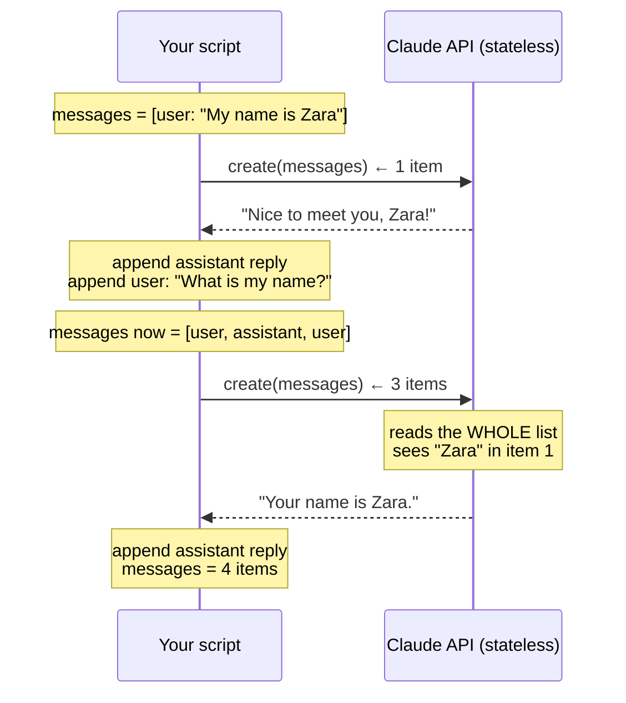

## 📘 Step 4 — Message roles & multi-turn conversations

<!-- pedagogy-header:begin -->
**Phase 1: Foundations** · Step 4 of 22 · ~20 min · ~$0.006 in API calls

> **Why this matters:** The API is stateless — appending to the `messages` list yourself is the entire secret behind every chatbot that appears to remember what you said.
<!-- pedagogy-header:end -->

### 🎯 What you'll learn

- What **stateless** means, and why Claude has no memory of your last call
- How a conversation is built: `role: "user"` / `role: "assistant"` turns
- What a **function** is (`def`), what **parameters** are, and what `return` does
- What a **docstring** is
- What `.append()` does to a **list**, and what `len()` measures
- Why you append the raw `content` list back, not the extracted string

---

### 🧠 The API has no memory

Every call to `client.messages.create()` takes a `messages` list — each item
is a dict with a `role` (`"user"` or `"assistant"`) and `content`. The API
itself is **stateless**: it has no memory between calls.

**Stateless** means the server keeps *nothing* between requests. Call #2 knows
absolutely nothing about call #1. So how do chatbots remember things?

Multi-turn conversation is just *you* re-sending the whole history each time,
with the latest assistant reply appended as a `"role": "assistant"` message
before you append the next user turn.



The list only ever grows. That growing list **is** the memory — it lives in
your program, not on the server.

```
      messages list grows each turn:

turn 1 send:  [ user ]                              → 1
turn 2 send:  [ user, assistant, user ]             → 3
after turn 2: [ user, assistant, user, assistant ]  → 4   ← len(messages) == 4
```

---

### Theory

```python
def get_text(content_blocks):
    """Find the text block in a response's content list.

    Some models (e.g. with extended thinking) return a ThinkingBlock
    BEFORE the TextBlock, so content[0] is not always the text. Search
    by block.type instead of assuming a fixed index.
    """
    for block in content_blocks:
        if block.type == "text":
            return block.text
    return ""


messages = [{"role": "user", "content": "My name is Zara. Remember that."}]

first = client.messages.create(
    model="claude-sonnet-5",
    max_tokens=200,
    messages=messages,
)
print(get_text(first.content))

# Append the assistant's reply, then the next user turn, before calling again
messages.append({"role": "assistant", "content": first.content})
messages.append({"role": "user", "content": "What is my name?"})

second = client.messages.create(
    model="claude-sonnet-5",
    max_tokens=200,
    messages=messages,
)
print(get_text(second.content))
```

#### 🔍 New construct: defining a function

In Steps 2 and 3 you wrote the "find the text block" loop twice. Here you
need it twice again, so we wrap it in a **function** — a named, reusable
chunk of code.

```python
def get_text(content_blocks):     # 1
    """Find the text block..."""  # 2
    for block in content_blocks:  # 3
        if block.type == "text":
            return block.text     # 4
    return ""                     # 5
```

1. **`def`** starts a function definition. `get_text` is the name you choose.
   `content_blocks` is a **parameter** — a placeholder variable that gets
   filled in with whatever the caller passes. The line ends in a colon, and
   the body is indented.
2. The triple-quoted string on the first line of the body is a **docstring**:
   documentation for the function. It's a normal string that Python keeps
   around as `get_text.__doc__`. Triple quotes `"""..."""` let a string span
   multiple lines.
3. The same for-loop you already know, but iterating the parameter.
4. **`return`** sends a value back to whoever called the function **and exits
   the function immediately** — so it doubles as the `break` you used before.
5. This line runs only if the loop finished without finding a text block.
   Returning `""` (an empty string) is a safe fallback instead of crashing.
   Note the indentation: this `return` is level with the `for`, so it's
   *after* the loop, not inside it.

**Defining vs. calling.** `def get_text(...)` only *defines* it — nothing
runs. It runs when you **call** it: `get_text(first.content)`. Here
`first.content` is the **argument** that lands in the `content_blocks`
parameter. Parameter = the name in the definition; argument = the actual value
you pass.

**Why two blank lines before/after the function?** Just PEP 8, Python's style
guide. Cosmetic, but conventional.

#### 🔍 New construct: `.append()` and `len()`

A **list** is mutable — you can change it after creating it.

```python
messages = [{"role": "user", "content": "..."}]   # list with 1 dict
messages.append({"role": "assistant", "content": ...})   # now 2 dicts
len(messages)   # 2  ← len() counts the items
```

`.append(x)` adds `x` to the **end** of the list, in place. It returns `None`,
so never write `messages = messages.append(...)` — that would throw your list
away and leave you with `None`.

`len()` is a built-in that returns how many items a container holds. On a list
it counts items; on a string it counts characters.

**Why append `first.content` (not just the text)?** The `assistant`
message you feed back in must match the *shape* the API itself returns —
a list of content blocks — not a plain string. Passing the raw
`response.content` list back in is the simplest way to guarantee that shape
stays correct, even for multi-block responses.

So notice the two different `content` shapes living side by side in the same
list, which is allowed:

```python
{"role": "user",      "content": "What is my name?"}   # a plain string
{"role": "assistant", "content": first.content}        # a list of blocks
```

**Why search for `block.type == "text"` instead of `content[0]`?** Some
models return extra block types — most commonly a `ThinkingBlock` (from
extended thinking) — placed *before* the text block in the `content` list.
`content[0].text` then raises `AttributeError: 'ThinkingBlock' object has
no attribute 'text'`. Always find the text block by type, never assume a
fixed index.

**When to use this:** Any chatbot, agent loop, or follow-up-question flow.
The context window is what the model actually "remembers" — if you truncate
or forget to include earlier turns, the model has no memory of them at all.

> 💰 **Cost note:** because you resend the whole history every turn, your
> input tokens grow with every message. A 20-turn chat pays for turn 1's text
> 20 times. That's exactly why this course uses `claude-sonnet-5` — it's far
> cheaper per token than Opus.

---

### 🏋️ Exercise

1. In this repo, create a new file at **`exercises/practice4_multiturn.py`**
   with exactly this content:

   ```python
   import os
   from dotenv import load_dotenv
   from anthropic import Anthropic

   load_dotenv()
   config = {"ICA_API_KEY": os.environ.get("ICA_API_KEY")}

   client = Anthropic(
       api_key=config["ICA_API_KEY"],
       base_url="https://api.servicesessentials.ibm.com",
   )


   def get_text(content_blocks):
       """Find the text block; some models put a ThinkingBlock first."""
       for block in content_blocks:
           if block.type == "text":
               return block.text
       return ""


   messages = [{"role": "user", "content": "My name is Zara. Remember that."}]

   first = client.messages.create(
       model="claude-sonnet-5",
       max_tokens=200,
       messages=messages,
   )
   print("Turn 1:", get_text(first.content))

   messages.append({"role": "assistant", "content": first.content})
   messages.append({"role": "user", "content": "What is my name?"})

   second = client.messages.create(
       model="claude-sonnet-5",
       max_tokens=200,
       messages=messages,
   )
   print("Turn 2:", get_text(second.content))

   messages.append({"role": "assistant", "content": second.content})
   print("Messages in list:", len(messages))
   ```

#### 📖 Line-by-line walkthrough

| Line | What it does | Why |
|---|---|---|
| `import os` | Standard-library OS access | For `os.environ.get()` |
| `from dotenv import load_dotenv` | The `.env` reader | Loads your key |
| `from anthropic import Anthropic` | The client class | To build the client |
| `load_dotenv()` | `.env` → `os.environ` | Grader greps for it |
| `config = {...}` | Dict holding the key | Grader greps for `ICA_API_KEY` |
| `client = Anthropic(...)` | Builds the client | Key + gateway |
| `base_url=...` | IBM gateway | Grader greps for `base_url=` |
| `def get_text(content_blocks):` | Defines the helper (doesn't run it) | Reused twice below |
| `"""Find the text block…"""` | Docstring | Explains the function |
| `for block in content_blocks:` | Walk the blocks | Layout varies |
| `if block.type == "text":` | Match the text block | Skip thinking blocks |
| `return block.text` | Hand the text back, exit the function | Also acts as the `break` |
| `return ""` | Fallback if no text block found | Never crashes |
| `messages = [{...}]` | The conversation, starting with **one** user turn | This list *is* the memory |
| `first = client.messages.create(` | **Call #1.** Sends 1 message | Claude learns the name |
| `messages=messages` | Passes the list | Keyword arg on the left, our variable on the right |
| `print("Turn 1:", get_text(first.content))` | Label `Turn 1:` + reply | Required label |
| `messages.append({"role": "assistant", "content": first.content})` | Adds Claude's reply to history | **Without this, turn 2 has amnesia.** Grader greps for `.append(` |
| `messages.append({"role": "user", "content": "What is my name?"})` | Adds the follow-up question | Now the list has 3 items |
| `second = client.messages.create(` | **Call #2.** Sends all 3 messages | Claude re-reads the history |
| `print("Turn 2:", get_text(second.content))` | Label `Turn 2:` + reply | Must mention Zara |
| `messages.append({"role": "assistant", "content": second.content})` | Adds reply #2 | Brings the list to 4 |
| `print("Messages in list:", len(messages))` | Label + the count `4` | Grader requires exactly `Messages in list: 4` |

**Why does the count have to be 4?** user, assistant, user, assistant — two
complete round trips. Count your `.append()` calls: you start with 1 item and
append 3 times → 4. If you get 3, you forgot the final append; if you get 5,
you appended twice somewhere.

**Watch the two `messages` in `messages=messages`.** The left side is the
SDK's keyword-argument *name*; the right side is *your variable*. They happen
to be spelled the same, which reads oddly but is perfectly normal Python.

---

### ⚠️ What happens if you skip this

| If you omit / change… | You get… |
|---|---|
| `load_dotenv()` | `api_key=None` → `AuthenticationError`. **Grader greps source for `load_dotenv()`.** |
| `ICA_API_KEY` | Grader fails on the source check. |
| `base_url=` | Requests hit `api.anthropic.com` → auth failure. **Grader greps for `base_url=`.** |
| **the first `.append()` (assistant reply)** | Turn 2 sees only `[user: "My name is Zara", user: "What is my name?"]`… actually the API also **rejects two consecutive `user` turns**, so you may get a `400 Bad Request` about alternating roles. Either way, no Zara → grader fails. |
| the second `.append()` (follow-up question) | Turn 2 resends the same first question; Claude re-greets you instead of answering. Grader fails on `Messages in list:` count too. |
| the final `.append()` | `Messages in list: 3` → grader fails (*"Expected 'Messages in list: 4'"*). |
| any `.append()` at all (rebuilding the list by hand) | Grader greps the source for the literal `.append(` and fails. |
| `first.content` → `get_text(first.content)` in the append | You'd feed back a plain string instead of the block list. It often still works, but it silently drops non-text blocks and diverges from the API's own shape. Keep `first.content`. |
| `messages = messages.append(...)` | `messages` becomes `None` → `TypeError` on the next call. `.append()` mutates in place and returns `None`. |
| the `return ""` fallback | If no text block existed, the function returns `None` implicitly, and `print("Turn 1:", None)` prints `None` — confusing but not fatal. Keep the fallback. |
| labels `Turn 1:` / `Turn 2:` / `Messages in list:` | Grader fails on the missing label. **Do not reword them.** |

> 💡 **The alternating-roles rule:** the API wants turns to alternate
> user → assistant → user → assistant. Two `user` dicts in a row is the #1
> symptom of a forgotten `.append()` of the assistant reply.

---

2. Run it locally to make sure it works:

   ```bash
   pip install anthropic python-dotenv
   python exercises/practice4_multiturn.py
   ```

   ✅ **What should happen:** `Turn 1:` prints a line acknowledging the name
   Zara. `Turn 2:` prints an answer that correctly says the name is **Zara**
   — even though you never repeated the name in the second question, Claude
   remembers it because the full history was resent. Finally `Messages in
   list: 4` prints (user, assistant, user, assistant).

   Roughly:

   ```text
   Turn 1: Got it, Zara — I'll remember that.
   Turn 2: Your name is Zara.
   Messages in list: 4
   ```

3. Commit and push your file to `main`:

   ```bash
   git add exercises/practice4_multiturn.py
   git commit -m "Step 4: message roles and multi-turn conversation"
   git push
   ```

4. Watch the **Actions** tab. The **"Step 4 — Message Roles & Multi-turn"**
   check runs automatically. On success this issue closes and **Step 5**
   opens. If it fails, read the error in the Action's log, fix your file,
   and push again.

<details>
<summary>Having trouble?</summary>

- Double-check the file path is exactly `exercises/practice4_multiturn.py`.
- Make sure you append `first.content` (the list of content blocks), **not**
  extracted text (a plain string) — the checker and the API both expect the
  assistant turn to be the same shape the API returned.
- If you see `AttributeError: 'ThinkingBlock' object has no attribute
  'text'`, you're indexing `content[0]` directly. Use the `get_text()`
  helper above, which searches for `block.type == "text"` instead of
  assuming position `0`.
- If Turn 2 doesn't mention "Zara", make sure `messages` actually contains
  all four entries in order before the second `client.messages.create()`
  call — if you forgot to `.append()` before calling again, Claude never
  sees the earlier turn.
- **`Messages in list: 3`** — you're missing the final
  `messages.append({"role": "assistant", "content": second.content})`. The
  grader wants exactly `4`.
- **`Messages in list: 5`** — you appended one time too many, or appended
  inside a loop.
- **`AttributeError: 'NoneType' object has no attribute 'append'`** — you
  wrote `messages = messages.append(...)` somewhere earlier. Just call
  `messages.append(...)` on its own line.
- **`NameError: name 'get_text' is not defined`** — the `def` block appears
  *after* the line that calls it. Python reads top to bottom; define the
  function before you use it.
- **`IndentationError: unindent does not match any outer indentation level`**
  — mixing tabs and spaces inside the function. Use spaces only (4 per
  level). The `return ""` must be at the same indentation as `for`.
- **`TypeError: get_text() missing 1 required positional argument`** — you
  called `get_text()` with nothing inside the parentheses. It needs the
  blocks: `get_text(first.content)`.
- **`400 Bad Request` mentioning roles must alternate** — two `user`
  messages ended up back-to-back. You skipped appending the assistant reply
  between them.
- **Turn 2's answer is cut off** — raise `max_tokens` (200 is normally
  plenty).
- The checker looks for `load_dotenv()`, `ICA_API_KEY`, and `base_url=` in
  your script — make sure all three are present.
- If the check fails complaining about `ICA_API_KEY`, make sure it's set as
  a repo secret (Settings → Secrets and variables → Actions).

</details>

<details>
<summary>Stuck? Reveal the solution</summary>

Give it a real attempt first — debugging your own code is where the learning
happens. If you're properly stuck, the complete working reference is here:

**[`solutions/practice4_multiturn.py`](../../solutions/practice4_multiturn.py)**

Copy it to `exercises/practice4_multiturn.py`, run it, then read it line by line and make
sure you can explain *why* each part is there.

</details>
