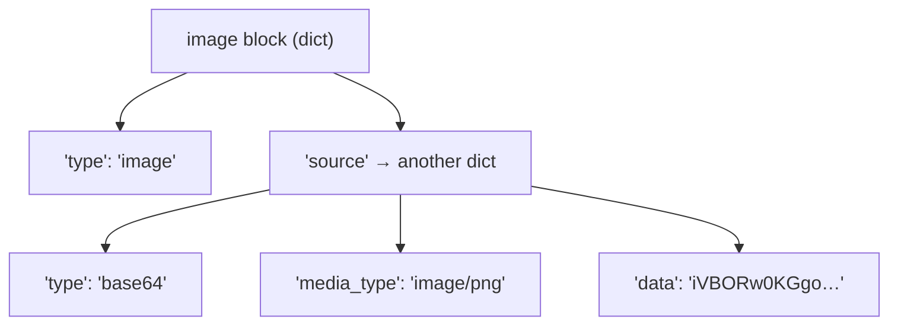

## 📘 Step 5 — Content blocks: text + image input (base64)

<!-- pedagogy-header:begin -->
**Phase 2: Input & output types** · Step 5 of 22 · ~15 min · ~$0.003 in API calls

> **Why this matters:** Receipts, screenshots, whiteboard photos — the moment a product accepts an image upload, it needs exactly this base64 content-block pattern.
<!-- pedagogy-header:end -->

### 🎯 What you'll learn

- The two shapes `content` can take: a plain string vs. a **list of blocks**
- What a **nested dict** is (a dict inside a dict) and how to read one
- What **base64** is and why images must be encoded before sending
- What **bytes** are vs. a **string**, and what `.decode("utf-8")` does
- What an **in-memory buffer** (`BytesIO`) is, so you don't need a file on disk
- What a **tuple** is (`(100, 100)`)
- Why block **order** matters

---

### 🧠 Two shapes for `content`

A message's `content` can be a plain string (shorthand for a single text
block) **or** a list of typed content block dicts.

```
SHORTHAND (what you used in steps 2–4):

  {"role": "user", "content": "What is 2 + 2?"}
                              └─ a plain string

FULL FORM (identical meaning, spelled out):

  {"role": "user", "content": [
      {"type": "text", "text": "What is 2 + 2?"}
  ]}
                   └─ a LIST of block dicts

The full form is the only one that can hold more than one thing:

  {"role": "user", "content": [
      {"type": "image", "source": {...}},   ← block 0  (put media FIRST)
      {"type": "text",  "text": "..."},     ← block 1
  ]}
```

Mixing types — an image plus a question, in the same turn — is the whole point
of multimodal messages. An image block looks like this:

```python
{
    "type": "image",
    "source": {
        "type": "base64",
        "media_type": "image/png",   # image/jpeg, image/png, image/gif, image/webp
        "data": "<base64-encoded-bytes>",
    },
}
```

#### 🔍 New construct: the nested dict

That's a **nested dict** — a dict whose value is *another* dict. Read it as a
tree:



To reach a nested value you chain square brackets, left to right:

```python
block["source"]                 # the inner dict
block["source"]["media_type"]   # "image/png"
```

Nothing magic — the value at key `"source"` just happens to be a dict, so you
index it again. Indentation and trailing commas inside `{}` are purely for
readability; Python ignores the whitespace.

---

Put it in the same `content` list alongside a `{"type": "text", "text": ...}`
block:

```python
message = client.messages.create(
    model="claude-sonnet-5",
    max_tokens=200,
    messages=[{
        "role": "user",
        "content": [
            {"type": "image", "source": {"type": "base64", "media_type": "image/png", "data": image_data}},
            {"type": "text", "text": "What color is this image? Answer in one word."},
        ],
    }],
)
```

Count the nesting there — it looks scary but it's only four levels:

```
messages=[ ... ]                       ← a LIST of turns
  └─ { "role": ..., "content": ... }   ← one turn: a DICT
       └─ "content": [ ... ]           ← a LIST of blocks
            └─ { "type": "image", ...} ← one block: a DICT
                 └─ "source": { ... }  ← a nested DICT
```

**Why does image come before text?** Block **order matters** — Claude reads
top-to-bottom, so put images/documents *before* the text that asks about
them for the best results.

**When to use this:** Anytime you need to show Claude a picture — screenshots,
diagrams, photos, scanned documents — instead of only describing it in words.

---

### 🧠 What is base64, and why bother?

The API request is JSON, and **JSON can only carry text** — it has no way to
represent raw binary bytes like a PNG file. **Base64** is an encoding that
rewrites arbitrary bytes using only 64 safe text characters (`A–Z`, `a–z`,
`0–9`, `+`, `/`). It makes the payload about 33% larger, but it's plain text,
so it travels safely inside JSON.

```
red.png on disk        base64 text                  JSON body
┌───────────────┐      ┌──────────────────┐         ┌──────────────────┐
│ 89 50 4E 47…  │ ───► │ "iVBORw0KGgoAA…" │  ───►   │ {"data": "iVBO…"}│
│  raw bytes    │      │  safe ASCII      │         │  valid JSON ✅   │
└───────────────┘      └──────────────────┘         └──────────────────┘
```

**Bytes vs. string.** Python distinguishes them. `b"hello"` is *bytes* (raw
data); `"hello"` is a *str* (text). `base64.standard_b64encode(...)` takes
bytes and returns **bytes** — so you must call `.decode("utf-8")` to turn
those bytes into a `str`, because the SDK needs to put a string in the JSON.
(`.decode()` = bytes → str. Its opposite, `.encode()`, is str → bytes.)

---

### 🏋️ Exercise

1. Install `pillow` (used only to generate a tiny test image locally —
   it is **not** part of the `anthropic` SDK):

   ```bash
   pip install anthropic python-dotenv pillow
   ```

   > `pillow` is the package name you install, but the module you `import` is
   > spelled `PIL` (for historical reasons). That mismatch surprises everyone
   > once.

2. In this repo, create a new file at
   **`exercises/practice5_image.py`** with exactly this content:

   ```python
   import base64
   import os
   from io import BytesIO

   from dotenv import load_dotenv
   from PIL import Image
   from anthropic import Anthropic

   load_dotenv()
   config = {"ICA_API_KEY": os.environ.get("ICA_API_KEY")}

   client = Anthropic(
       api_key=config["ICA_API_KEY"],
       base_url="https://api.servicesessentials.ibm.com",
   )

   # Generate a small solid-red test image in memory (no file needed)
   img = Image.new("RGB", (100, 100), color="red")
   buffer = BytesIO()
   img.save(buffer, format="PNG")
   image_data = base64.standard_b64encode(buffer.getvalue()).decode("utf-8")

   message = client.messages.create(
       model="claude-sonnet-5",
       max_tokens=200,
       messages=[{
           "role": "user",
           "content": [
               {
                   "type": "image",
                   "source": {
                       "type": "base64",
                       "media_type": "image/png",
                       "data": image_data,
                   },
               },
               {"type": "text", "text": "What color is this image? Answer in one word."},
           ],
       }],
   )
   for block in message.content:
       if block.type == "text":
           print("color:", block.text)
           break
   ```

#### 📖 Line-by-line walkthrough

| Line | What it does | Why |
|---|---|---|
| `import base64` | Standard-library base64 encoder | Turns image bytes into text |
| `import os` | OS access | For `os.environ.get()` |
| `from io import BytesIO` | An in-memory file-like object | Lets us "save" a PNG without touching disk |
| `from dotenv import load_dotenv` | `.env` reader | Loads your key |
| `from PIL import Image` | Pillow's image class | To *create* the test image |
| `from anthropic import Anthropic` | The client class | To build the client |
| `load_dotenv()` | `.env` → `os.environ` | Grader greps for it |
| `config = {...}` | Dict with the key | Grader greps for `ICA_API_KEY` |
| `client = Anthropic(...)` | Builds the client | Key + gateway |
| `base_url=...` | IBM gateway | Grader greps for `base_url=` |
| `img = Image.new("RGB", (100, 100), color="red")` | Creates a 100×100 all-red image object | Gives us something predictable to ask about |
| `buffer = BytesIO()` | Opens an empty in-memory byte bucket | Acts like a file, but in RAM |
| `img.save(buffer, format="PNG")` | Encodes the image as PNG **into the buffer** | Same call you'd use for a filename |
| `buffer.getvalue()` | Pulls the raw PNG **bytes** back out | The binary payload |
| `base64.standard_b64encode(...)` | Encodes bytes → base64 **bytes** | JSON-safe characters only |
| `.decode("utf-8")` | base64 bytes → **str** | The SDK needs a string. Grader greps for `base64` |
| `message = client.messages.create(` | The live call | Sends image + question |
| `model="claude-sonnet-5"` | Sonnet handles vision fine | Cheap + capable |
| `max_tokens=200` | Reply cap | Required |
| `messages=[{ "role": "user", "content": [...] }]` | One turn whose content is a **list of two blocks** | Grader greps for `"type": "image"` |
| `{"type": "image", "source": {...}}` | The image block, nested dict inside | Must come **first** |
| `"type": "base64"` | Tells the API how `data` is encoded | Alternative would be a URL |
| `"media_type": "image/png"` | Declares the format | Must match what you saved |
| `"data": image_data` | The base64 string variable | The actual pixels |
| `{"type": "text", "text": "What color…"}` | The question block | Comes **after** the image |
| `for block in message.content:` | Walk the reply's blocks | Layout varies |
| `if block.type == "text":` | Pick the text block | Skips thinking blocks |
| `print("color:", block.text)` | Label `color:` + the answer | Grader requires `color:` and the word `red` |
| `break` | Stop after the first text | Nothing more needed |

**About `(100, 100)`** — that's a **tuple**: an ordered, *immutable* group of
values in parentheses. Here it's `(width, height)`. Tuples work like lists
(`size[0]` is `100`) but can't be changed after creation, which makes them
right for fixed pairs like dimensions or coordinates.

**About `Image.new("RGB", ...)`** — `"RGB"` is the color mode (red/green/blue
channels). `color="red"` is a keyword argument; Pillow understands common
color names.

**Why generate an image instead of committing one?** No binary files in the
repo, and the answer is guaranteed to be "red" so the grader can check it
deterministically.

---

### ⚠️ What happens if you skip this

| If you omit / change… | You get… |
|---|---|
| `load_dotenv()` | `api_key=None` → `AuthenticationError`. **Grader greps for `load_dotenv()`.** |
| `ICA_API_KEY` | Grader fails on the source check. |
| `base_url=` | Hits `api.anthropic.com` → auth failure. **Grader greps for `base_url=`.** |
| **`.decode("utf-8")`** | `image_data` stays **bytes**, and the SDK can't JSON-serialize bytes → `TypeError: Object of type bytes is not JSON serializable`. |
| `base64` encoding entirely (sending raw bytes) | Same `TypeError`. **Grader also greps the source for `base64`.** |
| `img.save(buffer, format="PNG")` | The buffer stays empty → `buffer.getvalue()` returns `b""` → base64 of nothing → API rejects it as an invalid image (`400`). |
| `format="PNG"` | Pillow can't infer a format from a buffer (there's no filename to guess from) → `ValueError: unknown file extension`. |
| a matching `media_type` (e.g. you saved PNG but declared `image/jpeg`) | `400 Bad Request` — the declared type must match the actual bytes. |
| the `"source"` nesting (putting `media_type`/`data` at the top level) | `400 Bad Request` — the API validates the exact block shape. `media_type` and `data` live **inside** `source`. |
| the `[ ]` around the two blocks | A dict where a list is expected → validation error. Multi-block content **must** be a list. |
| putting the text block before the image | Still works, but answer quality degrades — Claude reads top-to-bottom and prefers media first. |
| `"type": "image"` (typo'd, e.g. `"img"`) | `400 Bad Request` on the unknown block type. **Grader also greps for `"type": "image"`.** |
| the loop, using `message.content[0].text` | `AttributeError: 'ThinkingBlock' object has no attribute 'text'` when a thinking block leads. |
| the `color:` label | Grader fails: *"Expected a line starting with 'color:'"*. **Don't rename it.** |

> 💡 **`buffer.getvalue()` vs. `buffer.read()`** — after `img.save()`, the
> buffer's internal cursor sits at the *end*, so `.read()` returns `b""`.
> `.getvalue()` ignores the cursor and returns everything. Use `.getvalue()`.

---

3. Run it locally:

   ```bash
   python exercises/practice5_image.py
   ```

   ✅ **What should happen:** A line `color:` prints, followed by Claude's
   answer, which should contain the word **"red"** — confirming the base64
   image block was encoded and understood correctly.

   ```text
   color: Red
   ```

   (Capitalization doesn't matter — the grader compares case-insensitively.)

4. Commit and push your file to `main`:

   ```bash
   git add exercises/practice5_image.py
   git commit -m "Step 5: content blocks - text and image input"
   git push
   ```

5. Watch the **Actions** tab. The **"Step 5 — Content Blocks & Image Input"**
   check runs automatically. On success this issue closes and **Step 6**
   opens. If it fails, read the error in the Action's log, fix your file,
   and push again.

<details>
<summary>Having trouble?</summary>

- Double-check the file path is exactly `exercises/practice5_image.py`.
- If you see `AttributeError: 'ThinkingBlock' object has no attribute
  'text'`, loop over `message.content` and check `block.type == "text"`
  instead of indexing `content[0]` directly — some models return a
  thinking block first.
- Make sure the image block comes **before** the text block in the
  `content` list — this matches the doc's recommended order.
- `media_type` must exactly match the format you saved with — `PNG` format
  pairs with `"image/png"`.
- Make sure you `base64.standard_b64encode(...).decode("utf-8")` — the API
  needs a plain string, not raw bytes.
- **`ModuleNotFoundError: No module named 'PIL'`** — install `pillow` (not
  `PIL`): `pip install pillow`. The install name and the import name differ.
- **`TypeError: Object of type bytes is not JSON serializable`** — you
  dropped `.decode("utf-8")`. Base64 encoding returns bytes; the SDK needs a
  `str`.
- **`ValueError: unknown file extension`** on `img.save(...)` — you passed a
  `BytesIO` without `format="PNG"`. With no filename, Pillow can't guess.
- **`400 Bad Request` / "could not process image"** — usually an empty or
  mismatched payload. Check that `img.save(buffer, format="PNG")` runs
  *before* `buffer.getvalue()`, and that `media_type` is `"image/png"`.
  Sanity-check with `print(len(image_data))` — it should be several hundred
  characters, not 0.
- **`SyntaxError` / `unexpected EOF`** — this step has the deepest nesting in
  the course. Count brackets: `messages=[{ ... "content": [ {...}, {...} ] }]`
  needs a closing `]`, `}`, `]`, `}`, `]` in that mirrored order. Let your
  editor's bracket matching help you.
- **`KeyError: 'source'` or a validation error naming `source`** — the
  `media_type` and `data` keys must be nested **inside** the `source` dict,
  not siblings of `"type": "image"`.
- **Claude answers something other than "red"** — you probably changed
  `color="red"` in `Image.new`, or the buffer contents got overwritten.
- The checker looks for `load_dotenv()`, `ICA_API_KEY`, and `base_url=` in
  your script — make sure all three are present.
- If the check fails complaining about `ICA_API_KEY`, make sure it's set as
  a repo secret (Settings → Secrets and variables → Actions).

</details>

<details>
<summary>Stuck? Reveal the solution</summary>

Give it a real attempt first — debugging your own code is where the learning
happens. If you're properly stuck, the complete working reference is here:

**[`solutions/practice5_image.py`](../../solutions/practice5_image.py)**

Copy it to `exercises/practice5_image.py`, run it, then read it line by line and make
sure you can explain *why* each part is there.

</details>
