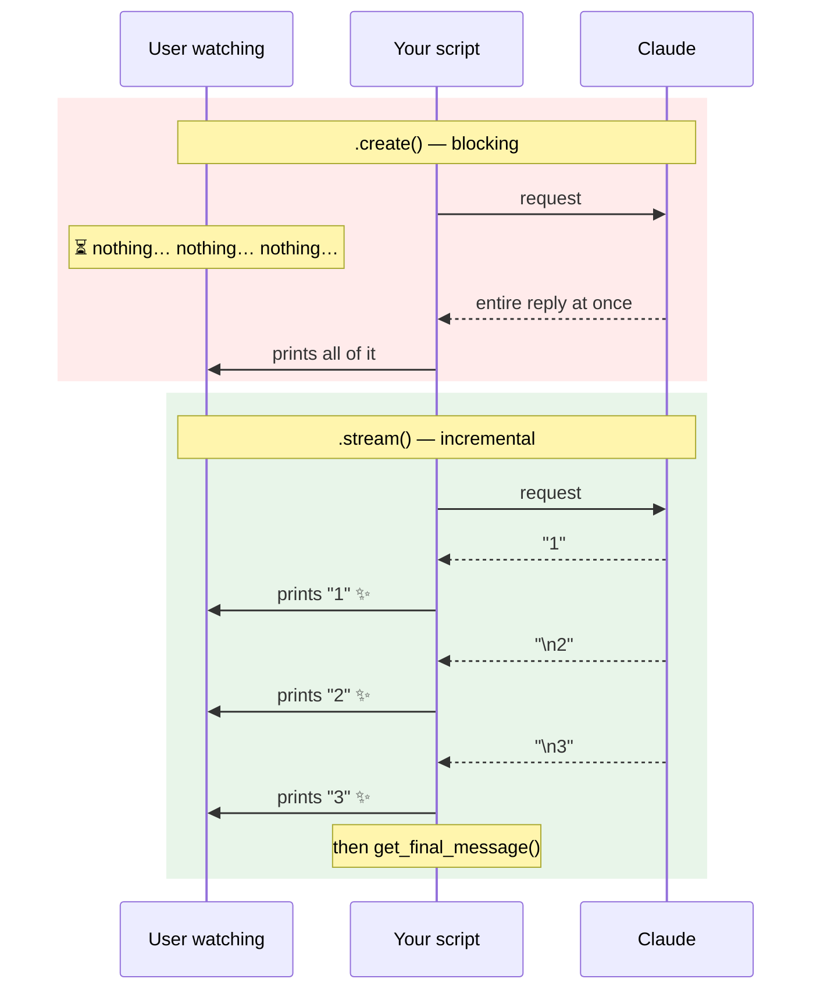

## 📘 Step 6 — Streaming responses

<!-- pedagogy-header:begin -->
**Phase 2: Input & output types** · Step 6 of 22 · ~15 min · ~$0.005 in API calls

> **Why this matters:** Streaming is why ChatGPT-style products feel fast: the same 8-second answer feels instant when the first word lands in 300 ms instead of a spinner.
<!-- pedagogy-header:end -->

### 🎯 What you'll learn

- The difference between `.create()` (wait for everything) and `.stream()`
  (get text as it's generated)
- What a **`with`-block** / **context manager** is, and why streaming needs one
- What an **iterator** / **generator** is, and how it differs from a list
- What `print(text, end="", flush=True)` does and why both arguments matter
- What `+=` does on a string (**accumulator** pattern)
- How to still get the full `Message` object after streaming

---

### 🧠 Blocking vs. streaming

`client.messages.create()` waits for the *entire* reply before returning
anything. For long answers that feels slow. `client.messages.stream()`
instead opens a streaming connection and hands you text chunks as Claude
generates them.



Same total time — but the user sees progress immediately, which *feels*
dramatically faster.

---

### Theory

Use it as a context manager:

```python
with client.messages.stream(
    model="claude-sonnet-5",
    max_tokens=300,
    messages=[{"role": "user", "content": "Count from 1 to 5."}],
) as stream:
    for text in stream.text_stream:
        print(text, end="", flush=True)

    final_message = stream.get_final_message()
```

#### 🔍 New construct: the `with`-block (context manager)

```text
with <something that opens> as <name>:
    <use it here>
# ← automatically closed here, even if an error happened
```

A **context manager** is an object that knows how to set something up and —
crucially — how to tear it down. `with ... as stream:` means "open this
streaming HTTP connection, call it `stream`, and **guarantee** it gets closed
when this indented block ends." You've probably seen the same pattern for
files: `with open("f.txt") as f:`.

Why it matters here: streaming holds a live network connection. If your loop
crashed halfway through and there were no `with`, that socket would leak. The
`with` block closes it no matter what — normal exit, exception, or `return`.

The flip side: **outside the block, the connection is gone.** That's why
`stream.get_final_message()` sits *inside* the `with` (indented under it),
while the plain `print()` calls that only use already-extracted values come
after.

#### 🔍 New construct: iterating a generator

```text
for text in stream.text_stream:
```

`stream.text_stream` is not a list. It's an **iterator** (specifically a
**generator**): something you can loop over, but which produces its items
**one at a time, on demand**, rather than holding them all in memory.

```
A LIST already has everything:      A GENERATOR produces on demand:

  ["1", "\n2", "\n3"]                 next → "1"   (arrives from network)
   ▲ all in memory now                next → "\n2" (arrives later)
   len() works, [0] works             next → "\n3"
                                      next → StopIteration (loop ends)
                                      ✗ no len(), no [0]
```

That's the whole point: the chunks don't exist yet when the loop starts.
Each turn of the loop waits for the next piece of text to arrive over the
network. `stream.text_stream` yields plain-text chunks (skipping non-text
event plumbing) as they arrive — perfect for printing incrementally.

Because a generator is consumed as you go, you can only iterate it **once**.
That's exactly why the exercise accumulates the text into `full_text` — if you
wanted the chunks again afterwards, they'd be gone.

#### 🔍 `print(text, end="", flush=True)`

Two keyword arguments change `print`'s default behavior:

- **`end=""`** — by default `print` appends a newline (`end="\n"`). Setting
  it to the empty string means chunks join up on one line instead of each
  landing on its own line. Claude's chunks already contain their own newlines
  where needed.
- **`flush=True`** — Python buffers stdout for speed, holding text until a
  newline or until the buffer fills. Since we removed the newline, output
  could sit in the buffer and appear all at once at the end — destroying the
  live effect. `flush=True` forces each chunk to the terminal immediately.

Drop either one and the streaming *works* but doesn't *look* like streaming.

#### 🔍 `full_text += text` — the accumulator

```python
full_text = ""        # start empty
full_text += text     # shorthand for: full_text = full_text + text
```

`+` on strings **concatenates** them. `+=` does it in place-ish: take the
current value, add the new chunk on the end, store it back. Repeat for every
chunk and you end up holding the complete reply — which is what `len(full_text)`
counts at the end.

This is the standard **accumulator** pattern: a variable initialized before a
loop, updated on each pass, read after the loop. It must be initialized
*before* the loop, or the first `+=` raises `NameError`.

#### 🔍 `get_final_message()`

After the `with` block finishes (or via `stream.get_final_message()` inside
it), you can still access the complete assembled `Message` object, exactly
like the one `messages.create()` returns — same `.content`, `.usage`,
`.stop_reason`.

So you get both: live chunks *and* the full metadata object from Step 3. The
SDK reassembles the pieces for you.

**When to use this:** Chat UIs, CLIs, or any place a user is watching output
appear live rather than waiting on a spinner.

---

### 🏋️ Exercise

1. In this repo, create a new file at **`exercises/practice6_streaming.py`**
   with exactly this content:

   ```python
   import os
   from dotenv import load_dotenv
   from anthropic import Anthropic

   load_dotenv()
   config = {"ICA_API_KEY": os.environ.get("ICA_API_KEY")}

   client = Anthropic(
       api_key=config["ICA_API_KEY"],
       base_url="https://api.servicesessentials.ibm.com",
   )

   print("streaming:")
   full_text = ""
   with client.messages.stream(
       model="claude-sonnet-5",
       max_tokens=300,
       messages=[{"role": "user", "content": "Count from 1 to 5, one number per line."}],
   ) as stream:
       for text in stream.text_stream:
           print(text, end="", flush=True)
           full_text += text

       final_message = stream.get_final_message()

   print()  # newline after the streamed text
   print("stop_reason:", final_message.stop_reason)
   print("chars streamed:", len(full_text))
   ```

#### 📖 Line-by-line walkthrough

| Line | What it does | Why |
|---|---|---|
| `import os` | OS access | For `os.environ.get()` |
| `from dotenv import load_dotenv` | `.env` reader | Loads your key |
| `from anthropic import Anthropic` | The client class | To build the client |
| `load_dotenv()` | `.env` → `os.environ` | Grader greps for it |
| `config = {...}` | Dict with the key | Grader greps for `ICA_API_KEY` |
| `client = Anthropic(...)` | Builds the client | Key + gateway |
| `base_url=...` | IBM gateway | Grader greps for `base_url=` |
| `print("streaming:")` | Label `streaming:` on its own line | Required label |
| `full_text = ""` | Initializes the accumulator | Must exist **before** the loop |
| `with client.messages.stream(` | Opens the streaming connection | Grader greps for `.stream(`. Note: **`.stream`**, not `.create` |
| `model="claude-sonnet-5"` | Sonnet | Cheap + fast |
| `max_tokens=300` | Reply cap | Required |
| `messages=[{...}]` | One user turn | "Count from 1 to 5, one number per line." |
| `) as stream:` | Names the stream object | The `with` will auto-close it |
| `for text in stream.text_stream:` | Consumes text chunks as they arrive | Grader greps for `text_stream` |
| `print(text, end="", flush=True)` | Prints each chunk live, no newline, unbuffered | The visible streaming effect |
| `full_text += text` | Appends the chunk to the accumulator | So we can count chars later |
| `final_message = stream.get_final_message()` | Grabs the assembled `Message` — **inside** the `with` | Grader greps for `get_final_message()` |
| `print()` | Prints just a newline | The streamed text left the cursor mid-line |
| `print("stop_reason:", final_message.stop_reason)` | Label + `end_turn` | Required label |
| `print("chars streamed:", len(full_text))` | Label + a count > 0 | Required label; proves chunks were collected |

**Indentation map** — three levels here, and they matter:

```
print("streaming:")                       ← level 0
full_text = ""                            ← level 0
with client.messages.stream(...) as stream:
    for text in stream.text_stream:       ← level 1 (inside with)
        print(text, end="", flush=True)   ← level 2 (inside for)
        full_text += text                 ← level 2 (inside for)

    final_message = ...                   ← level 1 (inside with, after for)

print()                                   ← level 0 (with is closed)
```

**Why `print()` with no arguments?** It prints nothing but the newline. Since
every chunk used `end=""`, the cursor is stranded at the end of the streamed
text; without this, `stop_reason:` would be glued onto the same line — and the
grader looks for a *line* starting with `stop_reason:`.

---

### ⚠️ What happens if you skip this

| If you omit / change… | You get… |
|---|---|
| `load_dotenv()` | `api_key=None` → `AuthenticationError`. **Grader greps for `load_dotenv()`.** |
| `ICA_API_KEY` | Grader fails on the source check. |
| `base_url=` | Hits `api.anthropic.com` → auth failure. **Grader greps for `base_url=`.** |
| `.stream(` → `.create(` | No streaming at all; `.text_stream` doesn't exist on a `Message` → `AttributeError`. **Grader greps the source for `.stream(`.** |
| the `with` (calling `.stream()` bare) | The SDK returns a manager object, not an open stream → `TypeError`/`AttributeError` when you touch `.text_stream`, and the connection leaks. |
| **moving `get_final_message()` outside the `with`** | The connection is already closed → runtime error. It must be indented **inside** the block. |
| `full_text = ""` before the loop | `NameError: name 'full_text' is not defined` on the first `+=`. |
| `flush=True` | Output sits in the buffer and dumps all at once at the end — it still *works*, but you lose the live effect entirely. |
| `end=""` | Every chunk lands on its own line, shredding the formatting. |
| the bare `print()` | `stop_reason:` gets appended to the last streamed chunk's line instead of starting its own → the grader's line check can fail. |
| `text_stream` | **Grader greps for `text_stream`** and fails. (You *could* iterate raw events instead, but you'd hand-filter deltas yourself.) |
| any of the three labels `streaming:` / `stop_reason:` / `chars streamed:` | Grader fails on the missing label. **Don't reword them.** |
| `len(full_text)` → a hardcoded number | Grader requires `chars streamed:` followed by a number **greater than 0**; faking it defeats the check and breaks if the reply is empty. |

> 💡 **`for text in ...` — `text` is just a name.** It's not a keyword and has
> nothing to do with `block.text`. It's the loop variable holding the current
> chunk; you could call it `chunk` and nothing would change.

---

2. Run it locally:

   ```bash
   pip install anthropic python-dotenv
   python exercises/practice6_streaming.py
   ```

   ✅ **What should happen:** A `streaming:` line prints, then you see the
   count from 1 to 5 appear (each chunk printed as it arrives, no single
   giant block). Afterwards `stop_reason: end_turn` prints, followed by
   `chars streamed:` with a number greater than 0.

   ```text
   streaming:
   1
   2
   3
   4
   5
   stop_reason: end_turn
   chars streamed: 10
   ```

   In a terminal you'll see the digits appear progressively. If you pipe the
   output to a file, you get the same final text — the *timing* is what
   differs, and that's invisible in a log.

3. Commit and push your file to `main`:

   ```bash
   git add exercises/practice6_streaming.py
   git commit -m "Step 6: streaming responses"
   git push
   ```

4. Watch the **Actions** tab. The **"Step 6 — Streaming Responses"** check
   runs automatically. On success this issue closes and **Step 7** opens.
   If it fails, read the error in the Action's log, fix your file, and push
   again.

<details>
<summary>Having trouble?</summary>

- Double-check the file path is exactly `exercises/practice6_streaming.py`.
- Make sure you use `client.messages.stream(...)` (not `.create(...)`) as a
  **context manager** (`with ... as stream:`) — iterating `.text_stream`
  outside the `with` block will raise an error.
- `stream.get_final_message()` must be called **inside** the `with` block,
  before the connection closes.
- **`AttributeError: 'Message' object has no attribute 'text_stream'`** —
  you called `.create()` instead of `.stream()`.
- **`AttributeError: '__enter__'` / `TypeError: ... does not support the
  context manager protocol`** — you wrapped the wrong thing in `with`. The
  shape is `with client.messages.stream(...) as stream:`.
- **`NameError: name 'full_text' is not defined`** — the `full_text = ""`
  line is missing, or it's indented *inside* the `with` block after the loop.
  It belongs at the top, before `with`.
- **`NameError: name 'final_message' is not defined`** — the assignment is
  indented at the wrong level, or you put it after the `with` block. It must
  be inside.
- **`chars streamed: 0`** — you forgot `full_text += text` inside the loop, so
  nothing accumulated. Check it's indented under the `for`.
- **Everything appears at once instead of gradually** — you dropped
  `flush=True`, or you're viewing captured output (CI logs, piped files)
  where timing isn't preserved. Both are fine for the grader.
- **`stop_reason:` appears glued to the end of the numbers** — the bare
  `print()` newline is missing or misindented.
- **`IndentationError`** — this step nests three levels deep. Compare against
  the indentation map above: `for` is inside `with`, the two prints are inside
  `for`, `get_final_message()` is back at `for`'s level.
- **`stop_reason: max_tokens`** — the reply hit the 300-token cap. Not an
  error, and the grader accepts it, but the count won't finish.
- The checker looks for `load_dotenv()`, `ICA_API_KEY`, and `base_url=` in
  your script — make sure all three are present.
- If the check fails complaining about `ICA_API_KEY`, make sure it's set as
  a repo secret (Settings → Secrets and variables → Actions).

</details>

<details>
<summary>Stuck? Reveal the solution</summary>

Give it a real attempt first — debugging your own code is where the learning
happens. If you're properly stuck, the complete working reference is here:

**[`solutions/practice6_streaming.py`](../../solutions/practice6_streaming.py)**

Copy it to `exercises/practice6_streaming.py`, run it, then read it line by line and make
sure you can explain *why* each part is there.

</details>
