## 📘 Step 7 — Structured / JSON output

<!-- pedagogy-header:begin -->
**Phase 2: Input & output types** · Step 7 of 22 · ~20 min · ~$0.003 in API calls

> **Why this matters:** Prose is for humans, JSON is for the rest of your stack — this is the step that turns Claude from a chat toy into a component you can pipe into a database.
<!-- pedagogy-header:end -->

### 🎯 What you'll learn

- Why there's no "JSON mode" — and how prompting + parsing replaces it
- The difference between a **JSON string** and a **Python dict**
- What a **generator expression** is, and what `next()` does with one
- Method chaining: `.strip()`, `.removeprefix()`, `.removesuffix()`
- **Implicit string concatenation** across lines
- What `type(x).__name__` gives you

---

### 🧠 The round trip

The Messages API has no dedicated "JSON mode" — instead you **ask Claude in
the prompt** to reply with JSON only, then parse the text yourself with
Python's `json` module.

The crucial idea: **what comes back is a string that merely *looks* like
JSON.** Until you parse it, `data["name"]` is impossible — you'd just be
slicing characters. `json.loads()` is the step that turns text into real
Python objects.

```mermaid
flowchart LR
    P["Your prompt<br/><i>'ONLY a JSON object<br/>with name and age'</i>"]
    T["Claude's reply<br/>a TextBlock containing<br/><code>&#123;&quot;name&quot;:&quot;Ada&quot;,&quot;age&quot;:36&#125;</code><br/><b>just a string</b>"]
    C["cleaned<br/>fences stripped"]
    D["Python dict<br/><code>{'name':'Ada','age':36}</code><br/><b>real objects</b>"]
    U["<code>data['age'] + 1</code><br/>works ✅"]

    P -->|API call| T
    T -->|".strip() / .removeprefix()"| C
    C -->|"json.loads()"| D
    D --> U
```



Two things make this reliable:

1. Be explicit and specific in the instruction ("Respond with ONLY a JSON
   object, no other text, no markdown code fences").
2. Give Claude the exact shape you want, e.g. by showing field names.

```python
message = client.messages.create(
    model="claude-sonnet-5",
    max_tokens=200,
    messages=[{
        "role": "user",
        "content": (
            "Respond with ONLY a JSON object (no markdown, no extra text) "
            "describing a fictional person with fields 'name' (string) and "
            "'age' (integer)."
        ),
    }],
)
# Some models put a ThinkingBlock before the TextBlock in content[],
# so search by block.type instead of assuming content[0] is text.
raw_text = next(b.text for b in message.content if b.type == "text")
import json
data = json.loads(raw_text)
print(data["name"], data["age"])
```

#### 🔍 New construct: implicit string concatenation

```python
prompt = (
    "Respond with ONLY a JSON object (no markdown, no extra text) "
    "describing a fictional person with fields 'name' (string) and "
    "'age' (integer)."
)
```

Those are **three separate string literals with no `+` between them**. Python
automatically joins adjacent string literals into one string. The parentheses
just let the expression span multiple lines. So the value is one long sentence
— it's a readability trick for long prompts, nothing more.

⚠️ Notice the **trailing space** inside the first two strings (`...text) "`).
Without them you'd get `...text)describing...` glued together. This is the
classic bug with this pattern: always end each fragment with a space.

Also note the prompt uses `'name'` in **single** quotes inside a
**double**-quoted string. That's legal and avoids escaping. If the outer quotes
were single too, you'd need `\'`.

#### 🔍 New construct: generator expression + `next()`

```python
raw_text = next(b.text for b in message.content if b.type == "text")
```

Read it right-to-left, in three parts:

1. `for b in message.content` — loop over the blocks.
2. `if b.type == "text"` — keep only text blocks.
3. `b.text` — from each kept block, take its `.text`.

Together, `(b.text for b in message.content if b.type == "text")` is a
**generator expression**: a one-line recipe that *lazily* produces values. It's
the same shape as a list comprehension but with parentheses instead of
brackets — `[...]` builds the whole list immediately, `(...)` produces items
only as asked.

4. **`next(...)`** pulls exactly **one** value from that generator — the
   first match — and stops. Nothing further is evaluated.

It's the Step 4 `get_text()` function compressed into one line:

```python
# these do the same thing
raw_text = next(b.text for b in message.content if b.type == "text")

for b in message.content:          # the long form
    if b.type == "text":
        raw_text = b.text
        break
```

`b` is just a short loop-variable name (for *block*). If no block matches,
`next()` raises `StopIteration` — you can guard it with a default:
`next(..., "")`.

#### 🔍 New construct: method chaining on strings

**Why this can still fail:** Claude sometimes wraps JSON in ```` ```json ````
fences even when told not to. A common defensive trick is to strip fence
markers before parsing:

```python
cleaned = raw_text.strip().removeprefix("```json").removeprefix("```").removesuffix("```").strip()
data = json.loads(cleaned)
```

Each method returns a **new string**, so the next method in the chain operates
on that result — like an assembly line, left to right:

| Method | Does |
|---|---|
| `.strip()` | Removes whitespace/newlines from **both** ends |
| `.removeprefix("```json")` | Deletes that exact text **only if** it's at the start; otherwise returns the string unchanged (no error) |
| `.removeprefix("```")` | Catches a bare fence when the `json` tag wasn't there |
| `.removesuffix("```")` | Deletes the closing fence at the **end**, if present |
| `.strip()` again | Cleans up the newline the fences left behind |

Strings in Python are **immutable** — none of these change `raw_text`; each
hands back a fresh string. That's why the result must be assigned to
`cleaned`. Order matters too: the leading `.strip()` must come *first*, or a
leading newline would hide the fence from `.removeprefix()`.

```
'```json\n{"name":"Ada","age":36}\n```'
  │ .strip()          → same (no outer whitespace)
  │ .removeprefix("```json")  → '\n{"name":"Ada","age":36}\n```'
  │ .removeprefix("```")      → unchanged (no longer starts with it)
  │ .removesuffix("```")      → '\n{"name":"Ada","age":36}\n'
  │ .strip()                  → '{"name":"Ada","age":36}'   ✅ parseable
```

**When to use this:** Any time your code needs to consume Claude's answer
programmatically (populate a form, feed another API, save to a database)
rather than just display it to a human.

---

### 🏋️ Exercise

1. In this repo, create a new file at
   **`exercises/practice7_json.py`** with exactly this content:

   ```python
   import json
   import os
   from dotenv import load_dotenv
   from anthropic import Anthropic

   load_dotenv()
   config = {"ICA_API_KEY": os.environ.get("ICA_API_KEY")}

   client = Anthropic(
       api_key=config["ICA_API_KEY"],
       base_url="https://api.servicesessentials.ibm.com",
   )

   message = client.messages.create(
       model="claude-sonnet-5",
       max_tokens=200,
       messages=[{
           "role": "user",
           "content": (
               "Respond with ONLY a JSON object (no markdown, no extra text) "
               "describing a fictional person with exactly two fields: "
               "'name' (string) and 'age' (integer)."
           ),
       }],
   )

   raw_text = next(b.text for b in message.content if b.type == "text")
   cleaned = raw_text.strip().removeprefix("```json").removeprefix("```").removesuffix("```").strip()
   data = json.loads(cleaned)

   print("raw:", raw_text)
   print("parsed name:", data["name"])
   print("parsed age:", data["age"])
   print("age type:", type(data["age"]).__name__)
   ```

#### 📖 Line-by-line walkthrough

| Line | What it does | Why |
|---|---|---|
| `import json` | Python's JSON parser/serializer | Grader greps for `json.loads(` |
| `import os` | OS access | For `os.environ.get()` |
| `from dotenv import load_dotenv` | `.env` reader | Loads your key |
| `from anthropic import Anthropic` | The client class | To build the client |
| `load_dotenv()` | `.env` → `os.environ` | Grader greps for it |
| `config = {...}` | Dict with the key | Grader greps for `ICA_API_KEY` |
| `client = Anthropic(...)` | Builds the client | Key + gateway |
| `base_url=...` | IBM gateway | Grader greps for `base_url=` |
| `message = client.messages.create(` | The live call | Returns a `Message` |
| `model="claude-sonnet-5"` | Sonnet | Cheap + fast |
| `max_tokens=200` | Reply cap | Plenty for a 2-field object |
| `messages=[{ "role": "user", ...}]` | One user turn | The JSON request |
| `"content": ( "…" "…" "…" )` | Three literals auto-joined into one prompt | Readable long prompt |
| `…ONLY a JSON object (no markdown…)` | The strict instruction | Reduces fences/preamble |
| `…exactly two fields: 'name' (string) and 'age' (integer).` | Names the schema **and the types** | Why `age` comes back as `36`, not `"36"` |
| `raw_text = next(b.text for b in ...)` | First text block's text | Skips thinking blocks |
| `cleaned = raw_text.strip()...` | Strips fences/whitespace | Defensive; makes parsing reliable |
| `data = json.loads(cleaned)` | **JSON string → Python dict** | Grader greps for `json.loads(` |
| `print("raw:", raw_text)` | Label `raw:` + the unparsed text | Required label; great for debugging |
| `print("parsed name:", data["name"])` | Label + the name | Required label. `data` is a dict → `[]` access |
| `print("parsed age:", data["age"])` | Label + the age | Required label |
| `print("age type:", type(data["age"]).__name__)` | Label + the literal word `int` | Grader requires `age type: int` |

**`type(data["age"]).__name__`, unpacked:**

- `data["age"]` → the value, e.g. `36`
- `type(36)` → the *class object*, which prints as `<class 'int'>`
- `.__name__` → that class's plain name, the string `"int"`

Without `.__name__` you'd print `<class 'int'>` and the grader's check for
`age type: int` would still match the substring — but the clean form is the
point of the exercise. **Keep `.__name__`.**

**Why print `raw:` at all?** So that when parsing fails you can *see* exactly
what Claude sent. It's the single most useful debugging line in the file.

**Why does `age` come back as an `int`?** Because JSON has real number types
and the prompt asked for `(integer)`. `json.loads()` maps JSON types to Python
ones: `string`→`str`, `number`→`int`/`float`, `true`/`false`→`bool`,
`null`→`None`, `{}`→`dict`, `[]`→`list`. If Claude had written `"age": "36"`
(quoted), you'd get `str` and the grader would fail — which is exactly why the
prompt spells out the types.

---

### ⚠️ What happens if you skip this

| If you omit / change… | You get… |
|---|---|
| `load_dotenv()` | `api_key=None` → `AuthenticationError`. **Grader greps for `load_dotenv()`.** |
| `ICA_API_KEY` | Grader fails on the source check. |
| `base_url=` | Hits `api.anthropic.com` → auth failure. **Grader greps for `base_url=`.** |
| `json.loads(cleaned)` | `data` is still a plain string, so `data["name"]` raises `TypeError: string indices must be integers`. **Grader greps for `json.loads(`.** |
| the `cleaned = ...` chain | Whenever Claude adds ```` ```json ```` fences, `json.loads()` dies with `JSONDecodeError: Expecting value: line 1 column 1 (char 0)`. It'll pass *sometimes* — the worst kind of bug. |
| the leading `.strip()` | A leading newline stops `.removeprefix("```json")` from matching, so the fence survives → `JSONDecodeError`. |
| `next(...)`, using `message.content[0].text` | `AttributeError: 'ThinkingBlock' object has no attribute 'text'` when a thinking block leads. |
| the `if b.type == "text"` filter | You'd take the *first* block whatever it is and hit the same `AttributeError`. |
| the "(no markdown, no extra text)" instruction | Claude often adds "Here's a JSON object:" before the braces → `JSONDecodeError`. |
| naming the fields (`'name'`, `'age'`) | Claude invents its own keys → `KeyError: 'name'`. |
| the `(integer)` type hint | `age` may arrive quoted as `"36"` → `age type: str` → **grader fails**, since it requires `int`. |
| `.__name__` | Prints `<class 'int'>` instead of `int` — messier, and fragile if the grader tightens. Keep it. |
| any of the four labels `raw:` / `parsed name:` / `parsed age:` / `age type:` | Grader fails on the missing label. **Don't reword them.** |
| `data["name"]` → `data.name` | `AttributeError: 'dict' object has no attribute 'name'`. `data` is a **dict** (from `json.loads`), so use `[]` — unlike `message`, which is an object and uses `.`. |

> 💡 **Dict `[]` vs. object `.` — again.** Step 3 warned you that
> `message["id"]` fails because `message` is an object. Here it's the mirror
> image: `data.name` fails because `data` is a dict. `json.loads()` always
> gives you plain dicts and lists.

---

2. Run it locally:

   ```bash
   pip install anthropic python-dotenv
   python exercises/practice7_json.py
   ```

   ✅ **What should happen:** A `raw:` line prints Claude's raw text, then
   `parsed name:` and `parsed age:` print the extracted fields, and
   `age type: int` confirms `json.loads()` correctly typed the age as an
   integer (not a string).

   ```text
   raw: {"name": "Ada Lovelace", "age": 36}
   parsed name: Ada Lovelace
   parsed age: 36
   age type: int
   ```

   The name and age are invented fresh each run — only `age type: int` is
   fixed.

3. Commit and push your file to `main`:

   ```bash
   git add exercises/practice7_json.py
   git commit -m "Step 7: structured JSON output"
   git push
   ```

4. Watch the **Actions** tab. The **"Step 7 — Structured JSON Output"**
   check runs automatically. On success this issue closes and **Step 8**
   opens. If it fails, read the error in the Action's log, fix your file,
   and push again.

<details>
<summary>Having trouble?</summary>

- Double-check the file path is exactly `exercises/practice7_json.py`.
- If you see `AttributeError: 'ThinkingBlock' object has no attribute
  'text'` or `StopIteration`, some models return a thinking block before
  the text block — the `next(b.text for b in message.content if b.type
  == "text")` pattern above already handles this; don't index
  `content[0]` directly.
- If `json.loads()` raises an error, print `raw_text` first to see exactly
  what Claude returned — it may still be wrapped in ```` ``` ```` fences the
  `.removeprefix()`/`.removesuffix()` calls didn't catch (they only strip
  from the very start/end of the string, so extra whitespace or newlines
  around the fences can trip this up — call `.strip()` again if needed).
- Make sure your prompt tells Claude the **exact field names** you expect
  (`name`, `age`) — vague prompts produce inconsistent JSON shapes.
- **`json.decoder.JSONDecodeError: Expecting value: line 1 column 1 (char
  0)`** — `cleaned` isn't valid JSON. The `raw:` line you already print shows
  you why: usually leftover fences or a chatty preamble like "Sure! Here's…".
  Tighten the prompt and confirm the `.strip()`/`.removeprefix()` chain is
  intact.
- **`JSONDecodeError: Unterminated string` / `Expecting ',' delimiter`** — the
  JSON got cut off mid-object because you hit `max_tokens`. Raise it, or check
  `message.stop_reason` (Step 3) for `max_tokens`.
- **`TypeError: string indices must be integers`** — you skipped
  `json.loads()` and are indexing the raw string. Parse it first.
- **`KeyError: 'name'`** — Claude used a different key (`full_name`,
  `person`…). Print `raw:` to see what it chose, and make the prompt more
  explicit about exact field names.
- **`age type: str`** — Claude quoted the number (`"age": "36"`). Keep the
  `(integer)` hint in the prompt; the grader requires `int`.
- **`StopIteration`** — no text block was found at all. Check
  `print(message.content)` and `message.stop_reason`.
- **`AttributeError: 'str' object has no attribute 'removeprefix'`** —
  `str.removeprefix()` needs **Python 3.9+**. Check with `python --version`.
- **`AttributeError: 'dict' object has no attribute 'name'`** — you wrote
  `data.name`. `data` is a dict: use `data["name"]`.
- **`SyntaxError` around the prompt** — the multi-line prompt needs its
  wrapping parentheses `( "..." "..." )` and no commas between the fragments.
  A comma there would silently make it a **tuple** instead of a string, and
  the API would reject it.
- The checker looks for `load_dotenv()`, `ICA_API_KEY`, and `base_url=` in
  your script — make sure all three are present.
- If the check fails complaining about `ICA_API_KEY`, make sure it's set as
  a repo secret (Settings → Secrets and variables → Actions).

</details>

<details>
<summary>Stuck? Reveal the solution</summary>

Give it a real attempt first — debugging your own code is where the learning
happens. If you're properly stuck, the complete working reference is here:

**[`solutions/practice7_json.py`](../../solutions/practice7_json.py)**

Copy it to `exercises/practice7_json.py`, run it, then read it line by line and make
sure you can explain *why* each part is there.

</details>
