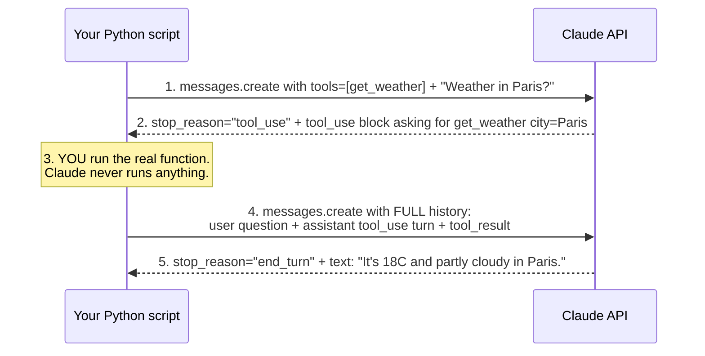

## 📘 Step 8 — Tool use

<!-- pedagogy-header:begin -->
**Phase 3: Tools & reasoning** · Step 8 of 22 · ~25 min · ~$0.01 in API calls

> **Why this matters:** Tool use is how Claude checks your live inventory, queries your database, or books the flight — it is the difference between an assistant that talks and an agent that acts.
<!-- pedagogy-header:end -->

### 🎯 What you'll learn

- What a **tool** is, in Claude terms: a Python function *you* own that Claude can ask you to run
- What **JSON Schema** is and why Claude needs one to call your function
- What `stop_reason == "tool_use"` means, and why the API pauses instead of answering
- How to send a **`tool_result`** back so Claude can finish its sentence
- Python constructs used here: **list**, **dict**, **nested dict**, **keyword arguments**, **`if` statement**, **generator expression with `next()`**, **`for` loop**, **`break`**, **attribute access** (`obj.field`)

---

### 🧠 Theory — Claude can't run code, so it asks you to

Claude has no hands. It cannot open a browser, hit a weather API, or query
your database. What it *can* do is say:

> "I'd like you to run the function `get_weather` with the argument
> `city="Paris"`. Tell me what it returns and I'll finish my answer."

That request is called a **tool use**. You are the one who actually runs the
function. Then you hand the result back and Claude continues. Nothing magic
is happening — it's a **two-message conversation** where the middle message
is Claude asking you for data.

#### The round trip, visually



Read that diagram twice. The single most common beginner mistake is
forgetting to resend step 2's assistant turn in step 4. More on that below.

---

### 🐍 Python concepts, defined as they appear

Before we read the code, here is every Python idea it uses. If you already
know one, skip it.

**A list** — an ordered collection written with square brackets. Items can
be anything, including dicts.

```python
colors = ["red", "green", "blue"]   # colors[0] is "red"
```

**A dict (dictionary)** — a collection of `key: value` pairs written with
curly braces. You look values up by key, not by position.

```python
person = {"name": "Ada", "age": 36}
print(person["name"])   # Ada
```

**A nested dict** — a dict whose *value* is itself another dict (or a list).
The tool definition below is nested three levels deep. It's still just
dicts inside dicts.

```python
config = {"db": {"host": "localhost", "port": 5432}}
print(config["db"]["port"])   # 5432
```

**A list of dicts** — extremely common in API code. `tools` below is a list
that happens to contain exactly one dict. The square brackets say "this is
a list of tools", the curly braces inside say "here is one tool".

**Keyword arguments** — when calling a function you can name each argument
instead of relying on position. `model="claude-sonnet-5"` is a keyword
argument. The Anthropic SDK uses them everywhere, so order never matters.

```python
client.messages.create(model="claude-sonnet-5", max_tokens=300)   # order irrelevant
```

**Attribute access with a dot** — `message.stop_reason` reads a *field* off
an object. Note the difference from a dict: dicts use `["brackets"]`,
objects use `.dots`. **You send dicts to the API; the API sends objects
back.** Remembering that one sentence prevents a lot of confusion.

**A generator expression + `next()`** — this line looks scary:

```python
tool_use_block = next(b for b in message.content if b.type == "tool_use")
```

Read it right-to-left in plain English: *"go through every block `b` in
`message.content`, keep only the ones whose `.type` is `"tool_use"`, and
give me the first one."* The part in parentheses is a **generator
expression** — a lazy recipe for producing values. `next()` pulls exactly
one value out of that recipe and then stops. It is a compact replacement
for:

```python
tool_use_block = None
for b in message.content:
    if b.type == "tool_use":
        tool_use_block = b
        break
```

Both do the same thing. The one-liner is what you'll see in real SDK code,
so it's worth learning to read.

**A `for` loop with `break`** — walk over each item in a list; `break`
leaves the loop immediately once you've found what you wanted.

**An `if` statement** — run the indented block only when the condition is
true. `if message.stop_reason == "tool_use":` means "only do the tool
dance if Claude actually asked for a tool."

---

### 🔧 The tool definition, unpacked

```python
tools = [{
    "name": "get_weather",
    "description": "Get the current weather for a city.",
    "input_schema": {
        "type": "object",
        "properties": {"city": {"type": "string", "description": "City name"}},
        "required": ["city"],
    },
}]
```

- `tools` — a **list**, because you can offer Claude many tools at once.
- `"name"` — the function name Claude will say back to you. Must match what
  your code expects.
- `"description"` — plain English. **This is the prompt.** Claude decides
  whether to use the tool based almost entirely on this sentence, so write
  it for a human reader.
- `"input_schema"` — a **JSON Schema**: a dict that describes the shape of
  the arguments. JSON Schema is just an agreed-upon vocabulary for saying
  "this is an object with a string field called `city`, and `city` is
  mandatory."
  - `"type": "object"` — the arguments arrive as a dict.
  - `"properties"` — a nested dict, one entry per argument.
  - `"required"` — a list of argument names Claude must supply.

Claude never sees your Python function. It only sees this schema. If the
schema is vague, the arguments will be vague.

---

### 🏋️ Exercise

1. In this repo, create a new file at **`exercises/practice8_tools.py`**
   with exactly this content:

   ```python
   import os
   from dotenv import load_dotenv
   from anthropic import Anthropic

   load_dotenv()
   config = {"ICA_API_KEY": os.environ.get("ICA_API_KEY")}

   client = Anthropic(
       api_key=config["ICA_API_KEY"],
       base_url="https://api.servicesessentials.ibm.com",
   )

   tools = [{
       "name": "get_weather",
       "description": "Get the current weather for a city.",
       "input_schema": {
           "type": "object",
           "properties": {"city": {"type": "string", "description": "City name"}},
           "required": ["city"],
       },
   }]

   user_question = "What's the weather in Paris?"

   message = client.messages.create(
       model="claude-sonnet-5",
       max_tokens=300,
       tools=tools,
       messages=[{"role": "user", "content": user_question}],
   )

   print("stop_reason:", message.stop_reason)

   if message.stop_reason == "tool_use":
       tool_use_block = next(b for b in message.content if b.type == "tool_use")
       print("tool name:", tool_use_block.name)
       print("tool input:", tool_use_block.input)

       # A real integration would call a weather API here. We hardcode a result.
       result = "18°C, partly cloudy"

       follow_up = client.messages.create(
           model="claude-sonnet-5",
           max_tokens=300,
           tools=tools,
           messages=[
               {"role": "user", "content": user_question},
               {"role": "assistant", "content": message.content},
               {
                   "role": "user",
                   "content": [{
                       "type": "tool_result",
                       "tool_use_id": tool_use_block.id,
                       "content": result,
                   }],
               },
           ],
       )
       for block in follow_up.content:
           if block.type == "text":
               print("final answer:", block.text)
               break
   ```

---

### 🔍 Line-by-line walkthrough

| Code | What it does, in plain English |
| --- | --- |
| `import os` | Loads Python's standard `os` module so we can read environment variables. |
| `from dotenv import load_dotenv` | Imports one function from the `python-dotenv` package. |
| `from anthropic import Anthropic` | Imports the `Anthropic` **class** — the SDK's client. A class is a blueprint; calling it makes an object. |
| `load_dotenv()` | Reads your `.env` file and copies each `KEY=value` line into the environment. Called with no arguments. |
| `config = {"ICA_API_KEY": os.environ.get("ICA_API_KEY")}` | Builds a one-key **dict**. `os.environ` is a dict-like object of all environment variables; `.get("X")` returns the value or `None` if missing (unlike `["X"]`, which would crash). |
| `client = Anthropic(api_key=..., base_url=...)` | Creates the **client object** — the thing that knows your key and where to send requests. Two **keyword arguments**. `base_url` points at this course's gateway instead of the public Anthropic endpoint. |
| `tools = [{...}]` | The **list of dicts** described above: one tool, named `get_weather`, with its `input_schema`. |
| `user_question = "What's the weather in Paris?"` | Stored in a **variable** because we need this exact string *twice* — once now, once in the follow-up history. Retyping it risks a typo that changes the conversation. |
| `message = client.messages.create(...)` | The first API call. `tools=tools` offers the tool; `messages=[{...}]` is the conversation so far — a list with one user turn. |
| `print("stop_reason:", message.stop_reason)` | `stop_reason` tells you *why* Claude stopped. `"end_turn"` = finished normally. `"tool_use"` = "I paused because I need you to run a tool." `print` with two arguments joins them with a space. |
| `if message.stop_reason == "tool_use":` | Only run the tool dance if Claude actually asked. `==` compares values; `=` assigns. |
| `tool_use_block = next(b for b in ... if b.type == "tool_use")` | The generator expression from earlier: grab the first `tool_use` block out of `message.content`. Needed because `content` is a **list of mixed block types** — there may be a text block before it. |
| `print("tool name:", tool_use_block.name)` | The tool Claude picked. Prints `get_weather`. |
| `print("tool input:", tool_use_block.input)` | The arguments Claude chose, as a **dict** — e.g. `{'city': 'Paris'}`. This is the schema you wrote, filled in. |
| `result = "18°C, partly cloudy"` | **Where your real code would live.** In production you'd call `requests.get(...)` on a weather API using `tool_use_block.input["city"]`. Hardcoding keeps the lesson focused. |
| `follow_up = client.messages.create(...)` | The second API call. Critically, `messages=` now contains **three turns**. |
| `{"role": "user", "content": user_question}` | Turn 1 — replay the original question. The API is stateless: it remembers nothing between calls, so you resend the whole history every time. |
| `{"role": "assistant", "content": message.content}` | Turn 2 — replay Claude's own tool request, **verbatim**. `message.content` is the exact list of blocks Claude returned. |
| `{"role": "user", "content": [{"type": "tool_result", ...}]}` | Turn 3 — the answer. Note `content` is a **list** here, not a plain string, because tool results are structured blocks. |
| `"tool_use_id": tool_use_block.id` | The receipt number. It links this result to the specific request Claude made. Claude may fire several tool calls at once, so IDs are how it matches them up. |
| `"content": result` | The actual data your function returned, as a string. |
| `for block in follow_up.content:` | Loop over the reply's blocks. |
| `if block.type == "text": print("final answer:", block.text); break` | Print the first text block and stop looking. |

---

### ⚠️ What happens if you skip this

**Skip appending the assistant turn** (`{"role": "assistant", "content": message.content}`):

```
anthropic.BadRequestError: 400 - messages.1: Found tool_result block(s)
without a corresponding tool_use block in the previous message
```

The API validates conversation structure. A `tool_result` **must** be
immediately preceded by an assistant message containing the matching
`tool_use`. Without it, the API sees an answer to a question nobody asked
and rejects the whole request. This is the #1 error in this step.

**Skip the `tool_use_id`, or hardcode a made-up one** → 400 error about an
unknown `tool_use_id`. Always read it from `tool_use_block.id`.

**Skip `tools=tools` on the second call** → 400 error, because the history
references a tool the request never declared. The tool list must be present
on *every* call in the conversation, not just the first.

**Skip the `if message.stop_reason == "tool_use"` guard** → if Claude
answers directly without the tool, `next(...)` finds no matching block and
raises `StopIteration`. The guard makes your code handle both paths.

**Index `message.content[0]` instead of looping/filtering** →
`AttributeError: 'TextBlock' object has no attribute 'name'`, or with
thinking enabled, `AttributeError: 'ThinkingBlock' object has no attribute
'text'`. Block order is not guaranteed. **Always filter by `.type`.**

**Skip `load_dotenv()`** → `api_key` is `None` and you get an
authentication error. The key lives in `.env`; nothing reads that file
automatically.

---

2. Run it locally:

   ```bash
   pip install anthropic python-dotenv
   python exercises/practice8_tools.py
   ```

   ✅ **What should happen:** `stop_reason: tool_use` prints, followed by
   `tool name: get_weather` and `tool input:` showing a dict with a `city`
   key. Then `final answer:` prints Claude's reply incorporating the
   `18°C, partly cloudy` result you supplied. Roughly:

   ```
   stop_reason: tool_use
   tool name: get_weather
   tool input: {'city': 'Paris'}
   final answer: It's currently 18°C and partly cloudy in Paris.
   ```

3. Commit and push your file to `main`:

   ```bash
   git add exercises/practice8_tools.py
   git commit -m "Step 8: tool use"
   git push
   ```

4. Watch the **Actions** tab. The **"Step 8 — Tool Use"** check runs
   automatically. On success this issue closes and **Step 9** opens. If it
   fails, read the error in the Action's log, fix your file, and push
   again.

<details>
<summary>Having trouble?</summary>

**Setup and path problems**

- Double-check the file path is exactly `exercises/practice8_tools.py`.
- `ModuleNotFoundError: No module named 'dotenv'` — the package is
  `python-dotenv` but you import `dotenv`. Run
  `pip install python-dotenv`.
- `ModuleNotFoundError: No module named 'anthropic'` — run
  `pip install anthropic`.
- `TypeError: Could not resolve authentication method` or a 401 — your
  `ICA_API_KEY` is empty. Confirm `.env` sits in the folder you run
  `python` from, and that `load_dotenv()` is called *before* you build the
  client.

**Errors specific to tool use**

- `400 ... Found tool_result block(s) without a corresponding tool_use
  block` — you forgot the `{"role": "assistant", "content":
  message.content}` turn, or put it after the `tool_result`. Order must be
  user → assistant → user.
- `StopIteration` from the `next(...)` line — no `tool_use` block exists.
  Either `stop_reason` wasn't `tool_use` (check the guard), or you
  filtered on the wrong `.type` string.
- `AttributeError: 'ThinkingBlock' object has no attribute 'text'` — don't
  index `content[0]` directly; loop and check `block.type == "text"`
  instead, since some models return a thinking block before the text block.
- `AttributeError: 'dict' object has no attribute 'type'` — you're using
  dot access on something you built yourself. Dicts you create use
  `block["type"]`; objects the API returns use `block.type`.
- If `stop_reason` isn't `tool_use`, Claude decided not to call the tool —
  make sure the `user_question` is clearly about weather so Claude has a
  reason to use `get_weather`, and that your tool `"description"` says it
  returns weather.
- The `tool_use_id` in your `tool_result` block **must exactly match** the
  `id` attribute of the `tool_use` block Claude returned — copy it from
  `tool_use_block.id`, don't hardcode a string.
- The second `messages.create()` call must include the **same `tools=`**
  list you passed the first time.
- `IndentationError` — everything after `if message.stop_reason ==
  "tool_use":` must be indented consistently (the file above uses 3-space
  indentation inside the markdown block; when you paste it, use a uniform
  4 spaces per level and keep it consistent).
- Nothing prints after `stop_reason:` — your `if` body isn't running.
  Add `print("entered branch")` inside it to confirm.

**Checker specifics**

- The checker looks for `load_dotenv()`, `ICA_API_KEY`, and `base_url=` in
  your script — make sure all three are present.
- It also requires the strings `tool_use_id` and `input_schema` in your
  source, and the labels `stop_reason:`, `tool name:`, `tool input:`, and
  `final answer:` in your output. Don't rename any printed label.
- If the check fails complaining about `ICA_API_KEY`, make sure it's set as
  a repo secret (Settings → Secrets and variables → Actions).

</details>

<details>
<summary>Stuck? Reveal the solution</summary>

Give it a real attempt first — debugging your own code is where the learning
happens. If you're properly stuck, the complete working reference is here:

**[`solutions/practice8_tools.py`](../../solutions/practice8_tools.py)**

Copy it to `exercises/practice8_tools.py`, run it, then read it line by line and make
sure you can explain *why* each part is there.

</details>
