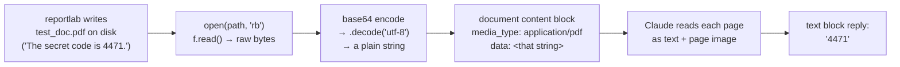

## 📘 Step 11 — PDF support

<!-- pedagogy-header:begin -->
**Phase 2: Input & output types** · Step 11 of 22 · ~20 min · ~$0.005 in API calls

> **Why this matters:** Contracts, invoices, and research papers all arrive as PDFs — document input replaces the entire fragile OCR-and-regex pipeline teams used to maintain.
<!-- pedagogy-header:end -->

### 🎯 What you'll learn

- How to hand Claude a whole PDF using a **`document` content block**
- Why Claude reads a PDF as **both text and page images** (so charts work, not just words)
- What a **context manager** (`with open(...) as f:`) is and why you should always use it for files
- How to read a value out of a response with a **generator expression**, safely
- Python constructs used here: **`with` statement**, **file modes (`"rb"`)**, **method calls on objects**, **generator expression with `next()`**, **`os.path.exists()`**, **f-string alternative (`print` with commas)**

---

### 🧠 Theory — PDFs are a first-class input

A PDF goes in a `document` content block. You can supply it three ways:

1. **base64** — inline in the request (what we do here; simplest).
2. **URL** — Anthropic fetches it.
3. **Files API `file_id`** — upload once, reference many times (best when
   you'll reuse the same PDF across many requests; that's Step 18).

The important thing to understand is *what the model does with it*. Claude
treats each page as **extracted text plus a rendered image of that page**.
That's why it can answer questions about a bar chart or a scanned table, not
just about the raw text layer.

```python
import base64

with open("test_doc.pdf", "rb") as f:
    pdf_data = base64.standard_b64encode(f.read()).decode("utf-8")

response = client.messages.create(
    model="claude-sonnet-5",
    max_tokens=200,
    messages=[
        {
            "role": "user",
            "content": [
                {
                    "type": "document",
                    "source": {
                        "type": "base64",
                        "media_type": "application/pdf",
                        "data": pdf_data,
                    },
                },
                {"type": "text", "text": "What is the secret code mentioned in this document?"},
            ],
        }
    ],
)
```

Block **order matters** — put the document block *before* the text that
asks about it, same as with images in Step 10.

#### The pipeline, visually



**When to use this:** Financial report analysis, legal document review,
"chat with a PDF" flows. For PDFs you'll reuse across many requests,
prefer uploading once via the Files API instead of re-sending base64 data
every time.

---

### 🐍 Python concepts, defined as they appear

**The `with` statement (a context manager)** —

```python
with open("test_doc.pdf", "rb") as f:
    pdf_data = base64.standard_b64encode(f.read()).decode("utf-8")
```

`open(...)` gives you a file object. `with ... as f:` binds it to the name
`f` for the indented block, then **closes it automatically** when the block
ends — even if an exception is raised inside. The manual equivalent is:

```python
f = open("test_doc.pdf", "rb")
try:
    pdf_data = ...
finally:
    f.close()          # must not forget this
```

The `with` version is shorter and can't leak the file handle. Always prefer
it. (`try`/`finally` shown here for comparison: `try` runs a block,
`finally` runs cleanup no matter what happens. You'll use `try`/`except` for
real error handling in Step 16.)

**File modes** — the second argument to `open()`:

| Mode | Meaning |
| --- | --- |
| `"r"` | read **text** (default) — gives back `str` |
| `"rb"` | read **binary** — gives back `bytes` |
| `"w"` | write text (truncates the file!) |
| `"wb"` | write binary |

A PDF is binary. Opening it with `"r"` will raise a
`UnicodeDecodeError` because its bytes aren't valid text.

**`f.read()`** — reads the entire file and returns its contents. With
`"rb"`, that's a `bytes` object.

**Method calls on an object** — `c.drawString(...)` and `c.save()` are
**methods**: functions that belong to the `c` object (a reportlab canvas)
and act on its internal state. `c.drawString(100, 700, "text")` means
"place this text at x=100, y=700 on the current page". PDF coordinates start
at the **bottom-left**, so a larger y is higher up the page.

**`os.path.exists(path)`** — returns `True` or `False` depending on whether
that file is on disk. We use it as a cheap sanity check that the PDF was
actually written before we try to read it.

**A generator expression with `next()`** — introduced in Step 8, used again:

```python
answer = next(b.text for b in response.content if b.type == "text")
```

In plain English: *"walk through every block `b` in `response.content`, keep
only those whose `.type` is `"text"`, take `.text` off the first one, and
stop."* Note it produces `b.text` (the string), not `b` (the block) — the
expression before `for` decides what comes out. This is the safe way to
grab text, because a thinking block may sit at index 0.

**`print` with multiple arguments** — `print("answer:", answer)` passes two
values; `print` joins them with a single space and adds a newline. An
f-string (`print(f"answer: {answer}")`) would do the same thing. Either is
fine — just don't change the label text, since the checker greps for it.

**Comments as documentation** — the `# Generate a one-page PDF...` line
explains *why* reportlab is here at all (it's test scaffolding, not part of
the Anthropic SDK).

---

### 🏋️ Exercise

1. Make sure `reportlab` is installed (used only to generate a tiny test
   PDF locally — it's not part of the Anthropic SDK):

   ```bash
   pip install reportlab
   ```

2. In this repo, create a new file at **`exercises/practice11_pdf.py`**
   with exactly this content:

   ```python
   import base64
   import os

   from dotenv import load_dotenv
   from anthropic import Anthropic
   from reportlab.pdfgen import canvas

   load_dotenv()
   config = {"ICA_API_KEY": os.environ.get("ICA_API_KEY")}

   client = Anthropic(
       api_key=config["ICA_API_KEY"],
       base_url="https://api.servicesessentials.ibm.com",
   )

   # Generate a one-page PDF containing a made-up "secret code"
   pdf_path = "test_doc.pdf"
   c = canvas.Canvas(pdf_path)
   c.drawString(100, 700, "The secret code is 4471.")
   c.save()
   print("pdf created:", os.path.exists(pdf_path))

   with open(pdf_path, "rb") as f:
       pdf_data = base64.standard_b64encode(f.read()).decode("utf-8")

   response = client.messages.create(
       model="claude-sonnet-5",
       max_tokens=200,
       messages=[
           {
               "role": "user",
               "content": [
                   {
                       "type": "document",
                       "source": {
                           "type": "base64",
                           "media_type": "application/pdf",
                           "data": pdf_data,
                       },
                   },
                   {"type": "text", "text": "What is the secret code mentioned in this document? Reply with just the number."},
               ],
           }
       ],
   )
   answer = next(b.text for b in response.content if b.type == "text")
   print("answer:", answer)
   ```

---

### 🔍 Line-by-line walkthrough

| Code | What it does, in plain English |
| --- | --- |
| `import base64` | Standard library base64 encoder — turns bytes into API-safe text (see Step 10 for the full explanation). |
| `import os` | For environment variables and `os.path.exists`. |
| `from dotenv import load_dotenv` | One function from `python-dotenv`. |
| `from anthropic import Anthropic` | The SDK client class. |
| `from reportlab.pdfgen import canvas` | Imports the `canvas` **module** from reportlab. This is test scaffolding so the exercise is self-contained — nothing to do with the Anthropic API. |
| `load_dotenv()` | Loads `.env` into the environment. |
| `config = {"ICA_API_KEY": os.environ.get("ICA_API_KEY")}` | A **dict** holding your key; `.get()` returns `None` instead of raising if it's missing. |
| `client = Anthropic(api_key=..., base_url=...)` | Builds the client with your key and the course gateway URL. |
| `pdf_path = "test_doc.pdf"` | The filename, stored in a **variable** because we use it three times (create, check, open). One variable = no typo risk. |
| `c = canvas.Canvas(pdf_path)` | Creates a blank PDF canvas that will be written to that path. `c` is an **object** holding the drawing state. |
| `c.drawString(100, 700, "The secret code is 4471.")` | Draws text at x=100, y=700 (measured from the **bottom-left** corner, in points — 72 points per inch). |
| `c.save()` | Finalises and writes the file to disk. **Nothing exists on disk until this runs.** |
| `print("pdf created:", os.path.exists(pdf_path))` | Sanity check. Should print `pdf created: True`. If it prints `False`, the save failed and everything downstream will too. |
| `with open(pdf_path, "rb") as f:` | Opens the PDF in **binary read** mode and guarantees it's closed after the block. |
| `pdf_data = base64.standard_b64encode(f.read()).decode("utf-8")` | Three chained steps: read all bytes → base64-encode them → convert the resulting bytes to a `str`. JSON can't carry raw bytes, hence the `.decode`. |
| `response = client.messages.create(` | The API call. |
| `model="claude-sonnet-5",` | Sonnet is plenty for reading a line of text out of a PDF, and much cheaper than larger models. |
| `max_tokens=200,` | Reply-length ceiling. We only expect four digits back. |
| `messages=[{"role": "user", "content": [` | One user turn whose `content` is a **list of blocks**. |
| `{"type": "document", "source": {...}}` | The PDF block. `"source"` is a **nested dict**: `"type": "base64"` (inline data), `"media_type": "application/pdf"` (tells the API how to parse it), `"data": pdf_data` (the encoded string). All three keys are required. |
| `{"type": "text", "text": "What is the secret code ...?"}` | The question, placed **after** the document so Claude has read it first. "Reply with just the number" keeps the answer terse and easy to verify. |
| `answer = next(b.text for b in response.content if b.type == "text")` | Pull the first text block's string out of the response, skipping any non-text block. |
| `print("answer:", answer)` | Prints the labelled result — should contain `4471`. |

---

### ⚠️ What happens if you skip this

**Skip `c.save()`** → the file is never written. You'll see
`pdf created: False`, then:

```
FileNotFoundError: [Errno 2] No such file or directory: 'test_doc.pdf'
```

The canvas buffers everything in memory until `save()` flushes it.

**Open the PDF with `"r"` instead of `"rb"`** →

```
UnicodeDecodeError: 'utf-8' codec can't decode byte 0x93 in position 10
```

PDFs are binary. Text mode tries to interpret those bytes as characters and
chokes.

**Skip `.decode("utf-8")`** →

```
TypeError: Object of type bytes is not JSON serializable
```

`standard_b64encode` returns bytes; the JSON body needs a string.

**Get `media_type` wrong** (e.g. `"application/x-pdf"` or
`"text/plain"`) → a 400 error from the API. The checker also greps your
source for the exact string `application/pdf`, so a typo fails twice.

**Put the text block before the document block** → Claude is asked about a
document it hasn't seen yet. It may say it can't find a code, and `4471`
never appears. Document first, question last.

**Index `response.content[0].text` instead of using the generator
expression** → `AttributeError: 'ThinkingBlock' object has no attribute
'text'` when a thinking block arrives first. Filter by `.type`, always.

**Use `next(...)` with no matching block and no default** →
`StopIteration`. If you want a safe fallback, `next(gen, "")` returns `""`
instead of raising — but for this exercise a text block always comes back.

**Skip the `with` and forget `f.close()`** → on CPython it usually still
works (garbage collection closes it eventually), but on Windows the file can
stay locked and later writes fail. Use `with`; it costs nothing.

---

3. Run it locally:

   ```bash
   pip install anthropic python-dotenv reportlab
   python exercises/practice11_pdf.py
   ```

   ✅ **What should happen:** `pdf created: True` prints, then `answer:`
   followed by Claude's reply containing `4471` — the code it read straight
   out of the PDF text. Roughly:

   ```
   pdf created: True
   answer: 4471
   ```

4. Commit and push your file (you don't need to commit `test_doc.pdf`
   itself — it's generated fresh each run):

   ```bash
   git add exercises/practice11_pdf.py
   git commit -m "Step 11: PDF support"
   git push
   ```

5. Watch the **Actions** tab. The **"Step 11 — PDF Support"** check runs
   automatically. On success this issue closes and **Step 12** opens. If it
   fails, read the error in the Action's log, fix your file, and push
   again.

<details>
<summary>Having trouble?</summary>

**Setup problems**

- Double-check the file path is exactly `exercises/practice11_pdf.py`.
- If you get `ModuleNotFoundError: No module named 'reportlab'`, run
  `pip install reportlab`.
- `ModuleNotFoundError: No module named 'dotenv'` — install
  `python-dotenv` (package name differs from import name).
- 401 / authentication error — confirm `.env` is in the directory you run
  `python` from and `load_dotenv()` runs before `Anthropic(...)`.

**File and encoding errors**

- `pdf created: False` — `c.save()` didn't run, or ran before
  `c.drawString`. The order must be: create canvas → draw → save → check.
- `FileNotFoundError: 'test_doc.pdf'` — same cause; the file was never
  written. Also check you're reading the same `pdf_path` variable you
  wrote.
- `UnicodeDecodeError` — you opened the PDF in text mode. It must be
  `open(pdf_path, "rb")`.
- `TypeError: Object of type bytes is not JSON serializable` — you dropped
  `.decode("utf-8")` after `standard_b64encode(...)`.
- `PermissionError` — a PDF viewer has the file open, or you lack write
  access to the current directory. Close the viewer / `cd` somewhere
  writable.

**API and response errors**

- If you see `AttributeError: 'ThinkingBlock' object has no attribute
  'text'` or `StopIteration`, some models return a thinking block before
  the text block — use `next(b.text for b in response.content if b.type
  == "text")` instead of indexing `content[0]` directly.
- The document content block needs `"type": "document"` with a `"source"`
  dict containing `"type": "base64"`, `"media_type": "application/pdf"`,
  and `"data"` — check every key is spelled exactly right.
- Put the document block **before** the text block in the `content` list,
  same ordering rule as images.
- `400 ... invalid base64` — your `"data"` value isn't a clean base64
  string. Print `pdf_data[:40]` to confirm it looks like readable ASCII
  and doesn't start with `b'`.
- Claude replies "I don't see a code" — the PDF is blank. Confirm
  `c.drawString` ran *before* `c.save()`, and that y=700 is on the page
  (valid range is roughly 0–790 on default letter size).

**Checker specifics**

- The checker looks for `load_dotenv()`, `ICA_API_KEY`, and `base_url=` in
  your script — make sure all three are present.
- It also greps your source for the exact strings `"type": "document"` and
  `application/pdf`, and greps stdout for `pdf created: True`, the label
  `answer:`, and `4471`. Don't rename any printed label or change that
  spacing.
- If the check fails complaining about `ICA_API_KEY`, make sure it's set as
  a repo secret (Settings → Secrets and variables → Actions).

</details>

<details>
<summary>Stuck? Reveal the solution</summary>

Give it a real attempt first — debugging your own code is where the learning
happens. If you're properly stuck, the complete working reference is here:

**[`solutions/practice11_pdf.py`](../../solutions/practice11_pdf.py)**

Copy it to `exercises/practice11_pdf.py`, run it, then read it line by line and make
sure you can explain *why* each part is there.

</details>
