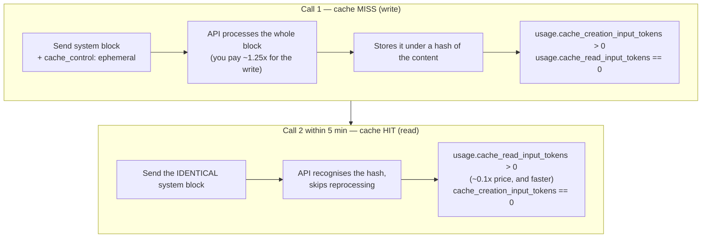

## 📘 Step 12 — Prompt caching

<!-- pedagogy-header:begin -->
**Phase 4: Production concerns** · Step 12 of 22 · ~20 min · ~$0.01 in API calls

> **Why this matters:** This is how production chatbots cut their bill by up to 90%: a long system prompt or document gets paid for once, then re-read at a tenth of the price on every later turn.
<!-- pedagogy-header:end -->

### 🎯 What you'll learn

- What prompt caching is: paying to process a big prompt **once** instead of every time
- The difference between a **cache write** and a **cache read**, and how to prove which happened
- Why `cache_control` goes **inside a block dict**, never as a top-level argument
- Why the cached content must be **byte-for-byte identical** across calls
- Python constructs used here: **string multiplication (`"x" * 400`)**, **list of dicts assigned to a variable**, **variable reuse**, **nested dict**, **attribute access on a `usage` object**, **comments**

---

### 🧠 Theory — stop paying to re-read the same document

Every request you send is processed from scratch. If you attach a 50-page
policy document to 200 support-ticket requests, you pay to process those 50
pages 200 times. That's slow and expensive.

**Prompt caching** tells the API: "remember your processed form of this
chunk; if I send the exact same chunk again soon, reuse it." You opt in per
block:

```python
block = {
    "type": "text",
    "text": "...a long chunk of reusable context...",
    "cache_control": {"type": "ephemeral"},
}
```

`"ephemeral"` means short-lived — the default time-to-live (TTL) is **5
minutes**, refreshed each time the cache is hit.

#### Cache write vs cache read



The two `usage` counters are how you *verify* caching is working. You are
not guessing — the API tells you which path it took:

| Counter | Meaning |
| --- | --- |
| `cache_creation_input_tokens` | tokens **written** into the cache on this call |
| `cache_read_input_tokens` | tokens **served from** the cache on this call |
| `input_tokens` | the remaining, uncached tokens processed normally |

A healthy pair of calls shows write-then-read: first call has a nonzero
*creation* count, second call has a nonzero *read* count.

#### What gets cached: everything up to and including the marked block

```
   ┌──────────────────────────────────────────────┐
   │  system block  (cache_control: ephemeral) ◄──┼── cache breakpoint
   └──────────────────────────────────────────────┘
        ▲ everything from the start of the prompt
          up to HERE is cached as one unit
   ┌──────────────────────────────────────────────┐
   │  user message: "what animal is above?"       │  ← processed fresh
   └──────────────────────────────────────────────┘   every single call
```

That's why the *stable, large* content goes first and the *changing, small*
content goes last. If you put the varying user question before the cached
block, the prefix differs every time and you'd never get a hit.

**When to use this:** Long system prompts, large reference documents, big
few-shot example sets, or any content reused across many requests in a
short window — cut latency and cost by not reprocessing it every time.

---

### 🐍 Python concepts, defined as they appear

**String multiplication** —

```python
long_context = "The quick brown fox jumps over the lazy dog. " * 400
```

The `*` operator on a string repeats it. This produces one string of the
sentence repeated 400 times (~17,600 characters, comfortably over the
minimum token count needed for caching to activate). It's a quick way to
fabricate a large prompt without shipping a real document.

> **Note on minimums:** caching only kicks in above a model-specific token
> floor (roughly 1024 tokens for Sonnet). Too-short content is silently not
> cached — both counters stay 0. That's why we repeat 400 times, not 4.

**A list of dicts stored in a variable** —

```python
system_blocks = [
    {"type": "text", "text": long_context, "cache_control": {"type": "ephemeral"}}
]
```

We name it instead of writing it inline **specifically so both calls use the
same object**. That guarantees the bytes are identical. If you typed the dict
out twice, a single stray space in one copy would silently break the cache
hit and you'd spend an hour wondering why.

**A nested dict** — `"cache_control": {"type": "ephemeral"}` is a dict
stored as the value of a key inside another dict. It sits *beside* `"type"`
and `"text"` at the same level, as a sibling key of that block.

**`system=` as a list rather than a string** — in earlier steps you may have
passed `system="You are helpful."`. To attach `cache_control` you need the
**structured form**: a list of text blocks. Both forms are valid; only the
list form supports per-block caching.

**Attribute access on `usage`** — `first.usage.cache_read_input_tokens`
walks three levels: the response object → its `usage` object → an integer
field. Each `.` steps one level deeper into objects the SDK built for you.

**Variable reuse (`first`, `second`)** — two separate response objects with
distinct names, so you can print both sets of counters and compare. Reusing
one name would clobber the first result.

**Comments (`#`)** — the `# First call: writes to the cache.` lines exist to
make the write/read intent obvious to a future reader. Comment the *why*,
not the *what*.

---

### 🏋️ Exercise

1. In this repo, create a new file at **`exercises/practice12_caching.py`**
   with exactly this content:

   ```python
   import os

   from dotenv import load_dotenv
   from anthropic import Anthropic

   load_dotenv()
   config = {"ICA_API_KEY": os.environ.get("ICA_API_KEY")}

   client = Anthropic(
       api_key=config["ICA_API_KEY"],
       base_url="https://api.servicesessentials.ibm.com",
   )

   # A long block of repeated text to make caching worthwhile.
   long_context = "The quick brown fox jumps over the lazy dog. " * 400

   system_blocks = [
       {
           "type": "text",
           "text": long_context,
           "cache_control": {"type": "ephemeral"},
       }
   ]

   # First call: writes to the cache.
   first = client.messages.create(
       model="claude-sonnet-5",
       max_tokens=100,
       system=system_blocks,
       messages=[{"role": "user", "content": "In one short sentence, what animal is mentioned above?"}],
   )
   print("first cache_creation_input_tokens:", first.usage.cache_creation_input_tokens)
   print("first cache_read_input_tokens:", first.usage.cache_read_input_tokens)

   # Second call with the identical cached block: reads from the cache.
   second = client.messages.create(
       model="claude-sonnet-5",
       max_tokens=100,
       system=system_blocks,
       messages=[{"role": "user", "content": "In one short sentence, what animal is mentioned above?"}],
   )
   print("second cache_creation_input_tokens:", second.usage.cache_creation_input_tokens)
   print("second cache_read_input_tokens:", second.usage.cache_read_input_tokens)
   ```

---

### 🔍 Line-by-line walkthrough

| Code | What it does, in plain English |
| --- | --- |
| `import os` | For reading environment variables. |
| `from dotenv import load_dotenv` | One function from `python-dotenv`. |
| `from anthropic import Anthropic` | The SDK client class. |
| `load_dotenv()` | Copies each `KEY=value` line from `.env` into the environment. |
| `config = {"ICA_API_KEY": os.environ.get("ICA_API_KEY")}` | A **dict** holding the key; `.get()` yields `None` rather than crashing if unset. |
| `client = Anthropic(api_key=..., base_url=...)` | Builds the client pointed at this course's gateway. |
| `long_context = "The quick brown fox ... " * 400` | **String multiplication** builds a ~17,600-character prompt — big enough to clear the caching minimum. |
| `system_blocks = [ { ... } ]` | A **list** containing one **dict**: the structured `system` prompt. Stored in a variable so both calls send byte-identical content. |
| `"type": "text",` | Declares this system block is plain text (as opposed to an image or document block). |
| `"text": long_context,` | The actual content to cache. |
| `"cache_control": {"type": "ephemeral"},` | The cache marker — a **nested dict**, a sibling key of `"type"` and `"text"`. This is the one line that turns caching on. |
| `first = client.messages.create(` | Call #1. |
| `model="claude-sonnet-5",` | Sonnet: cheap and fast, and caching works the same on any model. |
| `max_tokens=100,` | We only want one sentence back. |
| `system=system_blocks,` | Passing the **list** form (not a plain string) is what makes per-block `cache_control` possible. |
| `messages=[{"role": "user", "content": "In one short sentence, ..."}]` | The small, changing part of the prompt — deliberately placed *after* the cached system block. |
| `print("first cache_creation_input_tokens:", first.usage.cache_creation_input_tokens)` | How many tokens were **written** into the cache. Should be > 0 on the first call. |
| `print("first cache_read_input_tokens:", first.usage.cache_read_input_tokens)` | How many were **read** from cache. Normally `0` on a first, cold call. |
| `second = client.messages.create(` | Call #2 — same model, same `system_blocks`, same user message. |
| `print("second cache_creation_input_tokens:", ...)` | Should now be `0` — nothing new to write. |
| `print("second cache_read_input_tokens:", ...)` | Should be > 0 — **this is the cache hit**, and the proof caching worked. |

---

### ⚠️ What happens if you skip this

**Forget `cache_control` entirely** → no error, no crash, and that's exactly
what makes it dangerous. Both calls just report:

```
first cache_creation_input_tokens: 0
first cache_read_input_tokens: 0
second cache_creation_input_tokens: 0
second cache_read_input_tokens: 0
```

You silently pay full price forever. The checker catches it with *"Expected
'first cache_creation_input_tokens:' to be greater than 0"*. **Always verify
with the usage counters — never assume caching is on.**

**Pass `cache_control` as a top-level argument**
(`client.messages.create(cache_control=..., ...)`) →

```
TypeError: create() got an unexpected keyword argument 'cache_control'
```

It belongs *inside* the block dict, not next to `model=`.

**Pass `system` as a plain string** (`system=long_context`) → there's no
block dict to attach `cache_control` to, so caching can't be enabled at all.
You need the list-of-blocks form.

**Change even one character between the two calls** → the content hash
differs, so call 2 is another cold write:

```
second cache_creation_input_tokens: 4400   ← wrote again
second cache_read_input_tokens: 0          ← never hit
```

A single trailing space is enough to do this. Reusing the
`system_blocks` variable is your defence.

**Make the cached content too short** (e.g. `* 4` instead of `* 400`) →
below the model's minimum cacheable length, the API silently ignores
`cache_control` and both counters stay 0.

**Wait too long between calls** → `"ephemeral"` entries expire after ~5
minutes of no hits. If you step through this script line-by-line in a
debugger over coffee, the entry is gone by call 2. Run it as a whole script.

**Put the varying user message before the cached block** → the prefix that
gets hashed now changes every call, so you never get a hit. Stable content
first, variable content last.

---

2. Run it locally:

   ```bash
   pip install anthropic python-dotenv
   python exercises/practice12_caching.py
   ```

   ✅ **What should happen:** The first call prints a nonzero
   `first cache_creation_input_tokens` (writing the cache). The second call
   prints a nonzero `second cache_read_input_tokens` (reading from the
   cache instead of reprocessing). Roughly:

   ```
   first cache_creation_input_tokens: 4409
   first cache_read_input_tokens: 0
   second cache_creation_input_tokens: 0
   second cache_read_input_tokens: 4409
   ```

   Your exact token numbers will differ. The pattern is what matters:
   nonzero **creation** on call 1, nonzero **read** on call 2.

3. Commit and push your file to `main`:

   ```bash
   git add exercises/practice12_caching.py
   git commit -m "Step 12: prompt caching"
   git push
   ```

4. Watch the **Actions** tab. The **"Step 12 — Prompt Caching"** check runs
   automatically. On success this issue closes and **Step 13** (token
   counting) opens. If it fails, read the error in the Action's log, fix
   your file, and push again.

<details>
<summary>Having trouble?</summary>

**Setup problems**

- Double-check the file path is exactly `exercises/practice12_caching.py`.
- `ModuleNotFoundError: No module named 'dotenv'` — install
  `python-dotenv`.
- 401 / authentication error — verify `.env` is in the directory you run
  `python` from and `load_dotenv()` runs before `Anthropic(...)`.

**All four counters are 0**

- You forgot `"cache_control": {"type": "ephemeral"}` inside the system
  block. This is by far the most common cause.
- Your cached text is too short. Caching has a minimum length (roughly 1024
  tokens on Sonnet); below it, `cache_control` is silently ignored. Keep the
  `* 400` repetition.
- You passed `system=` a plain string instead of a list of block dicts.

**Second call shows a write instead of a read**

- The two calls must use the **exact same** cached content — even a single
  character difference invalidates the cache and both calls will show
  `cache_creation_input_tokens` instead of a cache read on the second call.
  Use the shared `system_blocks` variable rather than retyping the dict.
- The `model=` must match between calls; a different model means a different
  cache entry.
- Caches expire after a few minutes of inactivity — if you're debugging by
  running the script slowly line-by-line, run it as a whole script instead.
- Occasionally the very first run on a cold account misses. Re-run the
  script once before assuming your code is wrong.

**Errors**

- `TypeError: create() got an unexpected keyword argument 'cache_control'`
  — `cache_control` must be attached to the **system block dict itself**,
  not passed as a separate top-level argument.
- `400 ... system: Input should be a valid list` — you mixed the two forms;
  pick the list-of-dicts form.
- `AttributeError: 'Usage' object has no attribute
  'cache_creation_input_tokens'` — your `anthropic` package is old. Run
  `pip install --upgrade anthropic`.
- `TypeError: unsupported operand type(s) for *: 'str' and 'str'` — you
  wrote `"text" * "400"`. The multiplier must be an integer: `* 400`.

**Checker specifics**

- The checker looks for `load_dotenv()`, `ICA_API_KEY`, and `base_url=` in
  your script — make sure all three are present.
- It also greps your source for `cache_control` and `ephemeral`, and greps
  stdout for all four labels: `first cache_creation_input_tokens:`,
  `first cache_read_input_tokens:`,
  `second cache_creation_input_tokens:`, and
  `second cache_read_input_tokens:` — with the first creation count > 0 and
  the second read count > 0. Don't rename any printed label.
- If the check fails complaining about `ICA_API_KEY`, make sure it's set as
  a repo secret (Settings → Secrets and variables → Actions).

</details>

<details>
<summary>Stuck? Reveal the solution</summary>

Give it a real attempt first — debugging your own code is where the learning
happens. If you're properly stuck, the complete working reference is here:

**[`solutions/practice12_caching.py`](../../solutions/practice12_caching.py)**

Copy it to `exercises/practice12_caching.py`, run it, then read it line by line and make
sure you can explain *why* each part is there.

</details>
