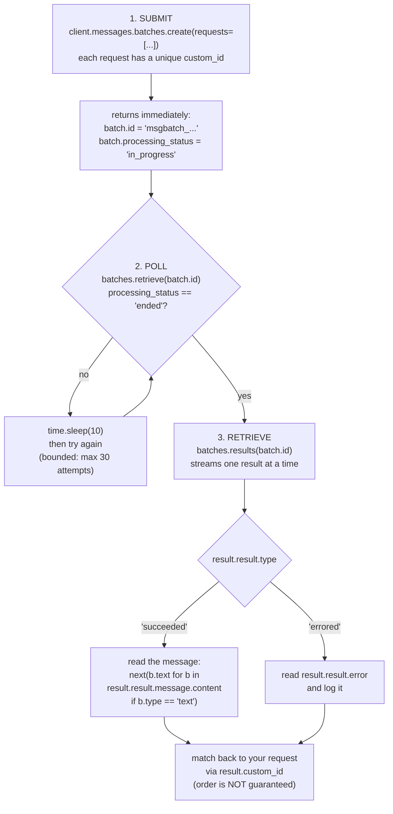

## 📘 Step 14 — Batch API: create, poll, retrieve results

<!-- pedagogy-header:begin -->
**Phase 4: Production concerns** · Step 14 of 22 · ~20 min · ~$0.001 in API calls

> **Why this matters:** When you need to classify 50,000 support tickets overnight, the Batch API halves the bill for work that does not need an answer this second.
<!-- pedagogy-header:end -->

### 🎯 What you'll learn

- The difference between a **synchronous** call and an **asynchronous job**
- The three-phase batch lifecycle: **submit → poll → retrieve**
- Why every request needs a unique **`custom_id`** (results come back out of order)
- How to write a **bounded polling loop** instead of a `while True` that can hang forever
- Python constructs used here: **`range()`**, **`for` loop with a counter**, **`break`**, **`time.sleep()`**, **f-string**, **`+=` (augmented assignment)**, **tuple unpacking**, **deeply nested attribute access**, **`if`/`elif`**

---

### 🧠 Theory — fire and forget, at half price

Everything so far has been **synchronous**: you call
`client.messages.create()`, your program stops, and it resumes when the reply
arrives. Great for chat. Terrible for 10,000 documents.

The **Message Batches API** is **asynchronous**: you hand over a pile of
requests, get an ID back immediately, and collect results later. In exchange
for that patience you get **50% of standard pricing**. Most batches finish in
minutes; the hard cap is 24 hours.

Because your program does *not* wait automatically, **you** are responsible
for asking "are you done yet?" That's what polling is.

#### The lifecycle



The single most important thing in that diagram is the loop back from
`sleep` to `retrieve`. Skip it and you call `batches.results()` while the
batch is still `in_progress` — you'll get nothing back, or an error, and your
tallies will be zero.

```python
import os, time
from dotenv import load_dotenv
from anthropic import Anthropic

load_dotenv()
config = {"ICA_API_KEY": os.environ.get("ICA_API_KEY")}

client = Anthropic(
    api_key=config["ICA_API_KEY"],
    base_url="https://api.servicesessentials.ibm.com",
)

# 1. Create a batch of independent requests, each with a unique custom_id
message_batch = client.messages.batches.create(
    requests=[
        {
            "custom_id": "my-first-request",
            "params": {
                "model": "claude-sonnet-5",
                "max_tokens": 100,
                "messages": [{"role": "user", "content": "Hello, world"}],
            },
        },
    ]
)
print(message_batch.id, message_batch.processing_status)   # in_progress

# 2. Poll for completion with a short, bounded loop (batches usually finish
#    within minutes — no need for a long-running `while True: sleep(60)`)
for attempt in range(30):
    batch = client.messages.batches.retrieve(message_batch.id)
    if batch.processing_status == "ended":
        break
    time.sleep(10)

# 3. Stream results (memory-efficient, one result at a time)
for result in client.messages.batches.results(message_batch.id):
    if result.result.type == "succeeded":
        text = next(b.text for b in result.result.message.content if b.type == "text")
        print(result.custom_id, "->", text)
    elif result.result.type == "errored":
        print(result.custom_id, "failed:", result.result.error)
```

#### The shape of a request, and the shape of a result

```
   REQUEST you send                       RESULT you get back
   ─────────────────                      ───────────────────
   {                                      result
     "custom_id": "capital-question",       .custom_id  = "capital-question"
     "params": {                            .result
        "model": ...,                          .type    = "succeeded" | "errored"
        "max_tokens": ...,                     .message = a normal Message object
        "messages": [ ... ]                        .content = [TextBlock, ...]
     }                                          .error   = present when errored
   }
   └─ "params" holds exactly what you'd
      pass to messages.create()
```

Notice `"params"` is a **nested dict** containing the *exact* arguments you'd
normally pass to `messages.create()`. That's the mental model: a batch is a
list of deferred `create()` calls.

Limits: 100,000 requests or 256MB per batch. Results are downloadable for 29
days. `max_tokens: 0` and `stream: true` are **not** supported inside a
batch request.

**What to expect:** the batch ID starts with `msgbatch_`, its status is
`in_progress` right away, then transitions to `ended` once processing
finishes. Results are matched back to your requests by `custom_id` — order
isn't guaranteed.

**When to use this:** bulk content generation, large-scale evals, offline
document processing, content moderation sweeps — anything where you don't
need an answer in real time and can wait for a big cost discount.

---

### 🐍 Python concepts, defined as they appear

**`range(n)`** — produces the integers `0, 1, 2, ... n-1`. `range(30)` gives
thirty numbers starting at 0. Combined with a `for` loop it means "do this at
most 30 times".

```python
for attempt in range(3):
    print(attempt)      # prints 0, then 1, then 2
```

That's also why we print `attempt + 1` — humans count from 1, `range` counts
from 0.

**`break`** — immediately exits the enclosing loop, skipping any remaining
iterations. Here it means "the batch is done; stop waiting."

**Bounded loop vs `while True`** — a `while True:` loop with no exit
condition runs forever if the batch never ends, hanging your terminal and
timing out CI. `for attempt in range(30)` with a `time.sleep(10)` inside gives
a hard ceiling of 30 × 10 = 300 seconds. Always bound your polling.

```python
while True:                  # ⚠️ can hang forever
    ...
for attempt in range(30):    # ✅ gives up after 30 tries
    ...
```

**`time.sleep(seconds)`** — pauses your program. Essential in a polling
loop: without it you'd hammer the API hundreds of times a second and get
rate-limited (HTTP 429).

**f-string** — a string literal prefixed with `f` where `{...}` is replaced
by the value of the expression inside:

```python
attempt = 0
print(f"poll_attempt_{attempt + 1}:")   # poll_attempt_1:
```

You can put arithmetic inside the braces. Without the `f` prefix, you'd
print the literal characters `{attempt + 1}`.

**`+=` (augmented assignment)** — `succeeded += 1` is shorthand for
`succeeded = succeeded + 1`. It's how you count things in a loop. The counter
must be initialised *before* the loop, or you get `NameError`.

**Tuple unpacking on one line** —

```python
succeeded, errored = 0, 0
```

Assigns `0` to both names in a single statement. Equivalent to two separate
lines; purely a convenience.

**Deeply nested attribute access** —

```python
result.result.message.content
```

Read it left to right as a path: the result item → its `result` payload → the
`message` inside → the `content` list of blocks. The doubled
`result.result` looks odd but is correct: the outer object wraps a
`custom_id` *and* a `result`.

**Generator expression with `next()`** — as in Steps 8 and 11: *"give me
`.text` from the first block whose `.type` is `"text"`."* Necessary because a
thinking block may come first.

**`if` / `elif` on a status string** — `"succeeded"` and `"errored"` are the
two outcomes you handle. Checking `.type` before reading `.message` matters:
an errored result has **no** `.message` at all.

---

### 🏋️ Exercise

1. Create **`exercises/practice14_batch_api.py`** with exactly this
   content:

   ```python
   import os
   import time
   from dotenv import load_dotenv
   from anthropic import Anthropic

   load_dotenv()
   config = {"ICA_API_KEY": os.environ.get("ICA_API_KEY")}

   client = Anthropic(
       api_key=config["ICA_API_KEY"],
       base_url="https://api.servicesessentials.ibm.com",
   )

   message_batch = client.messages.batches.create(requests=[
       {
           "custom_id": "capital-question",
           "params": {
               "model": "claude-sonnet-5",
               "max_tokens": 50,
               "messages": [{"role": "user", "content": "What is the capital of France? One word."}],
           },
       },
       {
           "custom_id": "math-question",
           "params": {
               "model": "claude-sonnet-5",
               "max_tokens": 50,
               "messages": [{"role": "user", "content": "What is 7 times 6? Just the number."}],
           },
       },
   ])
   print("batch_id:", message_batch.id)
   print("initial_status:", message_batch.processing_status)

   # Short, bounded polling loop — batches usually finish within minutes
   for attempt in range(30):
       batch = client.messages.batches.retrieve(message_batch.id)
       print(f"poll_attempt_{attempt + 1}:", batch.processing_status)
       if batch.processing_status == "ended":
           break
       time.sleep(10)

   succeeded, errored = 0, 0
   for result in client.messages.batches.results(message_batch.id):
       if result.result.type == "succeeded":
           succeeded += 1
           text = next(b.text for b in result.result.message.content if b.type == "text")
           print(result.custom_id, "SUCCEEDED ->", text)
       elif result.result.type == "errored":
           errored += 1
           print(result.custom_id, "ERRORED ->", result.result.error)

   print("succeeded:", succeeded)
   print("errored:", errored)
   ```

   ✅ **What should happen:** nothing yet — you're just creating the file.

---

### 🔍 Line-by-line walkthrough

| Code | What it does, in plain English |
| --- | --- |
| `import os` | For reading environment variables. |
| `import time` | Standard library timing module — we need `time.sleep`. |
| `from dotenv import load_dotenv` | One function from `python-dotenv`. |
| `from anthropic import Anthropic` | The SDK client class. |
| `load_dotenv()` | Loads `.env` into the environment. |
| `config = {"ICA_API_KEY": os.environ.get("ICA_API_KEY")}` | A **dict** holding the key; `.get()` returns `None` rather than raising if unset. |
| `client = Anthropic(api_key=..., base_url=...)` | Builds the client pointed at this course's gateway. |
| `message_batch = client.messages.batches.create(requests=[` | Submits the batch. `requests=` takes a **list**, one dict per queued request. This returns almost instantly — nothing has been generated yet. |
| `{ "custom_id": "capital-question",` | Your own label for this request. It must be **unique within the batch**; it's how you'll identify the answer later. |
| `"params": { ... }` | A **nested dict** holding exactly what you'd pass to `messages.create()`: `model`, `max_tokens`, `messages`. |
| `"model": "claude-sonnet-5",` | Sonnet — and remember batch pricing halves it again. |
| `"max_tokens": 50,` | Short answers, so 50 is generous. Must be > 0; `max_tokens: 0` is rejected inside a batch. |
| `"messages": [{"role": "user", "content": "What is the capital of France? One word."}],` | The actual prompt for this request. |
| `{ "custom_id": "math-question", ... }` | A **second, independent** request in the same batch. Batch entries never see each other — they aren't a conversation. |
| `])` | Closes the list and the call. |
| `print("batch_id:", message_batch.id)` | The server-assigned ID, starting with `msgbatch_`. You need it for every later call. |
| `print("initial_status:", message_batch.processing_status)` | Almost always `in_progress` — proof that submission returned before the work finished. |
| `for attempt in range(30):` | Poll at most 30 times. `attempt` counts 0…29. |
| `batch = client.messages.batches.retrieve(message_batch.id)` | Asks the server for the batch's *current* state. This is a fresh object each time — you must re-fetch; `message_batch` never updates itself. |
| `print(f"poll_attempt_{attempt + 1}:", batch.processing_status)` | An **f-string** giving human-friendly 1-based numbering, plus the status. |
| `if batch.processing_status == "ended":` | `"ended"` means all requests are finished (successfully *or* not). |
| `break` | Stop polling — we're done waiting. |
| `time.sleep(10)` | Only reached when still in progress. Waits 10 seconds so we don't spam the API. |
| `succeeded, errored = 0, 0` | Two counters initialised before the loop, via **tuple unpacking**. |
| `for result in client.messages.batches.results(message_batch.id):` | Streams results **one at a time** rather than loading all of them into memory — which matters when a batch has 100,000 entries. |
| `if result.result.type == "succeeded":` | Check the outcome *before* touching `.message`. |
| `succeeded += 1` | Increment the counter. |
| `text = next(b.text for b in result.result.message.content if b.type == "text")` | Pull the reply text out, skipping any non-text block. |
| `print(result.custom_id, "SUCCEEDED ->", text)` | Report which of *your* requests this answer belongs to. |
| `elif result.result.type == "errored":` | The failure branch. |
| `errored += 1` | Count the failure. |
| `print(result.custom_id, "ERRORED ->", result.result.error)` | An errored result has `.error` but **no** `.message`. |
| `print("succeeded:", succeeded)` | Final tally. The checker requires this to be at least `2`. |
| `print("errored:", errored)` | Final tally. The checker requires exactly `0`. |

---

### ⚠️ What happens if you skip this

**Skip the polling loop entirely** and call `batches.results()` right after
`create()` → the batch is still `in_progress`, so there's nothing to stream.
You get zero results and:

```
succeeded: 0
errored: 0
```

…followed by the checker failing with *"Expected both batch requests to
succeed (succeeded: 2), got succeeded: 0."* **This is the classic async
mistake: reading results before the work is done.**

**Poll `message_batch` instead of re-fetching** →

```python
for attempt in range(30):
    if message_batch.processing_status == "ended":   # ⚠️ never changes
        break
```

`message_batch` is a snapshot from submission time. Its status is frozen at
`in_progress` forever, so the loop burns all 30 attempts. You must call
`batches.retrieve()` each time to get fresh state.

**Skip `time.sleep(10)`** → you fire 30 retrieve calls in under a second,
get rate-limited (`429 Too Many Requests`), and still finish before the batch
does. Sleep is not optional in a polling loop.

**Use `while True:` with no bound** → if the batch stalls, your script hangs
forever. Locally that's annoying; in CI the checker kills it at 600 seconds
and you fail with a timeout. Bound your loops.

**Give two requests the same `custom_id`** → the API rejects the batch:

```
anthropic.BadRequestError: 400 - requests: custom_id must be unique
```

**Assume results come back in submission order** → they don't. If you write
`results[0]` and treat it as the capital question, you'll silently mislabel
data. Always match on `result.custom_id`.

**Read `result.result.message` without checking `.type` first** → on an
errored entry:

```
AttributeError: 'MessageBatchErroredResult' object has no attribute 'message'
```

Guard with the `if result.result.type == "succeeded"` check.

**Index `result.result.message.content[0].text`** →
`AttributeError: 'ThinkingBlock' object has no attribute 'text'` when a
thinking block lands first. Use the generator expression.

**Forget to initialise `succeeded, errored = 0, 0`** →
`NameError: name 'succeeded' is not defined` on the first `+=`. You can't
increment something that doesn't exist yet.

**Set `"max_tokens": 0`** → rejected; batches don't allow it. **Set
`"stream": true`** → also rejected; streaming is meaningless for an async
job.

---

2. Run it locally (make sure `.env` still has your `ICA_API_KEY`):

   ```bash
   python exercises/practice14_batch_api.py
   ```

   ✅ **What should happen:** `batch_id:` prints an ID starting with
   `msgbatch_`, `initial_status:` usually prints `in_progress`, several
   `poll_attempt_N:` lines print while the batch finishes, and finally you
   see both `capital-question SUCCEEDED -> ...` and `math-question
   SUCCEEDED -> ...` lines, ending with `succeeded: 2` and `errored: 0`.
   This can take a few minutes — that's expected for an async batch job.

   Roughly:

   ```
   batch_id: msgbatch_01AbCdEfGhIjKlMnOpQrSt
   initial_status: in_progress
   poll_attempt_1: in_progress
   poll_attempt_2: in_progress
   poll_attempt_3: ended
   capital-question SUCCEEDED -> Paris
   math-question SUCCEEDED -> 42
   succeeded: 2
   errored: 0
   ```

   The number of `poll_attempt_` lines and the order of the two
   `SUCCEEDED` lines will vary between runs. Both are normal.

3. Commit and push:

   ```bash
   git add exercises/practice14_batch_api.py
   git commit -m "Step 14: batch API - create, poll, retrieve results"
   git push
   ```

4. The **"Step 14 - Batch API"** check runs automatically. On success this
   issue closes and **Step 15** (Async client) opens automatically.

<details>
<summary>Having trouble?</summary>

**Setup problems**

- Double-check the file path is exactly
  `exercises/practice14_batch_api.py`.
- `ModuleNotFoundError: No module named 'dotenv'` — install
  `python-dotenv`.
- 401 / authentication error — confirm `.env` is in the directory you run
  `python` from and `load_dotenv()` runs before `Anthropic(...)`.
- `AttributeError: 'Messages' object has no attribute 'batches'` — your
  `anthropic` package is too old. Run `pip install --upgrade anthropic`.

**Polling problems**

- Every `poll_attempt_` line says `in_progress` and the script gives up —
  you're checking `message_batch.processing_status` (the frozen snapshot)
  instead of the freshly retrieved `batch.processing_status`. Re-fetch
  inside the loop.
- `429 Too Many Requests` — you removed `time.sleep(10)`. Put it back.
- The polling loop is intentionally *bounded* (30 attempts × 10s = 5
  minutes max) rather than an unbounded `while True` — this keeps both
  your local run and the CI check from hanging forever if something goes
  wrong.
- `succeeded: 0` and `errored: 0` with no `SUCCEEDED` lines — you read
  results before the batch ended. The poll loop must run *before* the
  results loop.

**Result-reading problems**

- If you see `AttributeError: 'ThinkingBlock' object has no attribute
  'text'` or `StopIteration`, some models return a thinking block before
  the text block — use `next(b.text for b in result.result.message.content
  if b.type == "text")` instead of indexing `content[0]` directly.
- `AttributeError: ... object has no attribute 'message'` — you read
  `.message` on an errored result. Check `result.result.type ==
  "succeeded"` first.
- Results come back matched by `custom_id`, not in submission order — that
  is why each request needs a unique `custom_id` and why you should match
  on it rather than assuming array order.
- `NameError: name 'succeeded' is not defined` — the
  `succeeded, errored = 0, 0` line must come *before* the results loop.

**Batch submission problems**

- `400 - custom_id must be unique` — both entries share the same
  `custom_id`. Give them distinct names.
- If `errored:` is greater than 0, double-check both requests' `params`
  match the shape shown above exactly (valid `model`, non-zero
  `max_tokens`, a `messages` list).
- `400 - requests.0.params.max_tokens` — you used `0`. Batches require a
  positive `max_tokens`, and `stream: true` isn't allowed either.

**Checker specifics**

- Keep `load_dotenv()`, `ICA_API_KEY`, and `base_url=` in your client setup
  — the checker verifies your script still uses this project's real client
  pattern, not the plain `Anthropic()` default.
- It also greps your source for `batches.create`, `batches.retrieve`, and
  `batches.results`, and greps stdout for the labels `batch_id:`,
  `initial_status:`, `succeeded:`, and `errored:` — with `batch_id:`
  followed by `msgbatch_`, `succeeded:` at least `2`, and `errored:`
  exactly `0`. Don't rename any printed label.
- CI runners can be slow — the checker gives the script several minutes to
  finish polling before timing out.

</details>

<details>
<summary>Stuck? Reveal the solution</summary>

Give it a real attempt first — debugging your own code is where the learning
happens. If you're properly stuck, the complete working reference is here:

**[`solutions/practice14_batch_api.py`](../../solutions/practice14_batch_api.py)**

Copy it to `exercises/practice14_batch_api.py`, run it, then read it line by line and make
sure you can explain *why* each part is there.

</details>
