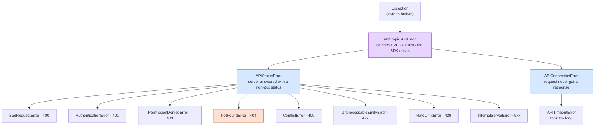

## 📘 Step 16 — Error Handling: `APIError`, `RateLimitError`, `APIStatusError`

<!-- pedagogy-header:begin -->
**Phase 4: Production concerns** · Step 16 of 22 · ~20 min · $0 in API calls

> **Why this matters:** Rate limits and overload errors are not edge cases at scale, they are Tuesday — catching the typed exception instead of crashing is what separates a demo from a service.
<!-- pedagogy-header:end -->

### 🎯 What you'll learn

- What an **exception** is and what `try` / `except` actually do
- Why you catch **specific** SDK exception classes instead of bare `Exception`
- The full Anthropic error family tree, and which HTTP status maps to which class
- How to deliberately *cause* an error so you can practise catching it
- `type(e).__name__` and `str(e)` — how to print *what* went wrong without a traceback
- What breaks if you catch too broadly, or not at all

---

### 🧠 The concept in plain English

When something goes wrong, Python doesn't return an error code — it **raises an
exception**. An exception is an object that gets thrown up through your code
looking for someone to catch it. If nobody catches it, Python prints a
**traceback** and kills your program with exit code 1.

`try` / `except` is how you catch one:

```python
try:
    risky_thing()            # run this
except SomeError as e:       # if SomeError is raised in the try block...
    print("handled:", e)     # ...run this instead of crashing
```

The `as e` part gives you a variable name (`e`) bound to the exception object,
so you can inspect it: its class, its message, its HTTP status code.

**Why specific classes matter.** The SDK doesn't raise one generic "something
broke" error. It raises a *different class per failure mode*, because your
correct response differs wildly:

- Rate limited (429)? **Wait and retry** — the request was fine.
- Network hiccup? **Retry immediately** — the request never arrived.
- Bad model name (404)? **Retrying is pointless forever.** Fix your code.

If you catch bare `Exception`, all three collapse into one branch and you can't
react correctly — worse, you also silently swallow your *own* bugs (typos,
`KeyError`, `AttributeError`) and turn a loud crash into a confusing wrong
answer. Catch narrow, act specifically.

---

### 🗺️ Diagram — the Anthropic exception family tree



**How to read the arrows:** a child *is a* parent. `NotFoundError` **is an**
`APIStatusError`, which **is an** `APIError`. So `except anthropic.APIStatusError`
catches a `NotFoundError` too — catching a parent catches every descendant.
That's exactly what this exercise relies on: the gateway might report an unknown
model as 404 or 400, and `APIStatusError` covers both.

**Order matters in `except` chains.** Python tries each `except` top to bottom
and takes the *first* match. Always list the **narrow** classes first and the
**broad** ones last, or the broad one shadows everything below it.

---

### 🐍 Python constructs used in this step

| Construct | Plain-English meaning |
|---|---|
| `try:` | "Attempt the code in this block. If it raises, jump to a matching `except` instead of crashing." |
| `except SomeError as e:` | "If the raised exception **is a** `SomeError` (or a subclass), run this block with the exception object bound to `e`." |
| exception **class** vs **instance** | `anthropic.NotFoundError` is the class (the category). `e` is the instance (this one specific failure, with its own message and status code). |
| `type(e)` | Built-in that returns the **class** of any object — here, the actual exception class that was raised. |
| `type(e).__name__` | Every class has a `__name__` attribute holding its name as a plain string, e.g. `"NotFoundError"`. Dunder (`__x__`) names are Python's built-in metadata attributes. |
| `str(e)` | Converts the exception to its human-readable message string — the same text you'd see on the traceback's last line. |
| `e.status_code` | Attribute present on `APIStatusError` instances: the numeric HTTP status the server returned (404, 429, …). |
| `e.__cause__` | The *underlying* lower-level exception the SDK wrapped. On `APIConnectionError` this is the raw socket/DNS error — the real reason you couldn't connect. |
| `except A: ... except B: ...` | Multiple branches. Python picks the **first** matching one and skips the rest. |
| subclass / inheritance | A class can be built "on top of" another and inherits its identity. `RateLimitError` inherits from `APIStatusError`, so it counts as one everywhere. |
| `import anthropic` (module import) | Imports the whole package, so you reference things as `anthropic.NotFoundError`. Contrast with `from anthropic import Anthropic`, which pulls one name out directly. This step uses the module form so the exception classes are all reachable. |

---

### 📖 Reference: the error table

Anthropic errors are subclasses of `anthropic.APIError`, split by HTTP
status code so you can branch on what actually happened:

| Status | Exception | What it usually means | Retry? |
|---|---|---|---|
| 400 | `BadRequestError` | Malformed request body / bad params | ❌ fix your code |
| 401 | `AuthenticationError` | Missing or wrong API key | ❌ fix your key |
| 403 | `PermissionDeniedError` | Key valid, but not allowed to do this | ❌ fix access |
| 404 | `NotFoundError` | Unknown model, file, or endpoint | ❌ fix the string |
| 409 | `ConflictError` | Resource state conflict | ⚠️ maybe |
| 422 | `UnprocessableEntityError` | Semantically invalid request | ❌ fix your code |
| 429 | `RateLimitError` | Too many requests / tokens per minute | ✅ back off, retry |
| ≥500 | `InternalServerError` | Anthropic-side problem | ✅ retry with backoff |
| N/A (network) | `APIConnectionError` | DNS/socket failure, never reached server | ✅ retry |
| N/A (timeout) | `APITimeoutError` | Server took too long to answer | ✅ retry |

```python
import anthropic

try:
    message = client.messages.create(
        model="claude-sonnet-5", max_tokens=1024,
        messages=[{"role": "user", "content": "Hello, Claude"}],
    )
except anthropic.APIConnectionError as e:
    print("Could not reach the server:", e.__cause__)
except anthropic.RateLimitError as e:
    print("429 — back off and retry later")
except anthropic.APIStatusError as e:
    print("Non-2xx response:", e.status_code, e.response)
```

Notice the ordering: `RateLimitError` (narrow) is listed **before**
`APIStatusError` (its parent). Flip those two and the 429 branch becomes
unreachable dead code — Python would match `APIStatusError` first.

**When to use this:** every production integration. Always at least catch
`RateLimitError` (back off) and `APIConnectionError` (transient network)
separately from `APIStatusError` (something's actually wrong with your
request). `NotFoundError` and `BadRequestError` are both subclasses of
`APIStatusError`, which is itself a subclass of `APIError` — so a broad
`except anthropic.APIError` catches everything the SDK can raise.

> 💡 **You get free retries already.** The SDK automatically retries certain
> failures (429s, connection errors, 5xx) twice by default before it ever
> raises. So by the time an exception reaches your `except`, the easy retries
> have already been tried. Tune it with
> `anthropic.Anthropic(max_retries=5, ...)`.

---

### 🔍 Line-by-line walkthrough of the exercise script

```python
import os                                        # 1
import anthropic                                 # 2
from dotenv import load_dotenv                   # 3

load_dotenv()                                    # 4
config = {"ICA_API_KEY": os.environ.get("ICA_API_KEY")}   # 5

client = anthropic.Anthropic(                    # 6
    api_key=config["ICA_API_KEY"],               # 7
    base_url="https://api.servicesessentials.ibm.com",    # 8
)

try:                                             # 9
    client.messages.create(                      # 10
        model="claude-does-not-exist-9000",       # 11
        max_tokens=100,                          # 12
        messages=[{"role": "user", "content": "Hi"}],     # 13
    )
    print("No error was raised — this should not happen!")  # 14
except anthropic.APIStatusError as e:            # 15
    print("error_type:", type(e).__name__)       # 16
    print("error_message:", str(e))              # 17
```

1. `os` — used to read the environment variable holding your key.
2. `import anthropic` — the whole module, so `anthropic.Anthropic` **and**
   `anthropic.APIStatusError` are both reachable.
3. `load_dotenv` — reads `.env` into the environment.
4. Runs that read. Without it, `os.environ.get("ICA_API_KEY")` returns `None`.
5. A **dict** holding the key under a named slot — the same pattern used
   throughout this course.
6. Builds the client. No network traffic yet; this is pure configuration.
7. Passes the key in as a keyword argument.
8. Routes through this project's IBM gateway rather than `api.anthropic.com`.
9. `try:` opens the protected block. Everything indented under it is guarded.
10. The API call — this **will** fail, on purpose.
11. **The deliberate mistake.** `claude-does-not-exist-9000` is not a real
    model, so the server rejects the request with a 4xx status and the SDK
    raises an `APIStatusError` subclass (usually `NotFoundError`).
12. `max_tokens` is still required by the API even for a doomed request.
13. A minimal one-turn message list.
14. **Unreachable in normal operation.** Line 10 raises, so control jumps
    straight to line 15 and this `print` is skipped. It exists as a tripwire: if
    you ever *do* see it, the model name got fixed and the exercise no longer
    demonstrates anything. (The checker fails the step if this line prints.)
15. `except anthropic.APIStatusError as e:` — catch any non-2xx HTTP response.
    We intentionally catch the **parent**, not `NotFoundError`, because
    different gateways report an unknown model differently (404 vs 400) and
    both are `APIStatusError` subclasses.
16. Prints the concrete class name that was actually raised — e.g.
    `error_type: NotFoundError`. `type(e)` gives the class; `.__name__` turns it
    into a printable string.
17. Prints the human-readable message from the API. `str(e)` is the same text
    you'd see on the last line of a traceback — but here it's *your* output, not
    a crash.

Because the exception was caught, the script exits with code **0** (success).
That's the whole point: a handled error is not a crash.

---

### ⚠️ What happens if you skip this

| If you skip / change… | What actually happens |
|---|---|
| the whole `try` / `except` | The `NotFoundError` propagates, Python prints a full traceback to **stderr**, and the process exits with code 1. The checker runs your script and fails on the non-zero exit code. |
| `except anthropic.APIStatusError` → `except Exception` | It technically still catches this one error, but now it *also* swallows your typos, `KeyError`s and `AttributeError`s, silently mislabelling real bugs as API problems. Debugging becomes guesswork. **This is the single most common beginner mistake in error handling.** |
| `except` → bare `except:` (no class at all) | Even worse: it also catches `KeyboardInterrupt` and `SystemExit`, so you can't even Ctrl-C out of a hung script. Never write a bare `except:`. |
| listing `APIStatusError` **before** `RateLimitError` in a multi-branch chain | The `RateLimitError` branch becomes unreachable — the parent matches first, so your back-off logic never runs and you hammer a rate-limited API. |
| fixing the model name to a valid one | No exception is raised, `print("No error was raised…")` executes, and the checker explicitly fails on that string. The invalid model **is** the exercise. |
| `print("error_type:", ...)` → any other label | The checker greps stdout for the exact substrings `error_type:` and `error_message:`. Rename them and the step fails even though your code works. |
| `load_dotenv()` or `base_url=` | You'll hit `AuthenticationError` instead of the intended 404, *and* the checker greps your source for both strings. |
| swallowing the exception with `pass` instead of printing | Script exits 0 but prints nothing; the checker fails on the missing labels. Silent `except: pass` is how production bugs hide for months. |

---

### 🏋️ Exercise

1. Create **`exercises/practice16_error_handling.py`** with exactly this
   content. It deliberately sends an invalid model name to trigger a real
   `NotFoundError` from the API, then catches it and prints the exception
   type and message:

   ```python
   import os
   import anthropic
   from dotenv import load_dotenv

   load_dotenv()
   config = {"ICA_API_KEY": os.environ.get("ICA_API_KEY")}

   client = anthropic.Anthropic(
       api_key=config["ICA_API_KEY"],
       base_url="https://api.servicesessentials.ibm.com",
   )

   try:
       client.messages.create(
           model="claude-does-not-exist-9000",
           max_tokens=100,
           messages=[{"role": "user", "content": "Hi"}],
       )
       print("No error was raised — this should not happen!")
   except anthropic.APIStatusError as e:
       print("error_type:", type(e).__name__)
       print("error_message:", str(e))
   ```

   ✅ **What should happen:** nothing yet — you're just creating the file.

2. Run it locally:

   ```bash
   python exercises/practice16_error_handling.py
   ```

   ✅ **What should happen:** two lines print — `error_type: NotFoundError`
   (a subclass of `APIStatusError`) and `error_message:` followed by the
   API's error text. No raw traceback should leak to your terminal —
   the `except` block caught it cleanly.

   You can confirm the script "succeeded" (i.e. handled the error rather than
   crashing) by checking the exit code:

   ```bash
   python exercises/practice16_error_handling.py; echo "exit code: $?"
   ```

   `exit code: 0` means the exception was caught. `exit code: 1` means it
   escaped.

3. Commit and push:

   ```bash
   git add exercises/practice16_error_handling.py
   git commit -m "Step 16: error handling with APIStatusError"
   git push
   ```

4. The **"Step 16 - Error Handling"** check runs automatically. On success
   this issue closes and **Step 17** (Models available) opens
   automatically.

<details>
<summary>Having trouble?</summary>

**Expected beginner errors**

- `NameError: name 'anthropic' is not defined` — you wrote
  `from anthropic import Anthropic` only. You need `import anthropic` (the
  module) to reach `anthropic.APIStatusError`.
- `AttributeError: module 'anthropic' has no attribute 'APIStatusErrror'` —
  typo in the exception class name (note the triple `r`). Copy the name exactly.
- `IndentationError: expected an indented block after 'try' statement` — the
  body of `try:` must be indented one level. Same for the `except:` body.
- `SyntaxError: invalid syntax` on the `except` line — you forgot the colon, or
  wrote `except anthropic.APIStatusError e:` without `as`.
- Full traceback still printed and exit code 1 — the exception raised is *not* a
  subclass of what you're catching. Temporarily add a last-resort
  `except anthropic.APIError as e:` branch to see the real class name, then
  narrow it back down.
- `error_type: AuthenticationError` instead of `NotFoundError` — your key isn't
  loading (see below). The `try`/`except` worked perfectly; the failure just
  happened for a different reason.
- Script prints nothing and exits 0 — you probably have `pass` (or a bare
  comment) in the `except` body instead of the two `print` calls.

**Course-specific gotchas**

- If nothing gets caught and you see `"No error was raised"`, double check
  the model string is actually invalid (`claude-does-not-exist-9000`) and
  that you didn't accidentally fix the typo.
- `anthropic.NotFoundError` is itself an `anthropic.APIStatusError`, which
  is itself an `anthropic.APIError` — catching the parent class is fine
  and is what this exercise does deliberately, since the exact status code
  a gateway returns for an unknown model can vary.
- If you get an `AuthenticationError` instead, your `ICA_API_KEY` isn't
  being loaded correctly — check your `.env` file and `load_dotenv()`.
- Keep `load_dotenv()`, `ICA_API_KEY`, and `base_url=` in your client setup
  — the checker verifies your script still uses this project's real client
  pattern.
- Keep the printed labels exactly `error_type:` and `error_message:` — the
  checker greps stdout for those literal strings.
- The checker also requires the word `except` and the string `anthropic.` to
  appear in your source, so keep the fully-qualified exception name rather than
  importing the class bare.

</details>

<details>
<summary>Stuck? Reveal the solution</summary>

Give it a real attempt first — debugging your own code is where the learning
happens. If you're properly stuck, the complete working reference is here:

**[`solutions/practice16_error_handling.py`](../../solutions/practice16_error_handling.py)**

Copy it to `exercises/practice16_error_handling.py`, run it, then read it line by line and make
sure you can explain *why* each part is there.

</details>
