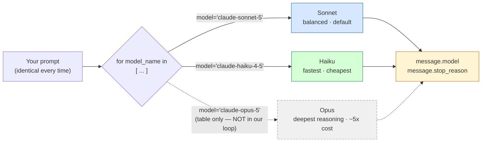

## 📘 Step 17 — Compare models: same call, different model string

<!-- pedagogy-header:begin -->
**Phase 5: Scale & deployment** · Step 17 of 22 · ~15 min · ~$0.003 in API calls

> **Why this matters:** Swapping one model string can cut cost by an order of magnitude — knowing when Haiku is good enough and when you need Sonnet is a direct line on your bill.
<!-- pedagogy-header:end -->

### 🎯 What you'll learn

- How Claude model IDs are structured, and why they're just **strings**
- The Opus / Sonnet / Haiku trade-off, and how to pick one
- How to write a `for` loop over a **list** of model names to test several in one script
- What `message.model` and `message.stop_reason` tell you about a response
- Why a typo in a model string is a `404`, not a helpful "did you mean…?"

---

### 🧠 The concept in plain English

There is no `client.use_opus()` or `client.use_haiku()` method. The model is
**just a string** you hand to `messages.create()` in the `model=` argument.
Everything else about your code — the messages list, `max_tokens`, how you read
the response — stays byte-for-byte identical.

That's a big deal for two reasons:

1. **Swapping models is a one-character-class change.** You can develop against
   cheap fast Haiku and flip to Sonnet for production by changing one string
   (ideally one read from config, not hard-coded).
2. **Nothing validates it for you at write time.** A string is a string. Python
   is perfectly happy with `model="claude-sonent-5"`; you find out it's wrong
   only when the server answers **404** at runtime.

Two useful fields come back on every response:

- **`message.model`** — the model the server *actually* used. Echoing this back
  is how you *prove* your request went where you thought it went (and it's why
  this step's checker requires at least two **distinct** values).
- **`message.stop_reason`** — *why* Claude stopped generating:

| `stop_reason` | Meaning |
|---|---|
| `end_turn` | Claude finished its thought naturally. The normal, healthy case. |
| `max_tokens` | You ran out of budget mid-sentence — the reply is **truncated**. Raise `max_tokens`. |
| `stop_sequence` | Claude hit one of your custom `stop_sequences` strings. |
| `tool_use` | Claude wants to call a tool and is waiting on you (Step 8). |

`stop_reason` is the field beginners most often ignore and then get burned by:
a truncated answer *looks* like a model quality problem but is really a
`max_tokens` problem, and `stop_reason: max_tokens` tells you so instantly.

---

### 🗺️ Diagram — one code path, three model strings



The dashed Opus branch is **documentation only**. This course runs on Sonnet and
Haiku on purpose — see the cost note below.

---

### 📖 Reference: model families

Model IDs follow the pattern `claude-{name}-{major}[-{minor}]`. Always check
[docs.claude.com/en/docs/about-claude/models/overview](https://docs.claude.com/en/docs/about-claude/models/overview)
for the live table since names/pricing change.

| Family | Example model ID | Best for |
|---|---|---|
| Opus | `claude-opus-5` | Complex agentic coding, enterprise-grade reasoning |
| Sonnet | `claude-sonnet-5` | Best balance of speed and intelligence — default workhorse |
| Haiku | `claude-haiku-4-5` | Fastest, near-frontier intelligence, cost-sensitive high-volume tasks |

Swapping models is just a string change:

```python
message = client.messages.create(
    model="claude-sonnet-5",   # <- just a string, swap freely
    max_tokens=1024,
    messages=[{"role": "user", "content": "Hi"}],
)
```

**When to use this:** Pick Opus when quality/reasoning depth matters most and
cost is secondary; Sonnet for the default "just build the thing" choice;
Haiku for high-throughput, latency-sensitive, or budget-constrained
workloads. Model IDs are **pinned** — the underlying model behind a given ID
never silently changes, so upgrading is always an explicit code change.

> 💰 **Cost note for this course:** the table above *mentions* Opus for
> completeness, but every runnable script in this course uses `claude-sonnet-5`
> and `claude-haiku-4-5` only. Opus costs roughly **5× more per token** and no
> exercise here needs that horsepower. Please don't add Opus to the loop below —
> you'd pay real money for an identical learning outcome.

---

### 🐍 Python constructs used in this step

| Construct | Plain-English meaning |
|---|---|
| `["claude-sonnet-5", "claude-haiku-4-5"]` | A **list**: an ordered, square-bracketed collection. Here it holds two strings. |
| `for model_name in [...]:` | A **for loop**. It runs the indented body once per item in the list, with `model_name` bound to the current item each time. Two items → two full API calls. |
| loop variable | `model_name` is a name *you* chose. It is re-assigned on every pass through the loop; nothing special about the word itself. |
| `prompt = "..."` | A plain **variable assignment**, pulled out of the loop so both models get the *identical* prompt — otherwise you'd be comparing two different things and learning nothing. |
| `model=model_name` | A **keyword argument** whose value is the loop variable. The parameter name is `model`; the value is whatever string this iteration holds. |
| `os.environ["ICA_API_KEY"]` | Dict-style lookup of an environment variable. Square brackets raise `KeyError` if it's missing (unlike `.get()`, which returns `None`) — a deliberately loud failure. |
| `print("model:", message.model)` | `print` with **two arguments** joins them with a single space, producing exactly `model: claude-sonnet-5`. That single space is what the checker's regex expects. |
| attribute access (`message.model`) | The dot reads a field off the response object. The SDK parses the JSON reply into a typed object so you get `.model` / `.stop_reason` instead of `response["model"]`. |
| `import anthropic` vs `from anthropic import Anthropic` | The first imports the package (use `anthropic.Anthropic(...)`); the second pulls one class out. This step uses the module form. |

---

### 🔍 Line-by-line walkthrough of the exercise script

```python
import os                                       # 1
from dotenv import load_dotenv                  # 2
import anthropic                                # 3

load_dotenv()                                   # 4

client = anthropic.Anthropic(                    # 5
    api_key=os.environ["ICA_API_KEY"],           # 6
    base_url="https://api.servicesessentials.ibm.com",   # 7
)

prompt = "In one sentence, what is your name/model family?"   # 8

for model_name in ["claude-sonnet-5", "claude-haiku-4-5"]:    # 9
    message = client.messages.create(            # 10
        model=model_name,                        # 11
        max_tokens=100,                          # 12
        messages=[{"role": "user", "content": prompt}],       # 13
    )
    print("model:", message.model)               # 14
    print("stop_reason:", message.stop_reason)   # 15
```

1. `os` — needed to read the environment variable holding your API key.
2. `load_dotenv` — copies `KEY=value` lines from `.env` into the environment.
3. `import anthropic` — the SDK package.
4. Performs the `.env` read. Must come **before** line 6, or the variable won't
   exist yet.
5. Builds the client once and reuses it for every model. You do **not** need one
   client per model — the model is a per-request argument, not client state.
6. Fetches the key. Bracket lookup means a missing key fails immediately with a
   clear `KeyError` rather than silently sending `None`.
7. Routes through this project's IBM gateway.
8. The shared prompt, defined **once**. Same input for both models = a fair
   comparison.
9. The loop. Two strings in the list → the indented body runs twice, first with
   `model_name == "claude-sonnet-5"`, then with `"claude-haiku-4-5"`.
10. The API call. Everything about it is identical between iterations *except*
    line 11 — that's the lesson.
11. `model=model_name` — the loop variable feeds straight into the request. This
    is the only line that differs between the two calls.
12. `max_tokens=100` — enough for one sentence, cheap for both models.
13. The standard one-user-turn messages list, using the shared `prompt`.
14. Prints the model the **server** reports using. Because the loop runs twice
    with different strings, you get two *different* values — which is exactly
    what the checker verifies.
15. Prints why generation stopped. Expect `end_turn` for a short complete answer;
    if you see `max_tokens`, line 12's budget was too small.

**Total output: 4 lines** — two per model, in loop order.

---

### ⚠️ What happens if you skip this

| If you skip / change… | What actually happens |
|---|---|
| a correct model string (typo, e.g. `claude-sonet-5`) | HTTP **404** → `anthropic.NotFoundError`. There is no fuzzy matching and no "did you mean". The script crashes on the first bad iteration and the checker fails on the non-zero exit code. |
| using two *different* models (e.g. Sonnet twice) | Both calls succeed, four lines print, but the checker fails with *"expected at least 2 DIFFERENT model names"* — it calls `set()` on the parsed values and requires ≥2 unique ones. |
| the `for` loop (single hard-coded call) | Only one `model:` line prints. The checker requires **≥2** `model:` lines *and* ≥2 `stop_reason:` lines. Fails. |
| the exact labels `model:` / `stop_reason:` | The checker regexes stdout for `model:\s*(\S+)` and `stop_reason:\s*(\S+)`. Rename to `Model =` or `model_name:` and it can't find them — your code is right and the step still fails. |
| defining `prompt` inside the loop with different text per model | The comparison becomes meaningless: you can no longer tell whether a difference came from the model or the prompt. |
| `stop_reason` (ignoring it entirely) | You'll one day ship a feature that silently truncates every answer at `max_tokens` and blame the model. `stop_reason` is your early-warning field. |
| adding `claude-opus-5` to the loop | It would probably work — and cost roughly 5× more per token for zero extra learning. Keep the runnable list to Sonnet + Haiku. |
| `load_dotenv()` / `base_url=` | `KeyError: 'ICA_API_KEY'` or requests aimed at the wrong host — and the checker greps your source for both strings. |

---

### 🏋️ Exercise

1. Create a new file at `exercises/practice17_models_available.py`.

2. Set up the client exactly like previous steps (`load_dotenv()`,
`ICA_API_KEY`, `base_url=`).

3. Loop over at least 2-3 different model name strings — for example
`"claude-sonnet-5"` and `"claude-haiku-4-5"` — and for each
one call `client.messages.create()` with the same prompt (e.g. "In one
sentence, what is your name/model family?"). Print two labeled lines per
model:

```python
print("model:", message.model)
print("stop_reason:", message.stop_reason)
```

Your full loop should look like this:

```python
import os
from dotenv import load_dotenv
import anthropic

load_dotenv()

client = anthropic.Anthropic(
    api_key=os.environ["ICA_API_KEY"],
    base_url="https://api.servicesessentials.ibm.com",
)

prompt = "In one sentence, what is your name/model family?"

# Note: we deliberately use Sonnet + Haiku here, NOT Opus — Opus costs
# roughly 5x more per token and this exercise doesn't need that horsepower.
for model_name in ["claude-sonnet-5", "claude-haiku-4-5"]:
    message = client.messages.create(
        model=model_name,
        max_tokens=100,
        messages=[{"role": "user", "content": prompt}],
    )
    print("model:", message.model)
    print("stop_reason:", message.stop_reason)
```

✅ What should happen: for each model in your loop, you get one `model:` line
and one `stop_reason:` line — four lines total for two models. The `model:`
values should differ across lines (proving you actually hit different
models, not the same one three times), and `stop_reason` will almost always
be `end_turn` for a short, complete answer.

4. Run it with `python exercises/practice17_models_available.py`.

✅ What should happen: all model calls succeed with no errors, and you can
visually compare which model IDs came back. This is the exact defensive
pattern real apps use before committing to a specific model in production.

Roughly:

```
model: claude-sonnet-5
stop_reason: end_turn
model: claude-haiku-4-5
stop_reason: end_turn
```

(The exact returned IDs may include a date suffix depending on the gateway —
that's fine, as long as the two values differ from each other.)

5. Commit and push your file to `main`. The workflow will run the
   checker, verify at least two distinct models were used, comment on this
   issue, and open Step 18.

<details>
<summary>Having trouble?</summary>

**Expected beginner errors**

- `anthropic.NotFoundError: Error code: 404 - model: claude-...` — a typo in a
  model string. Compare it character-by-character with the table above; they're
  case-sensitive and hyphen-sensitive (`claude-haiku-4-5`, not
  `claude-haiku-4.5`).
- `KeyError: 'ICA_API_KEY'` — `load_dotenv()` is missing, is called *after* the
  client setup, or your `.env` file isn't in the directory you ran `python` from.
- `IndentationError: unexpected indent` / only one model's output appears — the
  `print` lines must be indented **inside** the `for` loop. If they sit outside
  it, they run once, after the loop, using the last `message`.
- `NameError: name 'message' is not defined` — your `print`s are above the
  `client.messages.create(...)` call, or outside the loop entirely.
- `NameError: name 'anthropic' is not defined` — you wrote
  `from anthropic import Anthropic`; either use `Anthropic(...)` directly or
  switch to `import anthropic` as shown.
- `stop_reason: max_tokens` instead of `end_turn` — harmless here (the checker
  accepts any value), but it means the reply got cut off. Raise `max_tokens`.
- `TypeError: 'str' object is not callable` after editing — you likely shadowed a
  name, e.g. assigned `print = ...` or `prompt()`. Restart from the snippet.

**Checker-specific gotchas**

- If the checker says "expected 2 lines starting with 'model:'", make sure
  you print the label exactly as `model:` (lowercase, colon, one space) —
  the checker parses stdout with a regex looking for that exact prefix.
- If it says "expected 2 DIFFERENT model names", double check you're not
  accidentally calling the same model string in every loop iteration.
- If a model name causes an error, verify the spelling matches the table
  above exactly — model strings are case-sensitive and don't tolerate typos.
- Keep `load_dotenv()`, `ICA_API_KEY`, and `base_url=` in your client setup
  — the checker verifies your script still uses this project's real client
  pattern.
- The checker allows up to 90 seconds for the whole script. Two short calls
  finish well inside that, but don't add a dozen models to the loop.

</details>

<details>
<summary>Stuck? Reveal the solution</summary>

Give it a real attempt first — debugging your own code is where the learning
happens. If you're properly stuck, the complete working reference is here:

**[`solutions/practice17_models_available.py`](../../solutions/practice17_models_available.py)**

Copy it to `exercises/practice17_models_available.py`, run it, then read it line by line and make
sure you can explain *why* each part is there.

</details>
