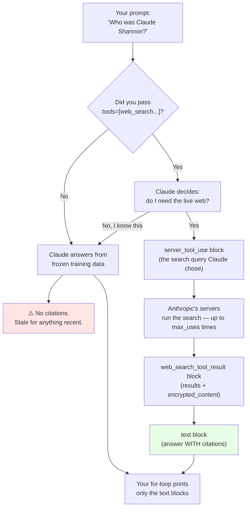

## 📘 Step 20 — Web search tool (server-side)

<!-- pedagogy-header:begin -->
**Phase 3: Tools & reasoning** · Step 20 of 22 · ~20 min · ~$0.04 in API calls

> **Why this matters:** Claude's training data has a cutoff; web search with citations is how you answer 'what happened this week' and give the user a link to verify it.
<!-- pedagogy-header:end -->

### 🎯 What you'll learn

- Why a model with a training cutoff needs live web access
- Enabling web search with one dict in `tools=` — and what `max_uses` protects you from
- **List comprehensions** — reading `[block.type for block in response.content]` out loud
- The block types that come back from a server-side search, and why you must filter for `text`
- What `encrypted_content` is and why you must never edit it
- What breaks with a mistyped type string, a missing `max_uses`, or unguarded `.text` access

---

### 🧠 The concept in plain English

A model's knowledge is frozen at its **training cutoff** — the date the training
data stopped. Ask it about today's weather, a stock price, or a product released
last month and it will either refuse or invent something.

The web search tool fixes this the same way Step 19 fixed arithmetic: you add one
tool entry, and Anthropic's servers perform the searches, read the results, and
feed them into Claude's reasoning — **with citations** — all inside one
`messages.create()` call. You write no scraping code, manage no API keys for a
search provider, and parse no HTML.

Two things to internalize:

1. **It's Claude's choice.** You *offer* the tool; Claude decides whether the
   question needs it. Ask "what is 2+2" with search enabled and it won't search.
2. **Searches cost money per search**, not just per token — hence `max_uses`.

---

### 🗺️ Diagram — where the answer comes from



**Read the response as a list of blocks, in order:**

```
response.content  ──▶  [ server_tool_use , web_search_tool_result , text ]
                          │                  │                       │
                          what Claude        what the web            the prose
                          searched for       returned                you print
```

---

### 📖 Reference

Like code execution, web search is a **server-side
tool** — Claude searches the live web itself and returns cited results,
all within one `messages.create()` call. No scraping code on your end.

```python
response = client.messages.create(
    model="claude-sonnet-5",
    max_tokens=1024,
    messages=[{"role": "user", "content": "What's the weather in NYC right now?"}],
    tools=[{"type": "web_search_20250305", "name": "web_search", "max_uses": 5}],
)
print(response.content)   # includes server_tool_use, web_search_tool_result, and cited text blocks
```

Optional tool-definition fields:
- `max_uses` — cap how many searches Claude can make per request.
- `allowed_domains` / `blocked_domains` — mutually exclusive allow/deny lists.
- `user_location` — localize results by city/region/country/timezone.

```python
tools = [{
    "type": "web_search_20250305",
    "name": "web_search",
    "max_uses": 5,
    "allowed_domains": ["wikipedia.org"],
    "user_location": {"type": "approximate", "city": "San Francisco", "country": "US"},
}]
```

Every search result carries `encrypted_content` — pass it back
**unmodified** on later turns to preserve multi-turn search context.
Priced at **$10 per 1,000 searches**, on top of the normal token cost of
ingested results.

**When to use this:** Current events, live prices/scores/stats, anything
about a person/company/product that could have changed since training —
basically "Claude, go check the internet" moments. Always ships with
citations built in.

⚠️ **Exact type string matters.** The reference doc for this SDK version
specifies `"type": "web_search_20250305"` — copy it exactly. A typo (like
`web_search_20305`) causes a validation error, not a silent failure.

---

### 🐍 Python constructs used in this step

| Construct | Plain-English meaning |
|---|---|
| `tools=[{...}]` | A **list** (square brackets) holding one **dict** (curly braces). List, because you can enable several tools; dict, because each tool is a bundle of named settings. |
| `"max_uses": 3` | A dict entry whose value is an `int`. A **budget cap**: Claude may search at most 3 times for this request. |
| `"allowed_domains": ["wikipedia.org"]` | A dict value that is itself a **list of strings** — nesting lists inside dicts is normal in API payloads. |
| `"user_location": {...}` | A dict value that is itself a **dict** — a nested object. |
| `[block.type for block in response.content]` | A **list comprehension**: "build a new list containing `block.type` for every `block` in `response.content`." Equivalent to a `for` loop that `.append()`s, but one line. Square brackets → it builds a real list immediately (unlike the round-bracket generator in Step 18). |
| `block` | Just a **loop variable** name. It is *not* a keyword — `for b in ...` would work identically. |
| `.type` vs `.text` | `.type` exists on **every** block. `.text` exists **only** on text blocks. That asymmetry is why line 14 needs an `if`. |
| `for ... : / if ... :` | Two levels of indentation: the `if` is inside the loop, the `print` is inside the `if`. Python uses indentation, not braces, to express nesting. |
| `print("block_types:", block_types)` | Prints the label then the list's repr, e.g. `block_types: ['server_tool_use', 'web_search_tool_result', 'text']`. Both labels here are checker-required. |
| `encrypted_content` | A field on each search result — an opaque blob. Treat it as read-only: copy it verbatim into later turns, never parse or truncate it. |

---

### 🔍 Line-by-line walkthrough of the exercise script

```python
import anthropic                                                  # 1
import os                                                         # 2
from dotenv import load_dotenv                                    # 3

load_dotenv()                                                     # 4

client = anthropic.Anthropic(                                      # 5
    api_key=os.environ.get("ICA_API_KEY"),                         # 6
    base_url="https://api.servicesessentials.ibm.com",             # 7
)

response = client.messages.create(                                 # 8
    model="claude-sonnet-5",                                       # 9
    max_tokens=1024,                                               # 10
    messages=[{"role": "user", "content": "Use web search to tell me who Claude Shannon was, in one or two sentences."}],   # 11
    tools=[{"type": "web_search_20250305", "name": "web_search", "max_uses": 3}],   # 12
)

block_types = [block.type for block in response.content]           # 13
print("block_types:", block_types)                                 # 14

for block in response.content:                                     # 15
    if block.type == "text":                                       # 16
        print("answer:", block.text)                               # 17
```

1–4. Standard imports and `.env` loading (see Step 19 for the details).
5–7. The usual gateway client. Tools are configured per-request, not on the client.
8. One call covers prompt → search → cited answer.
9. Sonnet handles this easily; no need for a pricier model.
10. 1024 tokens is enough for a two-sentence answer plus citations. (Lower than
    Step 19's 4096 because Claude isn't writing a program here.)
11. The prompt explicitly says **"Use web search"**. That nudge matters — Shannon
    is well inside training data, so without it Claude may skip searching and you'd
    see only `['text']` in `block_types`.
12. The tool: exact versioned `type`, the `name` Claude refers to, and
    `max_uses: 3` as a hard spend cap.
13. The **list comprehension** — turns the response's blocks into a plain list of
    their type names, so you can *see* the server-side machinery.
14. Prints it under the required `block_types:` label. This line is the whole
    point of the "show your work" part of the exercise.
15. Loops the blocks again, this time for content.
16. Filters to `text` blocks only — the search-machinery blocks have no `.text`.
17. Prints the prose under the required `answer:` label.

---

### ⚠️ What happens if you skip this

| If you skip / change… | What actually happens |
|---|---|
| the exact type string (e.g. `web_search_20305`) | Immediate `BadRequestError` — a validation error, **not** a graceful fallback. The checker also greps your source for `web_search_20250305`. |
| the `tools=` argument entirely | The call succeeds but Claude answers from frozen training data with **no citations**, and `block_types` shows only `['text']`. For a "what happened today" question it would be flatly wrong. |
| `"max_uses": 3` | Nothing breaks, but Claude may run many searches for one prompt. At $10/1,000 searches that's a real (if small) bill. Always cap it in learning/CI code. |
| `if block.type == "text":` | `AttributeError: 'ServerToolUseBlock'/'WebSearchToolResultBlock' object has no attribute 'text'`. |
| the `block_types:` print | The checker greps stdout for the literal `block_types:` and fails. Keep the label exactly. |
| the `answer:` print | Same — the checker requires the literal `answer:`. Both labels are mandatory. |
| the "Use web search" nudge in the prompt | Claude may answer from memory. Not a crash, but you never observe the tool blocks you're here to learn about. |
| indenting `print("answer:", ...)` at the `for` level instead of inside the `if` | The `if` becomes a no-op guard and line 17 runs for every block → `AttributeError`. Indentation *is* the logic in Python. |
| modifying/dropping `encrypted_content` on a follow-up turn | The API rejects the turn or loses the search context, so Claude "forgets" what it found. Copy it byte-for-byte. |
| using both `allowed_domains` and `blocked_domains` | They're **mutually exclusive** → validation error. Pick one. |
| `load_dotenv()` / `ICA_API_KEY` / `base_url=` | `AuthenticationError` or wrong host — and the checker greps your source for all three. |

---

### 🏋️ Exercise

1. Create a file called `exercises/practice20_web_search.py` in
   this repo with the following content:

```python
import anthropic
import os
from dotenv import load_dotenv

load_dotenv()

client = anthropic.Anthropic(
    api_key=os.environ.get("ICA_API_KEY"),
    base_url="https://api.servicesessentials.ibm.com",
)

response = client.messages.create(
    model="claude-sonnet-5",
    max_tokens=1024,
    messages=[{"role": "user", "content": "Use web search to tell me who Claude Shannon was, in one or two sentences."}],
    tools=[{"type": "web_search_20250305", "name": "web_search", "max_uses": 3}],
)

block_types = [block.type for block in response.content]
print("block_types:", block_types)

for block in response.content:
    if block.type == "text":
        print("answer:", block.text)
```

✅ **What should happen:** the script prints a `block_types:` line
showing a mix of tool/result block types (something like
`['server_tool_use', 'web_search_tool_result', 'text']`), followed by an
`answer:` line where Claude explains who Claude Shannon was (the "father
of information theory").

Roughly:

```
block_types: ['text', 'server_tool_use', 'web_search_tool_result', 'text']
answer: Claude Shannon was an American mathematician and engineer known as the
father of information theory...
```

The exact list varies run to run — Claude may narrate before searching, or search
twice. That's normal.

2. Run it locally to confirm it works:

```bash
python exercises/practice20_web_search.py
```

✅ **What should happen:** no errors, `block_types:` lists at least one
tool-related block type plus `text`, and the answer mentions Shannon /
information theory.

3. Commit and push your file to the `main` branch:

```bash
git add exercises/practice20_web_search.py
git commit -m "Complete step 20: web search tool"
git push
```

✅ **What should happen:** pushing triggers the "Step 20 - Web Search
Tool" GitHub Actions workflow. Watch the **Actions** tab — a green
checkmark means this issue will auto-close and Step 21 (the final step!)
will open automatically.

<details>
<summary>Having trouble?</summary>

**Expected beginner errors**

- `AttributeError: 'WebSearchToolResultBlock' object has no attribute 'text'` —
  the `print("answer:", ...)` is not indented inside the `if`. Check that it sits
  two levels in (4 spaces for the `if`, 8 for the `print`).
- `NameError: name 'block' is not defined` on line 13 — you wrote the list
  comprehension with the parts reversed. The order is
  `[<expression> for <var> in <iterable>]`, i.e. `block.type` **first**.
- `TypeError: 'ListComprehension' ...` / `SyntaxError` — a missing `for` or a
  stray comma inside the brackets. There are **no commas** in a comprehension.
- `block_types: ['text']` only — Claude answered from memory. Keep the "Use web
  search" wording, or ask about something genuinely recent.
- `TypeError: create() got an unexpected keyword argument 'tool'` — it's plural:
  `tools=`.
- `anthropic.BadRequestError: ... allowed_domains and blocked_domains` — you added
  both optional fields. Use at most one.
- `anthropic.AuthenticationError` — `load_dotenv()` missing, or you ran `python`
  from a directory without the `.env` file.
- The call may take 10–30 seconds while searches run. The checker allows 90.

**Course-specific gotchas**

- Double-check the tool type string is exactly `web_search_20250305` — a
  single-digit typo (like `web_search_20305`) triggers a validation error
  from the API rather than a graceful fallback.
- If `block_types` only shows `['text']` with no tool blocks, Claude may
  have decided it already knew the answer without searching — try making
  the prompt more explicitly time-sensitive or explicitly say "search the
  web" to nudge it toward using the tool.
- Web search is billed per search ($10/1,000), separate from token costs
  — this exercise uses `max_uses: 3` to keep costs minimal.
- Keep `load_dotenv()`, `ICA_API_KEY`, and `base_url=` in your client
  setup — the checker verifies your script still uses this project's real
  client pattern.

</details>

<details>
<summary>Stuck? Reveal the solution</summary>

Give it a real attempt first — debugging your own code is where the learning
happens. If you're properly stuck, the complete working reference is here:

**[`solutions/practice20_web_search.py`](../../solutions/practice20_web_search.py)**

Copy it to `exercises/practice20_web_search.py`, run it, then read it line by line and make
sure you can explain *why* each part is there.

</details>
