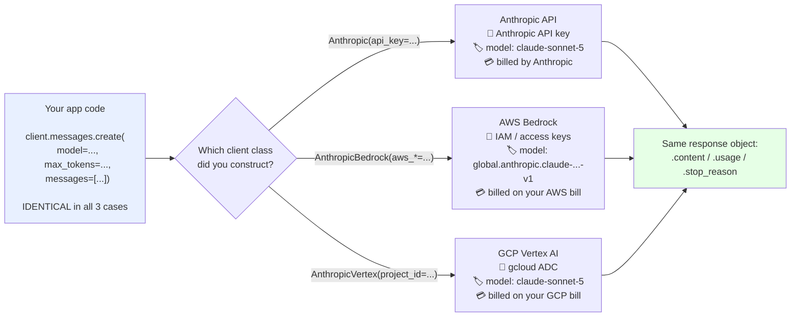

## 📘 Step 21 — Bedrock and Vertex client variants

<!-- pedagogy-header:begin -->
**Phase 5: Scale & deployment** · Step 21 of 22 · ~15 min · $0 in API calls

> **Why this matters:** Most enterprises will not hand you a new vendor invoice, but they will let you run Claude inside the AWS or GCP account they already audit — same call shape, different constructor.
<!-- pedagogy-header:end -->

This is the last step that teaches a new piece of API surface — after it
comes the capstone, where you build something yourself. This one is also
different from the rest in that you're not required to have AWS or GCP
credentials. It's a **conceptual/comparison** exercise about the SDK's
cloud-partner client variants.

### 🎯 What you'll learn

- What a "client" actually *is* — and why swapping the client class swaps the whole backend
- The three client classes: `Anthropic`, `AnthropicBedrock`, `AnthropicVertex`
- **Importing multiple names** on one line: `from anthropic import A, B`
- **Constructors** and **keyword arguments** — why building a client makes *no* network call
- `type(obj).__name__` — how to ask an object what class it is
- Why model ID strings differ per platform, and what a wrong one costs you

---

### 🧠 The concept in plain English

A **client** is just a Python object that holds two things:

1. **where** to send requests (a base URL / cloud endpoint), and
2. **how to prove who you are** (credentials).

Everything else — `messages.create()`, streaming, token counting, tools — is
identical machinery layered on top. So when your company says *"we can't use an
Anthropic API key, all AI spend has to go through our AWS account"*, you don't
rewrite your app. You change **one line**: which client class you construct.

That's the entire lesson. Three doors into the same house:

| Class | Talks to | Auth | Install |
|---|---|---|---|
| `Anthropic` | Anthropic's API directly (what you've used for 20 steps) | Anthropic API key | `pip install anthropic` |
| `AnthropicBedrock` | Claude hosted inside **AWS Bedrock** | AWS access key/secret or IAM role | `pip install "anthropic[bedrock]"` |
| `AnthropicVertex` | Claude hosted inside **Google Cloud Vertex AI** | `gcloud auth application-default login` | `pip install "anthropic[vertex]"` |

---

### 🗺️ Diagram — three clients, one request shape



**What changes vs. what doesn't:**

```
                      ┌─────────────── CHANGES ───────────────┐
   client class  →     Anthropic | AnthropicBedrock | AnthropicVertex
   credentials   →     API key   | AWS IAM          | gcloud ADC
   model ID      →     claude-sonnet-5 | global.anthropic.claude-...-v1 | claude-sonnet-5
   feature parity→     newest    | may lag          | may lag

                      ┌─────────── STAYS THE SAME ────────────┐
   .messages.create(model=, max_tokens=, messages=[...])
   response.content / response.usage / response.stop_reason
   streaming, tools, token counting, error classes
```

---

### 📖 Reference

Same SDK, different backend — swap the client class when Claude is
deployed through a cloud partner instead of the direct Claude API.

```python
# AWS Bedrock
from anthropic import AnthropicBedrock

client = AnthropicBedrock(
    aws_access_key="<access key>",
    aws_secret_key="<secret key>",
    aws_region="us-west-2",
)
message = client.messages.create(
    model="global.anthropic.claude-opus-4-6-v1",   # note the AWS-flavored model ID
    max_tokens=256,
    messages=[{"role": "user", "content": "Hello, world"}],
)
```

```python
# Google Cloud Vertex / Agent Platform
from anthropic import AnthropicVertex

client = AnthropicVertex(project_id="MY_PROJECT_ID", region="global")
message = client.messages.create(
    model="claude-sonnet-5",
    max_tokens=100,
    messages=[{"role": "user", "content": "Hey Claude!"}],
)
```

`messages.create()` and friends work identically once the client is
constructed — same params, same response shape. What differs:
authentication (AWS creds/`boto3` session vs. `gcloud auth
application-default login`), model ID format (Bedrock prepends
`anthropic.` and sometimes a region prefix like `us.` or `global.`), and
feature parity (some newer features — e.g. server-side tools, Files API —
lag behind on partner platforms).

**When to use which:**
- **`Anthropic`** (direct) — the default choice for most projects; talks
  straight to the Anthropic API with an Anthropic API key.
- **`AnthropicBedrock`** — you already run infrastructure on AWS and want
  Claude billed/governed through your existing AWS account (IAM, VPC,
  compliance boundary) instead of a separate Anthropic API key
  relationship. Install with `pip install "anthropic[bedrock]"`.
- **`AnthropicVertex`** — same idea, but for Google Cloud: you want Claude
  billed/governed through an existing GCP project via Vertex AI, using
  `gcloud` application-default credentials instead of an Anthropic API
  key. Install with `pip install "anthropic[vertex]"`.

> **Note on assumptions:** this step does not make a live call to the
> direct Anthropic API through this project's usual `ICA_API_KEY` /
> gateway pattern — it's a static, text-based exercise. There's no
> "correct" live response to check because most learners won't have real
> AWS or GCP credentials. Instead, the checker verifies your script
> demonstrates both client constructions correctly and explains, in a
> comment, when you'd reach for each one.

---

### 🐍 Python constructs used in this step

| Construct | Plain-English meaning |
|---|---|
| `from anthropic import AnthropicBedrock, AnthropicVertex` | Imports **two names** from one module in a single statement — the comma-separated list is just a convenience; two separate `from ... import ...` lines behave identically. |
| **class** | A blueprint for objects. `AnthropicBedrock` is a class; `bedrock_client` is an **instance** of it. |
| `AnthropicBedrock(...)` | Calling a class **constructs** an instance (this runs its `__init__`). Round brackets after a class name = "build me one of these". |
| **keyword arguments** | `aws_region="us-west-2"` names the parameter explicitly, so order doesn't matter. Contrast with **positional** args, where order is everything. Every client class uses keywords. |
| `# comment` | Everything after `#` on a line is ignored by Python. Used here to document *intent* — and the checker actually reads these comments. |
| `type(bedrock_client)` | Returns the object's class itself (e.g. `<class 'anthropic.AnthropicBedrock'>`). |
| `.__name__` | A **dunder** ("double underscore") attribute holding a class's plain-text name, so `type(x).__name__` gives the tidy string `"AnthropicBedrock"` instead of the noisy repr. |
| assignment (`bedrock_client = ...`) | Binds the constructed object to a name so you can use it later. |
| **lazy connection** | Not syntax, but the key idea: the constructor only *stores* your settings. No socket is opened until you call `.messages.create()`. That's exactly why fake credentials are safe here. |

---

### 🔍 Line-by-line walkthrough of the exercise script

```python
from anthropic import AnthropicBedrock, AnthropicVertex      # 1

# --- AWS Bedrock ---                                        # 2
# Use AnthropicBedrock when your team already runs ...        # 3
bedrock_client = AnthropicBedrock(                            # 4
    aws_access_key="fake-access-key-for-practice",            # 5
    aws_secret_key="fake-secret-key-for-practice",            # 6
    aws_region="us-west-2",                                   # 7
)

# --- Google Cloud Vertex AI ---                             # 8
# Use AnthropicVertex when your team already runs ...         # 9
vertex_client = AnthropicVertex(                              # 10
    project_id="fake-project-for-practice",                   # 11
    region="global",                                          # 12
)

print("Bedrock client:", type(bedrock_client).__name__)       # 13
print("Vertex client:", type(vertex_client).__name__)         # 14
print("Same .messages.create(...) call shape works on both — only the constructor differs.")  # 15
```

1. One import statement pulling in both partner client classes. Note there's no
   `import anthropic` + `anthropic.AnthropicBedrock` here — the `from` form binds
   the class names directly into your file's namespace. **The checker requires a
   `from anthropic import ...` line.**
2. A plain section-divider comment. Purely for humans.
3. The **explanatory comment the checker looks for.** It must contain the word
   "use" plus one of "when" / "if" / "want", and sit within six lines above the
   class usage. Keep it.
4. Constructs the Bedrock client. **This performs zero network I/O** — it just
   validates and stores what you passed.
5–6. Fake credentials. Perfectly fine, because nothing authenticates until a
   request is actually sent. In real code these come from an IAM role or the
   environment — never hard-coded.
7. The AWS region. Bedrock model availability varies by region, which is why it's
   a required part of the address.
8–9. Same divider + required explanatory comment pattern, for Vertex.
10. Constructs the Vertex client — again, no network call.
11. On GCP the unit of billing and isolation is a **project**, so `project_id`
    replaces AWS's key/secret pair. Credentials come from `gcloud` on the machine,
    which is why there's no key argument at all.
12. `region="global"` routes to Google's multi-region endpoint.
13–14. `type(x).__name__` proves each object really is the class you think it is.
    A nice debugging habit whenever you're unsure what you're holding.
15. The punchline of the step: from here on, your calling code is identical
    regardless of which of the three clients you built.

---

### ⚠️ What happens if you skip this

| If you skip / change… | What actually happens |
|---|---|
| the `# Use ... when ...` comments | **The checker fails**, even though the code runs perfectly. It greps for a `#` comment containing "use" plus "when"/"if"/"want" within 6 lines above each class usage. This is deliberate: knowing *when* to pick a client is the actual skill. |
| the `from anthropic import ...` form (e.g. `import anthropic` + `anthropic.AnthropicBedrock(...)`) | The checker's regex `from\s+anthropic\s+import` won't match → fail. Functionally equivalent Python, but this step grades the documented pattern. |
| abbreviating names (`Bedrock`, `Vertex`) | `ImportError: cannot import name 'Bedrock' from 'anthropic'`, and the checker requires the literal full class names. |
| worrying about fake credentials | Nothing happens — that's the point. Constructors are lazy. Swap in real creds and only then does auth matter. |
| adding a real `.messages.create()` call with fake creds | `anthropic.AuthenticationError` (or a `botocore` credentials error). The step deliberately stops before the call so it works for everyone. |
| the Bedrock-flavored model ID (using `claude-sonnet-5` on Bedrock) | `ValidationException` / model-not-found from AWS. Bedrock IDs are namespaced (`anthropic.`, plus a region prefix like `us.` or `global.`, plus a `-v1` suffix). A model string that works on one platform is **not** portable. |
| installing the plain `anthropic` package only, then using Bedrock for real | `ImportError` about a missing `boto3`. Partner clients need extras: `pip install "anthropic[bedrock]"` or `"anthropic[vertex]"`. |
| assuming full feature parity | Newer features (server-side tools from Steps 19–20, the Files API from Step 18) can lag on partner platforms. Check the docs before promising a feature on Bedrock/Vertex. |
| `aws_region=` / `region=` / `project_id=` | Missing required keyword → `TypeError` from the constructor, or requests aimed at the wrong endpoint. |

---

### 🏋️ Exercise

1. Create a file called
   `exercises/practice21_bedrock_vertex.py` in this repo. It should:
   - Import `AnthropicBedrock` and `AnthropicVertex` from `anthropic`.
   - Construct one instance of each (fake/placeholder credentials are fine
     — building the client object never makes a network call).
   - Include a comment explaining when you'd use each one.

Example:

```python
from anthropic import AnthropicBedrock, AnthropicVertex

# --- AWS Bedrock ---
# Use AnthropicBedrock when your team already runs infrastructure on AWS
# and wants Claude usage billed/governed through that existing AWS account
# (IAM roles, VPC boundaries, AWS cost reporting) rather than a separate
# Anthropic API key. Auth comes from AWS credentials (access key/secret
# key or an IAM role), not an Anthropic API key.
bedrock_client = AnthropicBedrock(
    aws_access_key="fake-access-key-for-practice",
    aws_secret_key="fake-secret-key-for-practice",
    aws_region="us-west-2",
)

# --- Google Cloud Vertex AI ---
# Use AnthropicVertex when your team already runs infrastructure on GCP
# and wants Claude usage billed/governed through that existing GCP project
# via Vertex AI, using gcloud application-default credentials instead of
# an Anthropic API key.
vertex_client = AnthropicVertex(
    project_id="fake-project-for-practice",
    region="global",
)

print("Bedrock client:", type(bedrock_client).__name__)
print("Vertex client:", type(vertex_client).__name__)
print("Same .messages.create(...) call shape works on both — only the constructor differs.")
```

✅ **What should happen:** running the script prints the two client class
names with no errors (constructing these clients never talks to AWS/GCP —
that only happens on `.messages.create()`, which this exercise
deliberately skips since most learners won't have real cloud creds).

Exactly:

```
Bedrock client: AnthropicBedrock
Vertex client: AnthropicVertex
Same .messages.create(...) call shape works on both — only the constructor differs.
```

2. Run it locally to confirm it works:

```bash
python exercises/practice21_bedrock_vertex.py
```

✅ **What should happen:** two lines printing `AnthropicBedrock` and
`AnthropicVertex`, plus the reminder line — no exceptions, no network
calls.

3. Commit and push your file to the `main` branch:

```bash
git add exercises/practice21_bedrock_vertex.py
git commit -m "Complete step 21: Bedrock and Vertex client variants"
git push
```

✅ **What should happen:** pushing triggers the "Step 21 - Bedrock and
Vertex Clients" GitHub Actions workflow. A green checkmark closes this issue
and opens **Step 22 — the capstone**, where you put everything you've learned
into one small application of your own.

<details>
<summary>Having trouble?</summary>

**Expected beginner errors**

- `ImportError: cannot import name 'AnthropicBedrock' from 'anthropic'` — your
  installed SDK is old. Upgrade with `pip install -U anthropic`. (You do *not*
  need the `[bedrock]` extra just to import and construct the class; you need it
  to actually send requests.)
- `TypeError: __init__() got an unexpected keyword argument 'aws_key'` — the
  parameter names are `aws_access_key`, `aws_secret_key`, `aws_region`. Copy them
  exactly.
- `TypeError: __init__() missing 1 required ... 'project_id'` — `AnthropicVertex`
  needs `project_id=`; there is no key/secret pair because auth comes from
  `gcloud`.
- `AttributeError: 'AnthropicBedrock' object has no attribute '__name__'` — you
  wrote `bedrock_client.__name__`. `__name__` lives on the **class**, so it's
  `type(bedrock_client).__name__`.
- `NameError: name 'AnthropicVertex' is not defined` — you imported only one class.
  Both names must be on the import line (or on two import lines).
- Checker says it *"couldn't find an explanatory comment"* — your comment is
  missing the trigger words, or it's more than 6 lines above the constructor. Make
  sure a line like `# Use AnthropicBedrock when ...` sits immediately above each
  client.
- The script finishes instantly. If it hangs, you accidentally added a
  `.messages.create()` call — remove it.

**Course-specific gotchas**

- This is the one step in the course with **no live API call required** —
  the checker only inspects your script's source text, it does not run
  it against a real endpoint.
- Make sure your script contains the literal class names `AnthropicBedrock`
  and `AnthropicVertex` (not just `Bedrock`/`Vertex` abbreviations).
- Make sure you have an actual explanatory comment (a `#` line) near each
  client construction — not just the import statement — describing when
  you'd pick that variant. The checker looks for a `#` comment containing
  words like "use" and "when" near each class name.
- You do NOT need real AWS or GCP credentials to complete this exercise —
  fake placeholder strings are correct and expected, since constructing a
  client object never makes a network call.
- Note this step needs **no** `ICA_API_KEY`, `load_dotenv()`, or `base_url=` —
  unlike every other checker in the course, `check_step21.py` skips all of that.

</details>

<details>
<summary>Stuck? Reveal the solution</summary>

Give it a real attempt first — debugging your own code is where the learning
happens. If you're properly stuck, the complete working reference is here:

**[`solutions/practice21_bedrock_vertex.py`](../../solutions/practice21_bedrock_vertex.py)**

Copy it to `exercises/practice21_bedrock_vertex.py`, run it, then read it line by line and make
sure you can explain *why* each part is there.

</details>
