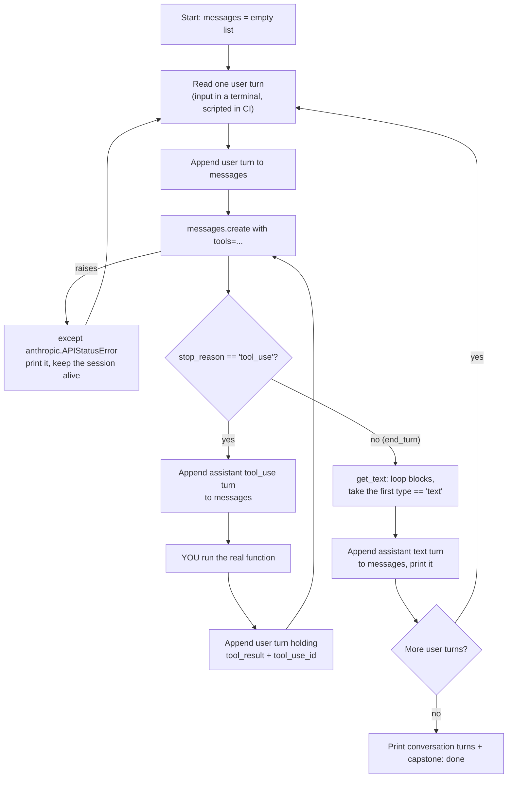

## 📘 Step 22 — Capstone: build a tool-using CLI assistant (FINAL STEP)

<!-- pedagogy-header:begin -->
**Phase 5: Scale & deployment** · Step 22 of 22 · ~60 min · ~$0.05 in API calls

> **Why this matters:** Every previous step taught one feature in isolation. Real work never arrives one feature at a time — a shippable assistant has to hold a conversation, call your code, and survive the API having a bad day, all in the same file. This is the step where the course stops teaching and starts checking whether you can build.
<!-- pedagogy-header:end -->

This is the **capstone**. It is deliberately different from Steps 1–21.

Up to now every step handed you a complete, copy-pasteable program and
explained it line by line. **This one does not.** You get the
architecture, the requirements, and the exact output contract the grader
checks — the code is yours to write. That is the point: you already met
every ingredient. Assembling them is the skill.

### 🎯 What you'll build

A command-line assistant, in a single file, that:

1. Holds a **multi-turn conversation** — it remembers earlier turns.
2. Offers Claude **at least one real tool** you implement in Python
   (a calculator, or a small lookup table — your choice).
3. Correctly performs the **`tool_use` → `tool_result` round trip**.
4. **Survives API failures** via `try`/`except` on a *specific* anthropic
   exception class.
5. Reads replies with the **safe text-extraction pattern** — never
   `content[0].text`.

### 🧠 Theory — what an "app" adds on top of a call

A `messages.create()` call is a single transaction. An *app* is a **loop
around state**. Three things have to be true at once, and they interact:

- **State**: the `messages` list only grows. The API is stateless, so your
  list *is* the conversation's memory. Drop a turn and Claude gets amnesia.
- **Control flow**: a reply is not always the answer. If
  `stop_reason == "tool_use"`, the turn is *not over* — you owe the API a
  `tool_result` before you get prose back. That makes it an **inner loop**
  nested inside your conversation loop.
- **Failure**: any call can raise. If an exception escapes, your whole
  session dies and the user loses their conversation. Catching it turns a
  crash into one bad turn.

The tricky interaction is between the first two: the tool round trip has
to append **both** the assistant's `tool_use` turn *and* your
`tool_result` turn to the same `messages` list the conversation loop is
using — in that order. Get the order wrong and the API rejects the
request (see the skip table below).

#### The app loop, visually



Note the arrow from `I` back to `D`, not to `B`. One user question can
cost you two or more API calls. That loop-back is the shape of every
agent you will ever write.

---

### 🔤 Glossary — the words this step reuses

| Term | What it means here |
| --- | --- |
| **Turn** | One entry in the `messages` list: a dict with a `role` and a `content`. A tool round trip adds **two** turns (the assistant's `tool_use`, then your `tool_result`), not one. |
| **Conversation state** | Your `messages` list. There is no server-side session — if it isn't in the list you send, Claude has never heard of it. |
| **Tool schema** | The `input_schema` JSON Schema dict inside your tool definition. It's how Claude knows what arguments your function takes. Without it there is nothing to call. |
| **`tool_use` block** | A block in `response.content` where Claude asks you to run a function. Carries `.id`, `.name`, `.input`. |
| **`tool_result` block** | A dict *you* build: `{"type": "tool_result", "tool_use_id": ..., "content": ...}`. The `tool_use_id` is the receipt number linking answer to question. |
| **`stop_reason`** | Why Claude stopped. `"end_turn"` = it answered. `"tool_use"` = it paused and is waiting on you. Your loop condition. |
| **Agentic loop** | Repeating "call → run tool → call again" until `stop_reason` is no longer `"tool_use"`. Claude may need several tools in a row. |
| **Specific exception** | An SDK class such as `anthropic.APIStatusError`, `anthropic.RateLimitError`, `anthropic.APIConnectionError`. Specific because `except Exception` also swallows your own typos. |
| **Safe text extraction** | Looping (or `next(...)`) over `response.content` for the first block whose `.type == "text"`. Block order is **not** guaranteed. |
| **Non-interactive mode** | GitHub Actions has no keyboard. `input()` there raises `EOFError`, so your script must fall back to a scripted list of questions. |

---

### 📋 Requirements

Create **`exercises/practice22_capstone.py`**. The grader checks the
requirements below — both by reading your source and by running it.

**R1 — Standard client setup.** `load_dotenv()`, the key from
`ICA_API_KEY`, and `base_url="https://api.servicesessentials.ibm.com"`,
exactly as in every previous step. Model is `claude-sonnet-5`.

**R2 — A real tool.** A tool definition with `name`, `description`, and
an `input_schema`, plus an actual Python function that computes the
answer. A calculator (`"expression"` in, number out) or a lookup dict
(`"city"` in, stored fact out) are both fine. It must genuinely run —
returning a hardcoded string regardless of input does not count.

**R3 — The full round trip.** When `stop_reason == "tool_use"`: append
the assistant turn (`{"role": "assistant", "content": response.content}`),
run your function, then append
`{"role": "user", "content": [{"type": "tool_result", "tool_use_id": ..., "content": ...}]}`
and call the API again. Pass `tools=` on **every** call.

**R4 — Multi-turn.** At least **two** user questions in one run, sharing
one `messages` list. The second question must be answered with the first
still in history. Make one question need the tool and one not.

**R5 — Error handling.** Wrap your `messages.create()` calls in
`try`/`except` catching a **named anthropic exception class**
(`anthropic.APIStatusError` or a subclass such as
`anthropic.RateLimitError` / `anthropic.NotFoundError`, or
`anthropic.APIConnectionError`). A bare `except:` or `except Exception:`
**fails the grader**. The script must keep going after a caught error, not
exit.

**R6 — Safe text extraction.** Write a `get_text(response)` helper that
loops (or uses `next(...)`) over `response.content` and returns the first
block with `.type == "text"`. `response.content[0].text` **fails the
grader** — it breaks the moment a thinking block or a tool_use block comes
first, which in this step it will.

**R7 — Runs unattended.** The grader runs your file with no keyboard
attached. Guard your input: use `sys.stdin.isatty()` (or catch
`EOFError`) and fall back to a hardcoded list of questions. If you call
bare `input()` unguarded, the grader times out and you fail.

---

### 📤 Output contract

The grader is formatting-tolerant about case and spacing, but the
**words and the colons must match**. Print these markers:

| Marker | When | Value |
| --- | --- | --- |
| `capstone: start` | Once, before the loop | — |
| `stop_reason:` | After **every** API call | `response.stop_reason` |
| `tool name:` | For each tool_use block | `block.name` |
| `tool input:` | For each tool_use block | `block.input` |
| `tool result:` | For each tool you run | Your function's return value. Must **not** start with `error` — a real result is required. |
| `assistant:` | Once per answered user turn (**≥ 2 times**) | The text from `get_text(...)` |
| `conversation turns:` | Once at the end | `len(messages)` — must be **≥ 4** |
| `capstone: done` | Last line | — |

At least one `stop_reason:` line must read `tool_use`, proving the tool
was actually exercised.

A passing run looks roughly like this (your wording will differ — only the
markers are graded):

```
capstone: start
you> What is 127 * 8 + 40?
stop_reason: tool_use
tool name: calculate
tool input: {'expression': '127 * 8 + 40'}
tool result: 1056
stop_reason: end_turn
assistant: That comes to 1056.
you> Nice — remind me what I just asked you to work out?
stop_reason: end_turn
assistant: You asked for 127 * 8 + 40, which is 1056.
conversation turns: 6
errors caught: 0
capstone: done
```

Note `conversation turns: 6` for two questions: user, assistant tool_use,
user tool_result, assistant, user, assistant. If you print `4`, you are
dropping the round-trip turns — go back to R3.

---

### 🏋️ Exercise

1. Write **`exercises/practice22_capstone.py`**. This skeleton is the
   scaffolding only — the bodies are yours:

   ```python
   import os
   import sys
   from dotenv import load_dotenv
   import anthropic
   from anthropic import Anthropic

   load_dotenv()
   config = {"ICA_API_KEY": os.environ.get("ICA_API_KEY")}
   client = Anthropic(
       api_key=config["ICA_API_KEY"],
       base_url="https://api.servicesessentials.ibm.com",
   )
   MODEL = "claude-sonnet-5"

   TOOLS = [
       {
           "name": "calculate",
           "description": ...,       # tell Claude WHEN to reach for it
           "input_schema": {...},    # R2
       }
   ]

   def calculate(expression: str) -> str:
       ...                           # R2: really compute it

   def get_text(response) -> str:
       ...                           # R6: loop for block.type == "text"

   def user_turns():
       ...                           # R7: input() if isatty, else scripted

   def ask(messages):
       ...                           # R3 + R5: create(), handle tool_use,
                                     # loop until stop_reason != "tool_use"

   def main():
       messages = []                 # R4: ONE list for the whole session
       print("capstone: start")
       ...
       print("conversation turns:", len(messages))
       print("capstone: done")

   if __name__ == "__main__":
       main()
   ```

2. Suggested build order — get each stage printing before adding the next:

   1. One hardcoded question, print `stop_reason:` and `assistant:`. (R1, R6)
   2. Add `TOOLS`; confirm `stop_reason: tool_use` and `tool name:`. (R2)
   3. Add the round trip until you see a real `tool result:` then
      `end_turn`. (R3)
   4. Wrap it in the multi-turn loop and check `conversation turns:`. (R4)
   5. Add `try`/`except` last, then break it on purpose to prove it
      catches — temporarily set `MODEL = "claude-nope-99"`, confirm your
      handler prints instead of crashing, then put the real model back. (R5)

3. Run it locally:

   ```bash
   pip install anthropic python-dotenv
   python exercises/practice22_capstone.py
   ```

   ✅ **What should happen:** every marker from the output contract
   appears, `tool result:` shows a genuinely computed value, and the
   second `assistant:` line proves the earlier turn is still in history.

4. Commit and push your file to `main`:

   ```bash
   git add exercises/practice22_capstone.py
   git commit -m "Step 22: capstone CLI assistant"
   git push
   ```

5. Watch the **Actions** tab. The **"Step 22 — Capstone CLI Assistant"**
   check runs automatically. On success this issue closes and the
   **course-complete** issue opens. If it fails, read the
   `EXPECTED` / `YOUR ACTUAL OUTPUT` / `HINT` report in the log, fix your
   file, and push again.

---

### ⚠️ What happens if you skip this

| If you skip… | What you'll see | Why |
| --- | --- | --- |
| Appending the assistant `tool_use` turn before the `tool_result` | `anthropic.BadRequestError: 400 — messages.N: Found tool_result block(s) without a corresponding tool_use block in the previous message` | The API validates structure: a `tool_result` must be *immediately* preceded by the assistant message containing the matching `tool_use`. The #1 error in this step. |
| Matching `tool_use_id` to `block.id` | 400 about an unknown `tool_use_id` | It's a receipt number. Claude may request several tools at once and pairs results by id. |
| Passing `tools=` on the **second** call | 400 — the history references a tool the request never declared | The tool list must be on *every* call in the conversation, not just the first. |
| Looping back to the API after sending `tool_result` | Your `assistant:` line prints empty, or nothing at all | The `tool_result` turn is *input*. Claude's prose only exists after the next `create()` call. |
| Reusing one `messages` list across turns (rebuilding it each time) | Turn 2 answers "I don't have any earlier context" | The API is stateless. A fresh list each turn = a fresh stranger each turn. |
| Appending the assistant's **text** turn after answering | Claude re-answers or contradicts itself later | Assistant turns are half the history. Only appending user turns produces a lopsided, confusing transcript. |
| Using a specific exception (`except Exception:` instead) | Grader fails R5; worse, in production your own `AttributeError` and `KeyError` get silently swallowed and reported as "API error" | Catching narrowly is what makes the handler *information*, not a blindfold. |
| `try`/`except` altogether | One transient 429 or 529 kills the session and the user loses the whole conversation | Networks fail. A one-line handler downgrades that from fatal to annoying. |
| Safe text extraction (using `content[0].text`) | `AttributeError: 'ToolUseBlock' object has no attribute 'text'` | In this step Claude often emits a short text block *and* a tool_use block, in either order. Index 0 is a coin flip. |
| Guarding `input()` for CI | Grader fails with "did not finish within 180 seconds" | GitHub Actions has no keyboard. `input()` hangs or raises `EOFError`. |

---

<details>
<summary>Having trouble?</summary>

**Setup and path problems**

- The path must be exactly `exercises/practice22_capstone.py`.
- `ModuleNotFoundError: No module named 'dotenv'` — the package is
  `python-dotenv`, the import is `dotenv`. Run `pip install python-dotenv`.
- 401 / `Could not resolve authentication method` — `ICA_API_KEY` is
  empty. Confirm `.env` is in the directory you run `python` from and
  `load_dotenv()` runs *before* the client is built.

**Errors specific to the capstone**

- `StopIteration` from `next(...)` — no matching block. Guard with
  `if response.stop_reason == "tool_use":` first, and double-check the
  `.type` string you filter on.
- `AttributeError: 'dict' object has no attribute 'type'` — dot access on
  something you built. Dicts *you* create use `block["type"]`; objects the
  API returns use `block.type`.
- Grader says *"tool result: value looks like an error"* — your function
  raised or rejected Claude's input. Print `block.input` and make your
  `description` / `input_schema` describe the format you actually accept.
- Grader says *"conversation turns: 3, expected ≥ 4"* — you're rebuilding
  `messages` per turn, or not appending the round-trip turns.
- The check times out — an unguarded `input()`, or a `while
  stop_reason == "tool_use"` loop with no cap. Add a max-iterations
  counter (5 is plenty).
- Only one `assistant:` line printed — your loop `break`s after the first
  question, or your second question hit the tool path and you printed
  inside the tool branch instead of after it.

**Checker specifics**

- Source must contain `load_dotenv()`, `ICA_API_KEY`, `base_url=`,
  `claude-sonnet-5`, `input_schema`, `tool_use_id`, and `tool_result`.
- Source must contain `except anthropic.<SomeError>` (or an imported
  `except APIStatusError`). `except Exception` alone fails.
- Source must contain a `.type == "text"` comparison and must **not**
  contain `content[0].text`.
- Output labels are matched case- and spacing-insensitively, but the words
  and colons must be there. Don't rename them.

</details>

<details>
<summary>Stuck? Reveal the solution</summary>

Give it a real attempt first — debugging your own code is where the learning
happens. This is the capstone, so the attempt matters more here than
anywhere else in the course. If you're properly stuck, the complete working
reference is here:

**[`solutions/practice22_capstone.py`](../../solutions/practice22_capstone.py)**

Copy it to `exercises/practice22_capstone.py`, run it, then read it line by line and make
sure you can explain *why* each part is there.

</details>

---

🎉 **This is the last step.** Push a passing capstone and the
course-complete issue opens automatically — you'll have finished all 22
steps and built something that actually works.
