# Introduction to the Anthropic Python SDK

_A self-paced, GitHub-native course. Modeled on [github.com/skills](https://github.com/skills)._

**Never called an API before? Never written much Python? You're in exactly the
right place.** This README is not a table of contents — it's a **primer**. Read
it once, start to finish, and every line of code in this course will make sense
*before* you type it.

In this course you learn the Anthropic Python SDK by actually using it — one
small exercise at a time, inside your own GitHub repo. A bot opens an issue with
a short lesson, you write a few lines of Python and push, and a GitHub Action
checks your work and unlocks the next issue. No videos, no slides — just you,
your editor, and real API calls.

> 💡 **Two things to know up front**
>
> 1. **This course uses `claude-sonnet-5` everywhere** — deliberately, to keep
>    your costs low. See [Choosing a model](#-choosing-a-model-its-just-a-string).
> 2. **You do not need Python installed on your computer.** You can do the
>    entire course in your browser. See
>    [Where to write your code](#-where-to-write-your-code-you-dont-need-python-installed).

Every term is defined the first time it appears. If a word looks like jargon,
keep reading — the definition is on the same screen.

---

## 🗺️ What's in this README

**Concepts first — read these, they're the whole point:**

| # | Section | You'll be able to… |
|---|---|---|
| 1 | [What is an API? What is an SDK?](#-what-is-an-api-what-is-an-sdk) | Say what you're actually installing and what you're talking to |
| 2 | [The whole journey of one request](#-the-whole-journey-of-one-request) | Trace your text from your script to Claude and back |
| 3 | [The `client` object](#-the-client-object-what-it-is-and-why-it-exists) | Explain why you build a client before calling anything |
| 4 | [`base_url`](#-base_url-why-this-course-points-at-ibm-not-anthropic) | Explain why we point at IBM's gateway, not Anthropic |
| 5 | [`ICA_API_KEY`, `.env`, `load_dotenv()`](#-ica_api_key-env-and-load_dotenv) | Keep your secret key out of git |
| 6 | [Choosing a model](#-choosing-a-model-its-just-a-string) | Swap models, and know what each one costs you |
| 7 | [The Python you actually need](#-the-python-you-actually-need) | Read lists, dicts, functions, kwargs, loops |
| 8 | [Content blocks](#-content-blocks-why-responsecontent-is-a-list-not-a-string) | Get the text out of a reply without crashing |
| 9 | [Multi-turn conversations](#-multi-turn-how-the-messages-list-grows) | Build memory into a stateless API |
| 10 | [What happens if you miss this](#-what-happens-if-you-miss-this) | Recognise the four classic errors instantly |

**Then get set up and go:**

- [Where to write your code (you don't need Python installed)](#-where-to-write-your-code-you-dont-need-python-installed)
- [Start the course](#-start-the-course)
- [Verify your setup (30 seconds)](#-verify-your-setup-30-seconds)
- [How the course loop works](#-how-the-course-loop-works)
- [The full 22 steps](#-the-full-22-steps)
- [Requirements](#requirements)
- [Cheat sheet + glossary](#-cheat-sheet)

---

## 🌐 What is an API? What is an SDK?

Let's define both, with no jargon.

### The API

**API** stands for *Application Programming Interface*. Forget the words —
here's the idea:

> Claude runs on Anthropic's computers, not yours. The **API** is the doorway
> that lets your program send text to those computers and get Claude's answer
> back.

Mechanically, an API call is just a **message sent over the internet**. Your
program sends a bundle of data ("here's my key, here's the model I want, here's
what the user said"), and a bundle of data comes back ("here's the reply, here's
how many tokens it cost"). It's the same plumbing your browser uses to load a web
page — **HTTP** either way. (**HTTP** = the rules computers follow to send each
other data over the web.)

If you did this by hand you'd have to: build a URL, set the right headers,
JSON-encode your data, handle a timeout, notice you got rate-limited, wait,
retry, then JSON-decode the response and hope its shape is what you expected.
That's a lot of fiddly work that has nothing to do with your actual idea.

- **URL** — a web address, like `https://api.anthropic.com/v1/messages`.
- **JSON** — a plain-text format for structured data. It looks almost exactly
  like Python dicts and lists, which is convenient for us.

### The SDK

**SDK** stands for *Software Development Kit*. In Python, an SDK is just **a
library you install that wraps the API in normal-looking Python code**. A
**library** (or **package**) is someone else's code that you install and then
`import` into yours.

```bash
pip install anthropic     # this installs the SDK
```

`pip` is Python's package installer — the command that downloads libraries onto
your machine (or into your cloud editor).

Instead of hand-building HTTP requests, you write:

```python
message = client.messages.create(
    model="claude-sonnet-5",
    max_tokens=1024,
    messages=[{"role": "user", "content": "Hello!"}],
)
```

The SDK turns that into an HTTP request for you, sends it, waits, retries if the
network hiccups, and hands you back a Python object you can poke at with `.`
(dot) access.

### So what's the actual difference?

| | **The API** | **The SDK** |
|---|---|---|
| What it is | A service, out on the internet | A Python package on *your* machine |
| Where it lives | Anthropic's (or a gateway's) servers | Your `site-packages` folder, after `pip install anthropic` |
| How you touch it | Raw HTTP requests + JSON | `client.messages.create(...)` |
| Who wrote it | Anthropic (the service) | Anthropic (the convenience layer) |
| Could you skip it? | No — it's the only way in | Yes, but you'd rewrite retries, auth, and parsing yourself |
| Does it cost money? | Yes, per token | No, it's free and open source |

**One-line version:** the API is the *destination*; the SDK is the *car you drive
there*. This course teaches you to drive the car.

---

## 🚚 The whole journey of one request

Here's what actually happens when you call `client.messages.create()`. Follow the
numbers.

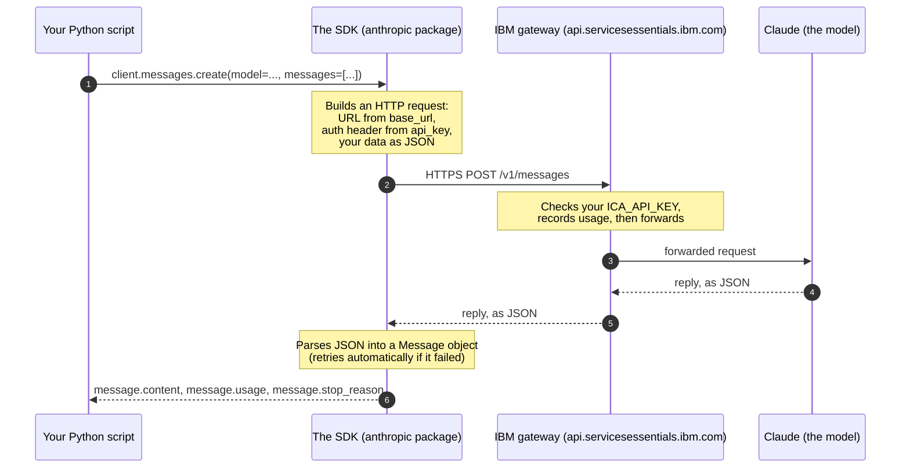

Four things worth noticing:

1. **Your code never touches HTTP.** The SDK does that. You only deal in Python
   objects.
2. **`base_url` decides where step 3 goes.** Change it and that arrow points at a
   different server. That's the whole mechanism.
3. **Your API key rides along on every single request.** It's not a one-time
   login; it's proof of identity attached to each call.
4. **The reply comes back as JSON, but you receive a Python object.** That
   translation step is a big part of what the SDK is doing for you.

---

## 🔑 The `client` object: what it is and why it exists

Every exercise in this course starts by building a **client**:

```python
import os
from dotenv import load_dotenv
from anthropic import Anthropic

load_dotenv()

client = Anthropic(
    api_key=os.environ["ICA_API_KEY"],
    base_url="https://api.servicesessentials.ibm.com",
)
```

### Why must I create a client before making any call?

You could imagine an SDK where you write
`anthropic.send("Hello", key="sk-...", url="https://...")` every single time. But
then you'd repeat your key, the URL, your timeout, and your retry preferences on
*every call*. Miss one and you get a confusing failure at 2am.

Instead, the SDK asks you to **set up your connection once** and store it in a
variable. That variable is the client. Think of it as:

> A **remote control** you configure once (which TV, which batteries), then press
> buttons on all day.

Or in plain terms: **the client is a bundle of settings, plus the methods that
use those settings.** `Anthropic(...)` is the SDK's class; calling it with
parentheses builds one configured instance — your client. Nothing is sent over
the network at this point. Creating a client is free; only `.create()` calls
cost money.

### What the client actually holds

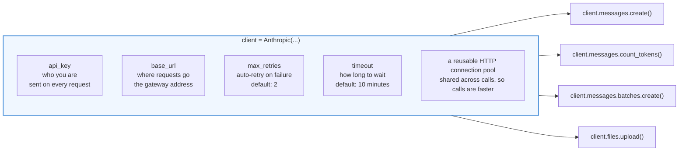

Every method hanging off `client.` automatically inherits all of those settings.
That's the entire point: **configure once, call many times.**

| What the client holds | What it means in plain English | What happens if it's wrong |
|---|---|---|
| `api_key` | Your secret password, attached to every request | `401 Unauthorized` |
| `base_url` | Which server receives your requests | Requests go to the wrong building → `401` or `404` |
| `max_retries` | How many times the SDK silently tries again after a network/rate-limit hiccup | Transient failures become hard failures |
| `timeout` | How long to wait before giving up on one call | Slow calls hang, or die too early |
| connection pool | Kept-open network connections, reused between calls | Slower calls (rebuilding the connection every time) |

### Two ways to build a client

The public Anthropic docs usually show you this:

```python
# Option A — the SDK's default, straight to Anthropic
client = Anthropic()                                           # reads ANTHROPIC_API_KEY from your environment
client = Anthropic(api_key=os.environ["ANTHROPIC_API_KEY"])    # or pass it explicitly
```

**This course uses Option B**, because that's the real setup here:

```python
# Option B — this course: key from .env, requests via IBM's gateway
load_dotenv()
client = Anthropic(
    api_key=os.environ["ICA_API_KEY"],
    base_url="https://api.servicesessentials.ibm.com",
)
```

Both create the same *kind* of object with the same methods. Only the key name
and the destination differ. You'll see Option A in tutorials all over the
internet — now you know why our version looks slightly different, and that
nothing deeper has changed.

### You can also pass settings per call

Settings on the client are **defaults**. Any single call can override them:

```python
# This one call gets 5 retries and a 20-second timeout; the client keeps its own defaults.
message = client.with_options(max_retries=5, timeout=20.0).messages.create(
    model="claude-sonnet-5",
    max_tokens=100,
    messages=[{"role": "user", "content": "Hi"}],
)
```

You won't need this until later steps, but it explains the design: **client =
defaults, call = overrides.**

---

## 🌍 `base_url`: why this course points at IBM, not Anthropic

### What a `base_url` is

The SDK builds full request addresses by gluing a **path** onto a **base**:

```
base_url                                  +  path          =  where the request actually goes
─────────────────────────────────────────────────────────────────────────────────────────────────
https://api.anthropic.com                 +  /v1/messages  =  https://api.anthropic.com/v1/messages
https://api.servicesessentials.ibm.com    +  /v1/messages  =  https://api.servicesessentials.ibm.com/v1/messages
```

`base_url` is **the front half of that address** — the "which server" part. The
SDK fills in the back half (`/v1/messages`, `/v1/files`, and so on) depending on
which method you call. You never write the path yourself.

If you don't pass `base_url`, the SDK uses its built-in default:
`https://api.anthropic.com`.

### Why we override it here

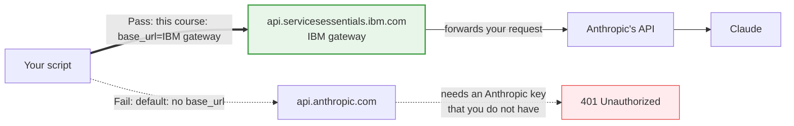

This course routes traffic through **IBM's gateway** — a server that sits *in
front of* Anthropic's API. A **gateway** (also called a proxy) is a middleman
server: requests hit IBM first, IBM checks your `ICA_API_KEY`, records the usage,
and forwards the call onward.

Organizations do this constantly, for entirely mundane reasons:

- **Access control** — one gateway key per person, revocable, instead of handing
  out the company's single Anthropic key.
- **Cost tracking** — the gateway can see who spent what.
- **Logging & compliance** — a central record of what was sent.
- **Vendor flexibility** — change what's behind the gateway without editing app
  code.

**The important part for you:** the request and response shapes are
**identical**. Everything you learn here — `messages`, content blocks, streaming,
tools — works exactly the same against `api.anthropic.com`. You are not learning
an IBM-specific dialect. You're learning the Anthropic SDK, with one address
changed.

> 🧠 **The mental model:** `base_url` is the street address on an envelope.
> Change it and the letter goes to a different building. The letter itself — your
> paper, your handwriting, your words — is unchanged.

---

## 🔐 `ICA_API_KEY`, `.env`, and `load_dotenv()`

### What an API key is

An **API key** is a long secret string that identifies *you* to a service. It's
closer to a password than a username: anyone holding it can spend money as you.
Treat it accordingly.

**`ICA_API_KEY`** is the name of the environment variable holding *your* key for
IBM's gateway. (ICA = IBM Consulting Advantage, the platform behind that
gateway.) Because we go through IBM, the key is an IBM-issued one — which is why
it isn't called `ANTHROPIC_API_KEY` like in the public docs.

An **environment variable** is a named value that lives in your shell/session
rather than in your code. Python reads them from a dict-like object called
`os.environ`:

```python
import os
key = os.environ["ICA_API_KEY"]           # crashes loudly with KeyError if missing
key = os.environ.get("ICA_API_KEY")       # returns None if missing (no crash)
```

Both appear in this course. `os.environ[...]` fails fast, which is often what you
want; `.get()` is gentler when you plan to check for `None` yourself.

### Why the key lives in a `.env` file

A **`.env` file** is a plain text file of `NAME=value` lines, sitting in your
project folder:

```bash
# .env  ← your real file, never committed
ICA_API_KEY=your-actual-secret-key-here
```

Why not just put the key in your Python file? Because your Python file goes into
git, and git remembers **forever**:

| Approach | Problem |
|---|---|
| `api_key="sk-abc123..."` hardcoded | Committed to git. Public repo = leaked key. Even deleting it later leaves it in history. |
| `export ICA_API_KEY=...` in your shell | Works, but vanishes when you close the terminal, and every collaborator must remember to do it. |
| **`.env` file (this course)** | Lives on disk so it persists, but is **gitignored** so it never gets committed. ✅ |

### Why `.env` is gitignored

**`.gitignore`** is a file listing paths git should pretend it can't see. This
repo's `.gitignore` includes `.env`, so:

- `git status` won't show it
- `git add .` won't stage it
- it can never be pushed to GitHub by accident

That last point is the whole reason. Leaked keys are one of the most common
security incidents in software, and this one line prevents it.

That's also why the repo ships **`.env.example`** — a committed *template* with
the variable names but no real values:

```bash
# .env.example  ← committed, safe, no secrets
ICA_API_KEY=your_ica_api_key_here
```

You copy it to `.env` and fill in the real value. The template documents *what*
is needed without revealing *what it is*.

```bash
cp .env.example .env     # macOS / Linux / Codespaces
copy .env.example .env   # Windows CMD
```

### What `load_dotenv()` actually does

`load_dotenv()` comes from the `python-dotenv` package — a separate library from
the SDK. Here is literally all it does:

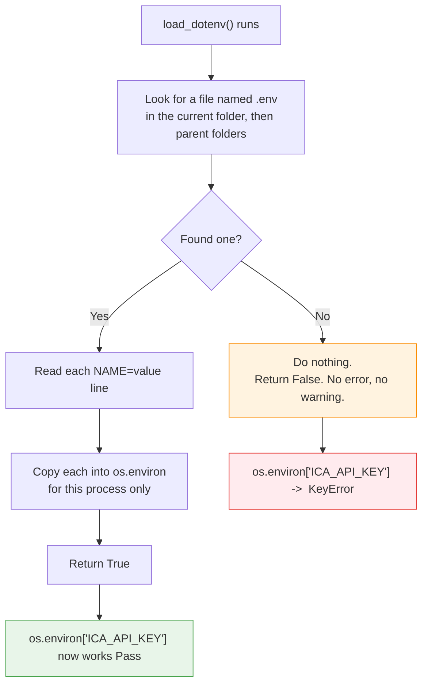

Three things people get wrong about it:

1. **It doesn't return your key.** It returns `True`/`False`. It's a *side
   effect* function: it fills `os.environ` and you read from there afterwards.
2. **It must run before you read the variable.** Order matters —
   `load_dotenv()` first, `os.environ[...]` second.
3. **It fails silently.** No `.env` file? No complaint. You'll only find out one
   line later, via `KeyError: 'ICA_API_KEY'`.

The canonical three-line opening of every exercise in this course:

```python
import os                          # standard library: gives us os.environ
from dotenv import load_dotenv     # from the python-dotenv package
from anthropic import Anthropic    # from the anthropic SDK

load_dotenv()                      # .env → os.environ

client = Anthropic(
    api_key=os.environ["ICA_API_KEY"],                    # now this works
    base_url="https://api.servicesessentials.ibm.com",
)
```

Note the two different `import` styles: `import os` brings in the whole module
(so you write `os.environ`), while `from x import y` pulls one name out directly
(so you write `Anthropic`, not `anthropic.Anthropic`).

### Three places your key needs to exist

This trips up nearly everyone, so let's be explicit. There are up to **three
separate environments** that each need the key, and setting it in one does **not**
set it in the others:

| Where | How the key gets there | Needed for |
|---|---|---|
| 💻 **Your local machine / Codespace** | a `.env` file you create | running `python exercises/practice2.py` yourself |
| ⚙️ **GitHub Actions (the grader)** | a **repository secret** named `ICA_API_KEY` | the automated grading on every push |
| ☁️ **A Codespace terminal** | a **Codespaces secret** *or* a `.env` you create inside the Codespace | running code in the cloud editor |

> ⚠️ **The classic trap:** a repository **Actions** secret is *not* visible in a
> Codespace terminal. They're two different secret stores. If you work in
> Codespaces you must **also** add a Codespaces secret (or make a `.env` inside
> the Codespace). Details in [Where to write your
> code](#-where-to-write-your-code-you-dont-need-python-installed).

---

## 🤖 Choosing a model: it's just a string

Here's a genuinely reassuring fact: **`model=` is just a piece of text.** There's
no import, no config file, no special object. To use a different model, you type a
different string.

```python
message = client.messages.create(
    model="claude-sonnet-5",   # ← swap this string, that's the whole mechanism
    max_tokens=1024,
    messages=[{"role": "user", "content": "Hello!"}],
)
```

Because it's a plain string, you can put it in a variable and reuse it. Many
steps in this course do exactly that:

```python
MODEL = "claude-sonnet-5"      # ALL_CAPS is Python's convention for "this is a constant"

first  = client.messages.create(model=MODEL, max_tokens=100, messages=msgs)
second = client.messages.create(model=MODEL, max_tokens=100, messages=msgs)
```

Now switching models across a whole file is a one-line edit. (Python doesn't
*enforce* constants — `ALL_CAPS` is a message to human readers saying "don't
reassign this".)

### 💰 This course uses `claude-sonnet-5` everywhere — on purpose

**Every single exercise in this course uses `claude-sonnet-5`.** This is a
deliberate cost decision, and we want you to know it rather than wonder:

- Sonnet is **plenty capable** for everything taught here — messages, streaming,
  tools, JSON output, vision, PDFs, caching, batching, thinking.
- Every step runs **twice**: once when you test locally, once again when the
  GitHub Action grades your push. Using the priciest model would double an
  already-doubled bill.
- Opus costs roughly **5× more per token** than Sonnet. Across 22 steps × 2 runs,
  that difference is the entire point.

So if you see a tutorial elsewhere using an Opus model string, that's fine —
just know that **we've standardised on Sonnet, and you should keep it that way
while working through the course** unless you're deliberately experimenting and
watching your spend.

### The three model families

| Family | Think of it as | Relative cost | Speed | Reach for it when |
|---|---|---|---|---|
| **Opus** | The specialist | 💰💰💰💰💰 (~5× Sonnet) | 🐢 Slowest | Genuinely hard reasoning, long agentic tasks, tricky refactors — where a better answer is worth 5× |
| **Sonnet** ⭐ | The workhorse — **this course's default** | 💰 (baseline) | 🐇 Fast | Almost everything: chat, tools, extraction, coding, summarising |
| **Haiku** | The sprinter | 💵 (cheapest) | ⚡ Fastest | High volume, simple work: classification, tagging, routing, short replies |

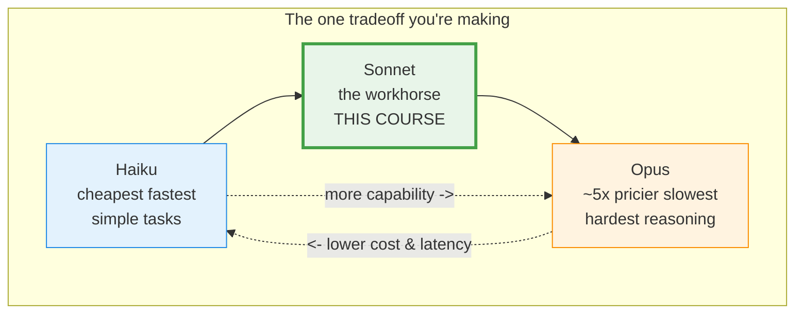

**How to choose, practically:**

1. Start with **Sonnet**. It's the default for a reason.
2. Too slow or too expensive at your volume? Try **Haiku** and check quality.
3. Genuinely stuck on a hard reasoning problem? Reach for **Opus**, and
   spend on purpose.

Two things to remember:

- **Model names are exact strings.** A typo doesn't fall back to a default; it
  raises a `404` / `not_found_error`. The API can't guess what you meant.
- **Which names are available depends on your gateway.** Step 17 has you list
  them programmatically with `client.models.list()` rather than trusting any
  hardcoded list — including this README's.

---

## 🐍 The Python you actually need

You do **not** need to know Python before starting. But five ideas show up on
almost every line of this course, so here they are with tiny, concrete examples
taken from real course code.

### 1. LIST — an ordered collection in `[ ]`

A **list** holds several values in order. You create it with square brackets and
commas.

```python
numbers = [10, 20, 30]
print(numbers[0])     # 10   ← indexes start at 0, not 1
print(numbers[2])     # 30
print(len(numbers))   # 3    ← len() counts items
```

**Where you'll see it in this course:** `messages=[...]` is always a list, even
when it holds only one item.

```python
messages = [{"role": "user", "content": "Hello!"}]   # a list containing ONE dict
```

Lists are **mutable** — you can add to them after creating them:

```python
messages.append({"role": "assistant", "content": "Hi there!"})   # now 2 items
```

> ⚠️ `.append()` changes the list in place and returns `None`. Never write
> `messages = messages.append(...)` — you'd throw the list away.

### 2. DICT — labelled values in `{ }`

A **dict** (dictionary) stores **key → value** pairs. Instead of remembering
positions, you look things up by name.

```python
person = {"name": "Zara", "city": "Boston"}
print(person["name"])    # Zara   ← square brackets, with the KEY inside
```

**Where you'll see it in this course:** every message is a dict with exactly two
keys.

```python
{"role": "user", "content": "What is 2+2?"}
#  ^key   ^value  ^key       ^value
```

`role` is always `"user"` or `"assistant"`. `content` is what was said.

| Structure | Looks like | You access it by | Course example |
|---|---|---|---|
| **list** | `[a, b, c]` | position → `x[0]` | `messages=[...]`, `response.content` |
| **dict** | `{"k": v}` | key → `x["k"]` | `{"role": "user", "content": "..."}` |

### 3. NESTED structures — dicts inside lists inside dicts

Real API payloads combine the two. A list of dicts, where a value is itself a
list of dicts. It looks scary; it's just the two rules above, applied twice.

```python
messages = [                                  # ← a LIST
    {                                         # ← containing a DICT
        "role": "user",
        "content": [                          # ← whose "content" is another LIST
            {"type": "text", "text": "What's in this image?"},      # ← of DICTS
            {"type": "image", "source": {                            # ← with a nested DICT
                "type": "base64",
                "media_type": "image/png",
                "data": "iVBORw0KGgo...",
            }},
        ],
    }
]
```

Read it **outside-in**, and read the punctuation:

```
messages          → a list
messages[0]       → a dict            {"role": ..., "content": ...}
["content"]       → a list of blocks  [{...}, {...}]
[1]               → a dict            {"type": "image", "source": {...}}
["source"]        → a dict            {"type": "base64", ...}
["media_type"]    → a string          "image/png"

# all together:
messages[0]["content"][1]["source"]["media_type"]   # "image/png"
```

**Rule of thumb for the whole course:** `content` can be a plain **string** when
it's simple text, or a **list of blocks** when it mixes text with images, PDFs, or
tool results. Both are valid.

### 4. FUNCTION — a named, reusable chunk of code (`def`)

A **function** lets you name a piece of code and run it whenever you like.

```python
def greet(name):              # 1. 'def' + name + parameters + colon
    """Say hello to someone."""   # 2. docstring: what this does
    return "Hello, " + name + "!" # 3. 'return' sends a value back and exits

print(greet("Zara"))          # 4. calling it → Hello, Zara!
```

1. **`def`** starts the definition. `name` is a **parameter** — a placeholder.
   The body is **indented** (Python uses indentation where other languages use
   braces).
2. A **docstring** is a triple-quoted string on the first line of the body,
   documenting the function. `"""..."""` can span multiple lines.
3. **`return`** hands a value back to the caller **and stops the function
   immediately**.
4. Defining runs nothing. **Calling** it — with `( )` — runs it.

**Parameter vs argument** (two words for two sides of the same handoff):

- **Parameter** = the name in the definition (`name`)
- **Argument** = the actual value you pass in (`"Zara"`)

### 5. ARGUMENTS vs KEYWORD ARGUMENTS

There are two ways to pass values into a function.

```python
def make_tea(kind, sugars):
    return f"{kind} tea with {sugars} sugars"

make_tea("green", 2)                # POSITIONAL: order decides which is which
make_tea(kind="green", sugars=2)    # KEYWORD: name= decides. Order no longer matters.
make_tea(sugars=2, kind="green")    # identical result ✅
```

- **Positional argument** — matched by *position*. Swap them and you get nonsense.
- **Keyword argument** (**kwarg**) — matched by *name*, written `name=value`.
  Self-documenting and order-independent.

**This matters because the SDK is keyword-arguments all the way down.** Every one
of these is a kwarg:

```python
message = client.messages.create(
    model="claude-sonnet-5",   # kwarg: model=
    max_tokens=1024,           # kwarg: max_tokens=
    messages=[...],            # kwarg: messages=
)
```

There is no `client.messages.create("claude-sonnet-5", 1024, [...])`. You must
name them. That's a deliberate design choice: with a dozen possible options, names
are far safer than positions.

`f"{kind} tea"` above is an **f-string** — put `f` before the quotes and anything
inside `{ }` gets replaced by its value. You'll use it constantly for printing.

```python
name = "Zara"
print(f"Hello, {name}!")            # Hello, Zara!
print(f"Tokens used: {1024 + 50}")  # Tokens used: 1074   ← expressions work too
```

### 6. HELPER FUNCTION — the real `get_text()` from this course

A **helper function** is a small function you write to avoid repeating yourself.
Here's the actual one you'll write in Step 4 and reuse for the rest of the
course. It solves a real problem: **finding the text in a response whose
`content` list might have other block types in it.**

```python
def get_text(content_blocks):
    """Find the text block in a response's content list.

    Some models (e.g. with extended thinking) return a ThinkingBlock
    BEFORE the TextBlock, so content[0] is not always the text. Search
    by block.type instead of assuming a fixed index.
    """
    for block in content_blocks:
        if block.type == "text":
            return block.text
    return ""
```

#### Line-by-line

| Line | Code | What's happening |
|---|---|---|
| 1 | `def get_text(content_blocks):` | Defines a function taking **one parameter**, `content_blocks`. The colon opens the indented body. |
| 2-7 | `"""Find the text..."""` | The **docstring**. Purely documentation — it changes nothing at runtime, but it's where you record *why* the function exists. |
| 8 | `for block in content_blocks:` | A **for-loop**: visit each item of the list once, in order, naming it `block`. |
| 9 | `if block.type == "text":` | A **condition**. `==` means "is equal to" (`=` means "assign"). Each block has a `.type` string telling you what kind it is. |
| 10 | `return block.text` | Found it → hand the text back **and exit immediately**. The loop stops here; no `break` needed. |
| 11 | `return ""` | Only reached if the loop finished without finding a text block. Returns an empty string as a safe fallback instead of crashing. |

Look carefully at line 11's indentation: it lines up with `for`, not with `if`.
So it runs **after** the loop, not inside it. In Python, indentation *is* the
structure.

#### How the argument gets passed in, and what comes back

```python
message = client.messages.create(
    model="claude-sonnet-5",
    max_tokens=100,
    messages=[{"role": "user", "content": "Say hi"}],
)

text = get_text(message.content)   # ← the call
print(text)                        # Hi there! How can I help?
```

Trace it precisely:

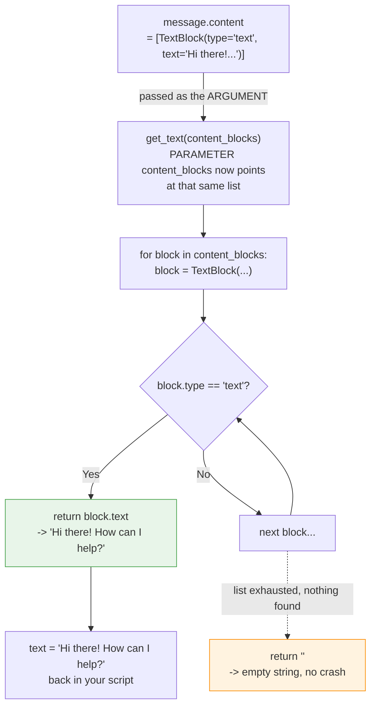

1. **Going in:** `message.content` (a list) is the **argument**. Inside the
   function, the **parameter** `content_blocks` refers to that same list. The name
   changed; the data didn't move or get copied.
2. **Inside:** the loop checks each block's `.type`.
3. **Coming out:** a **string** — either the text it found, or `""`. Never a
   block, never `None`.

Because `get_text` doesn't care where the list came from, it works on *any*
response:

```python
print(get_text(first.content))    # reuse #1
print(get_text(second.content))   # reuse #2 — write once, use forever
```

**That's the whole value of a helper:** the tricky "which block is the text?"
logic lives in exactly one place. Fix a bug there and every call site is fixed.

### 7. FOR-LOOP — do something once per item

```python
for block in message.content:
    print(block.type)        # runs once per block: "thinking", then "text"
```

`block` is a name *you* choose; Python rebinds it to each item in turn. The
indented body runs once per item.

Two loop keywords worth knowing:

```python
for block in message.content:
    if block.type == "text":
        print(block.text)
        break                # break: stop looping right now
```

`break` exits early. `continue` (which you'll meet later) skips to the next item.
In a function, `return` does both jobs at once — it exits the loop *and* the
function, which is why `get_text` doesn't need `break`.

### 8. GENERATOR EXPRESSION — the compact one-liner version

Later steps use a denser idiom, and it's worth decoding because it appears
everywhere in real Python:

```python
text = next(b.text for b in blocks if b.type == "text")
```

Read it right-to-left, in three parts:

| Part | Code | Meaning |
|---|---|---|
| Source | `for b in blocks` | go through each block, calling it `b` |
| Filter | `if b.type == "text"` | keep only the ones whose type is `"text"` |
| Produce | `b.text` | from each keeper, produce its `.text` |
| Take one | `next(...)` | give me the **first** result and stop |

The `(...)` part is a **generator expression** — a lazy recipe for producing
values. It doesn't compute anything until asked. `next()` asks for exactly one
value, so the loop stops at the first match. It's the same logic as `get_text`,
compressed to one line:

```python
# these two do the same thing
text = next(b.text for b in blocks if b.type == "text")

def get_text(blocks):
    for b in blocks:
        if b.type == "text":
            return b.text
    return ""
```

> ⚠️ **One real difference:** if *nothing* matches, `next()` raises
> `StopIteration`, whereas `get_text` returns `""`. Give `next()` a fallback to
> make it safe:
>
> ```python
> text = next((b.text for b in blocks if b.type == "text"), "")   # "" if no match
> ```
>
> Note the extra parentheses around the generator — required when you pass a
> second argument to `next()`.

### 9. Dicts use `["brackets"]`; API objects use `.dots`

This one distinction prevents a surprising number of errors:

```python
# YOU build dicts → square brackets with the key
msg = {"role": "user", "content": "hi"}
msg["role"]                  # "user"

# The SDK returns OBJECTS → dot access
message = client.messages.create(...)
message.content              # a list of blocks
message.usage.input_tokens   # 12
message.stop_reason          # "end_turn"
```

Mix them up and you get `TypeError: 'Message' object is not subscriptable` (you
used `[ ]` on an object) or `AttributeError` (you used `.` on a dict).

| You're touching | Syntax | Example |
|---|---|---|
| A dict you wrote | `["key"]` | `messages[0]["content"]` |
| An object the SDK returned | `.attribute` | `message.content[0].text` |

---

## 🧱 Content blocks: why `response.content` is a LIST, not a string

This is the single most common beginner surprise in the whole SDK, so it gets its
own section.

You ask Claude a question. You'd expect the answer to be a string:

```python
message = client.messages.create(
    model="claude-sonnet-5",
    max_tokens=100,
    messages=[{"role": "user", "content": "Say hello"}],
)

print(message.content)   # ❌ NOT "Hello!" — you get:
# [TextBlock(citations=None, text='Hello! How can I help you today?', type='text')]
```

`message.content` is a **list of content blocks**. Even for a one-sentence reply,
it's a list with one item in it.

### Why on earth is it a list?

Because a single reply can contain **several different kinds of thing at once**. A
plain string couldn't represent that. Consider:

- Claude writes some reasoning, *then* an answer → `ThinkingBlock` + `TextBlock`
- Claude says "let me check the weather" and calls a tool → `TextBlock` +
  `ToolUseBlock`
- Claude cites its sources → `TextBlock` with citations attached

A **content block** is one typed piece of a message. Every block has a `.type`
string saying what it is, and its *own* set of attributes depending on that type.

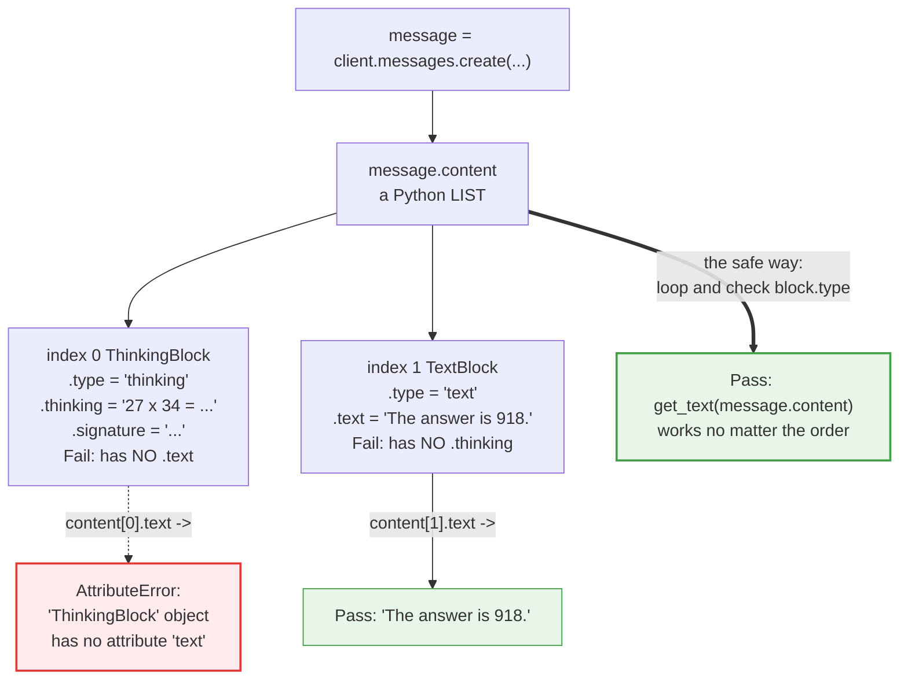

### The block types you'll meet in this course

| Block type | `.type` | Where its content lives | First seen |
|---|---|---|---|
| `TextBlock` | `"text"` | `.text` | Step 2 |
| `ThinkingBlock` | `"thinking"` | `.thinking` (plus `.signature`) | Step 9 |
| `ToolUseBlock` | `"tool_use"` | `.name`, `.input`, `.id` | Step 8 |
| `RedactedThinkingBlock` | `"redacted_thinking"` | `.data` (encrypted) | Step 9 |

Notice the pattern: **the attribute name matches the type.** A `"text"` block has
`.text`; a `"thinking"` block has `.thinking`. Ask the wrong one and Python raises
`AttributeError`.

### ⚠️ The real ThinkingBlock gotcha this course hit

This is not hypothetical — it happened while building these exercises, and it will
happen to you if you take the shortcut.

The tempting first instinct is:

```python
print(message.content[0].text)     # 😬 works... until it doesn't
```

For a simple reply, index 0 *is* the `TextBlock`, so this appears to work
perfectly. Then you enable extended thinking (Step 9) — or use a model that
thinks by default — and the model returns the **ThinkingBlock first**:

```
message.content  =  [ ThinkingBlock(...),  TextBlock(...) ]
                       ↑ index 0             ↑ index 1
                       no .text!             the text is here
```

And your program dies:

```
AttributeError: 'ThinkingBlock' object has no attribute 'text'
```

Nothing about your code changed. The *shape of the response* changed, and your
code had assumed a fixed position.

**The fix — never index, always search by type:**

```python
# ❌ Fragile: assumes the text is always first
text = message.content[0].text

# ✅ Robust: finds the text block wherever it is
text = get_text(message.content)
```

That's the entire reason `get_text()` exists and gets reused in every later step.
Take this as the rule for the whole course:

> 🎯 **Never trust the position of a content block. Always check `block.type`.**

---

## 💬 Multi-turn: how the `messages` list grows

One more idea before setup, because it surprises people: **the API has no
memory.**

**Stateless** means the server keeps *nothing* between requests. Call #2 knows
absolutely nothing about call #1. There's no session, no conversation ID, no
server-side history.

So how do chatbots remember your name? **You** remember it. Multi-turn
conversation is just you re-sending the whole history on every call, with each new
reply appended to the list.

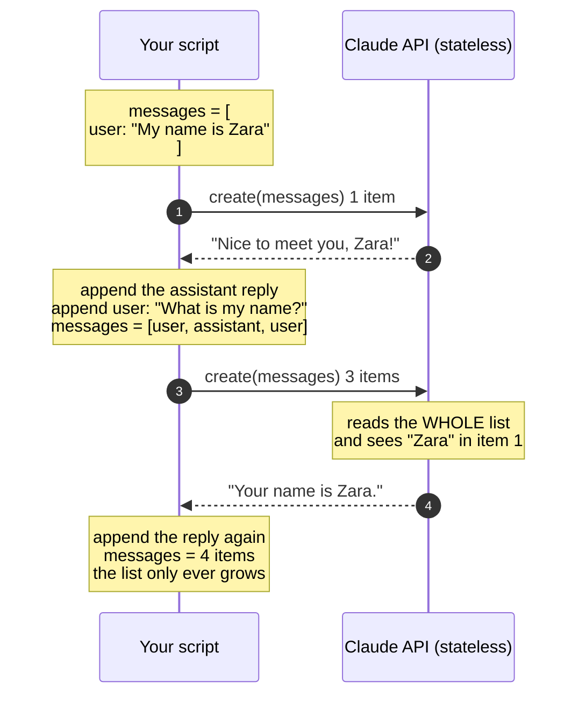

In code (this is essentially Step 4):

```python
messages = [{"role": "user", "content": "My name is Zara. Remember that."}]

first = client.messages.create(model="claude-sonnet-5", max_tokens=200, messages=messages)
print(get_text(first.content))

messages.append({"role": "assistant", "content": first.content})   # what Claude said
messages.append({"role": "user", "content": "What is my name?"})   # your follow-up

second = client.messages.create(model="claude-sonnet-5", max_tokens=200, messages=messages)
print(get_text(second.content))     # "Your name is Zara."
```

```
      the messages list grows each turn:

turn 1 send:  [ user ]                              → 1 item
turn 2 send:  [ user, assistant, user ]             → 3 items
after turn 2: [ user, assistant, user, assistant ]  → 4 items
```

Two details that matter:

1. **Roles alternate** — `user`, `assistant`, `user`, `assistant`. A conversation
   always starts with `user`.
2. **Append the raw `first.content` list**, not the extracted string. The
   assistant message should have the same *shape* the API produced, which keeps
   multi-block replies (thinking, tool use) intact.

> 💰 **Cost consequence:** because you resend everything each turn, your input
> tokens grow every turn. A 20-turn chat pays for turn 1's text 20 times. That's
> another reason this course sticks to `claude-sonnet-5`, and why Step 12
> (prompt caching) and Step 13 (token counting) exist.

---

## 🚨 What happens if you miss this

Bookmark this table. These four mistakes account for most of the confusion in the
early steps. When you hit an error, find it here first.

| If you forget… | The error you'll see | What's actually wrong | The fix |
|---|---|---|---|
| **`load_dotenv()`** | `KeyError: 'ICA_API_KEY'` | Your `.env` file exists, but nothing ever copied it into `os.environ`. Python never looks at `.env` on its own. | Call `load_dotenv()` **before** reading `os.environ`. Also confirm the file is named exactly `.env` and sits in the folder you run from. |
| **`base_url=`** | `401 Unauthorized` / `authentication_error` (sometimes `404`) | The SDK defaulted to `https://api.anthropic.com`, which has never heard of your IBM gateway key. Right key, wrong building. | Pass `base_url="https://api.servicesessentials.ibm.com"` when constructing the client. |
| **Using `content[0].text`** | `AttributeError: 'ThinkingBlock' object has no attribute 'text'` | You assumed the text block is first. With thinking enabled, index 0 is a `ThinkingBlock`, whose text lives in `.thinking`. | Search by type: `get_text(message.content)`, or loop and check `block.type == "text"`. |
| **`max_tokens=`** | `TypeError: create() missing 1 required keyword-only argument: 'max_tokens'` | Unlike most options, `max_tokens` has no default — the API requires an explicit ceiling on the reply length. This error comes from Python, before any network call. | Always pass `max_tokens=`. Start with `1024`; raise it for long replies. |

A few more you may meet as you go:

| Symptom | Likely cause | Fix |
|---|---|---|
| `ModuleNotFoundError: No module named 'anthropic'` | SDK not installed in the interpreter you're running | `pip install -r requirements.txt` |
| `ModuleNotFoundError: No module named 'dotenv'` | The package is `python-dotenv`, the import is `dotenv` | `pip install python-dotenv` |
| `404 not_found_error` mentioning the model | Typo in the model string, or that model isn't on your gateway | Check the spelling; run Step 17's `client.models.list()` |
| `TypeError: 'Message' object is not subscriptable` | Used `["..."]` on an SDK object | Use dot access: `message.content` |
| Reply cut off mid-sentence | Hit your `max_tokens` ceiling | Raise `max_tokens`; check `message.stop_reason == "max_tokens"` |
| `400` when using thinking | `budget_tokens` >= `max_tokens` | `budget_tokens` is carved *out of* `max_tokens` — keep it strictly smaller |

---

## 💻 Where to write your code (you don't need Python installed)

**You can complete this entire course in a web browser.** If installing Python
has ever stopped you from learning something, that excuse is gone. Pick one of
three routes.

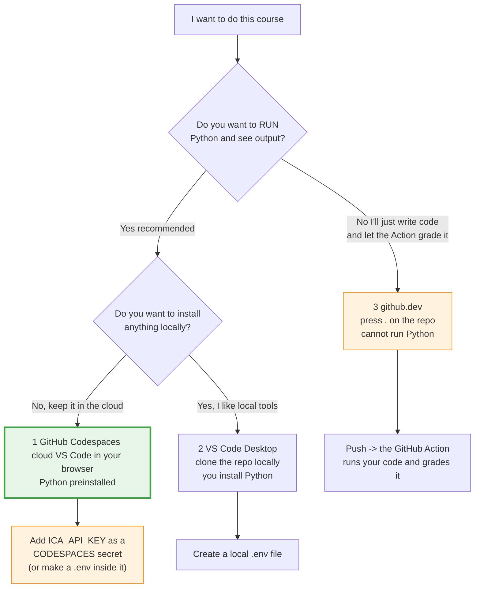

### Quick comparison

| | 1️⃣ **Codespaces** ⭐ | 2️⃣ **VS Code Desktop** | 3️⃣ **github.dev** |
|---|---|---|---|
| Where it runs | Cloud VM, in your browser | Your own computer | Your browser (editor only, no machine) |
| Install anything? | Nothing | VS Code + Python + git | Nothing |
| Python preinstalled? | ✅ Yes | ❌ You install it | ❌ **No Python at all** |
| Can you **run** your code? | ✅ Yes | ✅ Yes | ❌ **No** |
| Terminal? | ✅ Full Linux terminal | ✅ Yes | ❌ None |
| Free? | Generous free monthly hours, then billed | ✅ Always | ✅ Always |
| Best for | Most learners, especially beginners | People who already develop locally | Quick edits, typo fixes, working from a locked-down machine |

### 1️⃣ GitHub Codespaces — the easy path ⭐

A **Codespace** is a full development machine that GitHub runs in the cloud for
you, with VS Code in your browser attached to it. Python, pip, git, and a
terminal are already there.

**How to open one:**

1. Go to **your** copy of this repo on GitHub (the one you created with **Use this
   template**).
2. Click the green **`< > Code`** button.
3. Choose the **Codespaces** tab → **Create codespace on main**.
4. Wait ~30–60 seconds while it builds. VS Code opens in your browser, with your
   repo files already there.

This repo ships a **dev container** (`.devcontainer/devcontainer.json`), so that
build already does the boring parts for you:

- Python 3.11 is installed and selected as the interpreter.
- `pip install -r requirements.txt` has already run (`anthropic` + `python-dotenv`).
- A `.env` has been created for you from `.env.example` (only if you didn't
  already have one — it never overwrites your key).
- The Python extension is installed, so the ▷ **Run** button works.

So the only thing left for you to do is **paste your key into `.env`** — the
welcome message in the terminal reminds you. Then verify everything at once:

```bash
python3 scripts/preflight.py
```

See [Verify your setup](#-verify-your-setup-30-seconds) for what that checks.

> If you opened the Codespace *before* this dev container existed, run
> **`Codespaces: Rebuild Container`** from the Command Palette (`F1`) to pick it up.

> 💳 **Free hours:** personal GitHub accounts include a monthly allowance of free
> Codespaces compute hours and storage on the smallest machine type — plenty for a
> course like this. Beyond that it's billed per hour, so **stop your Codespace
> when you're done**: on github.com go to your Codespaces list (or the `< > Code`
> button) and choose **Stop codespace**. Idle Codespaces also auto-stop after a
> timeout. Check GitHub's current Codespaces billing docs for exact figures.

#### Codespaces + your API key: the one thing everybody gets wrong

Adding `ICA_API_KEY` as a **repository Actions secret** does **not** make it
available in your Codespace terminal. Actions secrets and Codespaces secrets are
**two separate stores** with two separate settings pages.

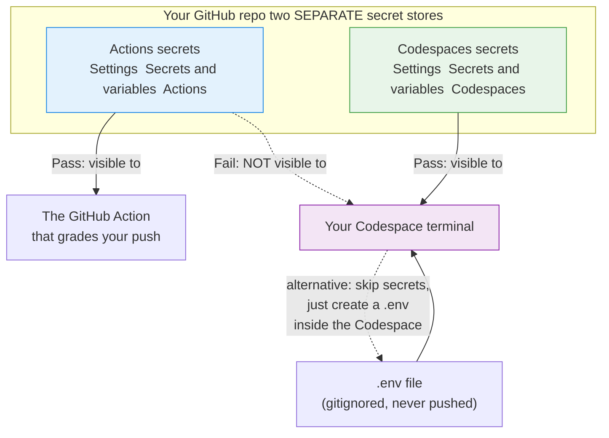

So you need the key in **both** places. Pick either option for the Codespace:

**Option A — add a Codespaces secret (do it once, works in every Codespace):**

1. Repo → **Settings** → **Secrets and variables** → **Codespaces**
2. **New repository secret**
3. Name: `ICA_API_KEY`  ·  Value: your real key → **Add secret**
4. **Rebuild or restart the Codespace** if one is already running — secrets are
   injected at start-up. (`Ctrl/Cmd+Shift+P` → *Codespaces: Rebuild Container*.)

It then arrives as a real environment variable, so `os.environ["ICA_API_KEY"]`
works. `load_dotenv()` stays harmless — it just finds no `.env` and does nothing.

**Option B — create a `.env` inside the Codespace:**

```bash
cp .env.example .env
# then open .env in the editor and paste your real key
```

`.env` is gitignored, so it stays inside your Codespace and never reaches GitHub.

> 🔍 **Check it worked** (this prints only the length, never the key itself):
>
> ```bash
> python -c "import os; from dotenv import load_dotenv; load_dotenv(); k=os.environ.get('ICA_API_KEY'); print('key found, length', len(k)) if k else print('NOT FOUND')"
> ```

### 2️⃣ VS Code Desktop — the local path

Prefer real local tooling? **VS Code** is a free code editor from Microsoft.

**Route A — clone and open the folder:**

```bash
git clone https://github.com/YOUR-USERNAME/YOUR-REPO.git
cd YOUR-REPO
code .                                  # opens VS Code in this folder
pip install -r requirements.txt
cp .env.example .env                    # then paste your key into .env
```

Install the **Python extension** (by Microsoft) when VS Code offers it — you get
syntax highlighting, error squiggles, and a ▶️ Run button.

**Route B — desktop VS Code driving a cloud Codespace:** install the **GitHub
Codespaces** extension, sign in, then `Ctrl/Cmd+Shift+P` → *Codespaces: Create New
Codespace*. You get the local VS Code feel while the code actually runs on
GitHub's machine — best of both worlds, and no local Python needed.

You'll need locally: **Python 3.9+** ([python.org](https://www.python.org/downloads/))
and **git** ([git-scm.com](https://git-scm.com/downloads)). Verify with:

```bash
python --version     # or: python3 --version
git --version
```

### 3️⃣ github.dev — the lightweight web editor

Press **`.`** (the full-stop key) while viewing your repo on GitHub. A VS Code
editor opens instantly in your browser at `github.dev`. You can also change the
URL from `github.com/...` to `github.dev/...`.

**What it's great at:** editing files, creating files, committing, and pushing —
all without installing anything, on any machine, in seconds.

> ⚠️ **The critical limitation: github.dev has NO compute.** There is no machine
> behind it — no terminal, no Python interpreter, no `pip`. You **cannot run**
> `python exercises/practice2.py`, and you cannot test anything.

| In github.dev you can… | You cannot… |
|---|---|
| ✅ Edit and create files | ❌ Run Python |
| ✅ Commit and push | ❌ Open a terminal |
| ✅ Search the repo | ❌ `pip install` |
| ✅ Review diffs | ❌ Debug or see output |

**Does the course still work?** Yes — **grading happens in GitHub Actions**, on
GitHub's servers, not on your machine. So you can write code in github.dev, push,
and the Action will run and grade it.

But understand the tradeoff: **your first feedback becomes the Action's verdict**,
maybe a minute or two after pushing, instead of instant local output. For a
beginner that's a slow, frustrating loop. Also, `.env` files you create there
won't help you (nothing runs), and the Action uses the repository secret anyway.

> 🎯 **Recommendation:** use **Codespaces** as your main environment so you can
> run and iterate quickly. Keep **github.dev** in your pocket for one-line fixes.

---

## 🚀 Start the course

### Step 0 — Get your own copy (use the template, do NOT fork)

1. Click **[Use this template](../../generate)** → **Create a new repository**.
2. Name it whatever you like, choose public or private, click **Create
   repository**.

> ⚠️ **Use this template, not Fork.** A template copy gives you a clean history
> and its own independent Actions runs, which is what the grading needs. A fork
> ties your copy to the original and disables workflows by default — the course
> won't start.

### Step 1 — Enable Actions and give them write permission

Your copy needs permission to open issues, comment, and close them.

1. In **your** new repo, go to **Settings** → **Actions** → **General**.
2. Under **Actions permissions**, select **Allow all actions and reusable
   workflows** → **Save**.
3. Scroll to **Workflow permissions**, select **Read and write permissions** →
   **Save**.

Without write permission the grader can run but can't open your next step's
issue — it looks like nothing is happening.

### Step 2 — Add your `ICA_API_KEY` as a repository secret

This is what the **grader** uses.

1. **Settings** → **Secrets and variables** → **Actions**
2. **New repository secret**
3. Name: `ICA_API_KEY` (exact spelling, ALL CAPS, underscores)
4. Value: your real key → **Add secret**

Secrets are write-only: GitHub will never show you the value again, and it's
automatically masked in Action logs. If you doubt it, just overwrite it.

> Doing the course in Codespaces? Also add a **Codespaces** secret — see [the
> warning above](#codespaces--your-api-key-the-one-thing-everybody-gets-wrong).

### Step 3 — Set up your editor and your local key

Open your repo in **Codespaces**, **VS Code**, or **github.dev** (see [Where to
write your code](#-where-to-write-your-code-you-dont-need-python-installed)),
then:

```bash
pip install -r requirements.txt      # installs anthropic + python-dotenv

cp .env.example .env                 # macOS / Linux / Codespaces
# copy .env.example .env             # Windows CMD
```

Open `.env` and replace the placeholder with your real key:

```bash
ICA_API_KEY=your-actual-key-here
```

> 💡 **In a Codespace, most of this is already done for you** — the dev container
> installs the requirements and creates `.env` on first build. You still have to
> paste your key in.

Then verify the whole setup in one shot (see next section):

```bash
python3 scripts/preflight.py
```

### ✅ Verify your setup (30 seconds)

*Optional, between Step 3 and Step 4.* Run the preflight check. It turns "why
doesn't my code work?" into a specific, named problem:

```bash
python3 scripts/preflight.py
```

It prints one `✅ PASS` / `❌ FAIL` line per check, and every failure comes with a
one-line fix:

| # | Check | Why it matters |
|---|---|---|
| 1 | Python is 3.9 or newer | The SDK requires it |
| 2 | `anthropic` imports (and its version) | Proves `pip install` actually landed in *this* Python |
| 3 | `python-dotenv` imports | Without it, `load_dotenv()` is an `ImportError` |
| 4 | A `.env` file exists | `load_dotenv()` fails *silently* when it doesn't |
| 5 | `ICA_API_KEY` is set, non-empty, and not still the placeholder | Catches the #1 setup mistake |
| 6 | A real **1-token API call** to the gateway succeeds | The only way to prove your key *and* network actually work |

Example of a good run:

```text
Preflight check — Anthropic Python SDK course
====================================================
✅ PASS  Python version >= 3.9: Python 3.11.9
✅ PASS  anthropic SDK installed: anthropic 0.40.0
✅ PASS  python-dotenv installed: python-dotenv installed
✅ PASS  .env file exists: found .env
✅ PASS  ICA_API_KEY looks like a real key: ICA_API_KEY present (40 chars, ends …90ab)
✅ PASS  Live API call (1 token): live call to claude-sonnet-5 succeeded (stop_reason=max_tokens)
====================================================
✅ All 6 checks passed — your environment is ready.
   Next: open the Step 1 issue in the Issues tab and start coding.
```

And a failure — note the specific fix on the line underneath:

```text
❌ FAIL  ICA_API_KEY looks like a real key: ICA_API_KEY still holds the placeholder value 'your-key-here'
         → Fix: Replace it in .env with your real key:  ICA_API_KEY=<your real key>
```

It exits `0` when everything passes and `1` if anything failed, so you can also
use it as a quick sanity check any time the course starts misbehaving.

> 💰 Check 6 makes one real API call with `max_tokens=1` — the smallest billable
> request there is. Fractions of a cent.
>
> 🧰 This script is for **you**. The grader has its own separate checks in
> `.github/scripts/`; you never need to run those.

### Step 4 — Kick it off

Go to the **Actions** tab → select **Start Course** → **Run workflow**.

Within a few seconds, **Issue #1** appears in your **Issues** tab with your first
lesson. Everything from here happens in issues.

> 💰 **Cost warning — read this before you start.**
> Step 1 installs the SDK and makes **no** API calls. **Every step from Step 2
> onward makes real, billed API calls** — and each one runs **twice**:
>
> 1. Once when **you** run it locally (or in your Codespace) to test.
> 2. Once again in **GitHub Actions** when your push is graded.
>
> Individually these are tiny (`max_tokens` is kept small on purpose, and the
> whole course uses `claude-sonnet-5` rather than a pricier model). Cumulatively,
> 22 steps × 2 runs × any re-tries adds up. A few habits keep it negligible:
>
> - Don't push a "let's see what happens" commit — run it locally first.
> - Keep `max_tokens` at the value the exercise suggests.
> - Keep the model as `claude-sonnet-5`.
> - Glance at your usage dashboard occasionally.

---

## 🔄 How the course loop works

Every one of the 22 steps follows the same rhythm. Once you've done it once,
you've done it 22 times.

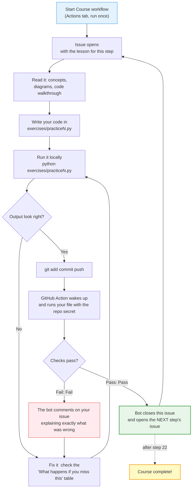

**Pushing your work — the three commands you'll use 22 times:**

```bash
git add exercises/practice2.py
git commit -m "Complete step 2"
git push
```

Then watch the **Actions** tab, or just wait for the bot to comment on your issue.

**A failing check is not a problem.** There's no penalty, no limit, and no
watching teacher. The bot's comment tells you what it expected versus what it
found. Fix, push again. That's the loop — and iterating is how everyone learns
this.

**Graders ignore formatting.** Capitalisation and spacing around colons don't
matter — `Turn 1:`, `turn 1 :` and `Turn  1:` are all accepted. The *values*
still have to be right: if a count should be `4`, `3` won't pass.

**Want to start over?** To redo the course from Step 1, run:

```bash
./scripts/reset_course.sh --dry-run   # preview first, changes nothing
./scripts/reset_course.sh             # asks you to confirm
```

One gotcha worth knowing: simply re-running the "Step 0 - Start Course"
workflow **won't** reopen Step 1. It skips itself when course issues already
exist — *including closed ones* — and still reports success, so nothing appears
to happen. The reset script handles that. See
[**Restarting or resetting the course**](SETUP-GUIDE.md) in `SETUP-GUIDE.md`
(section 6) for the manual steps and the full explanation.

---

## 📚 The full 22 steps

Each step builds on the last. Everything uses `claude-sonnet-5`.

The 22 steps are grouped into **5 phases**. Each phase is a coherent chunk you
can finish in one sitting — a natural place to stop for the day.

| Phase | Steps | What you'll learn | Est. time |
|---|---|---|---|
| **1 · Foundations** | 1–4 | Install the SDK, make your first call, read every field on the response, and hold a multi-turn conversation. The vocabulary the other 18 steps assume. | ~1 hr |
| **2 · Input & output types** | 5–7, 10, 11 | Feed Claude more than a string — images, several images at once, whole PDFs — and get machine-readable JSON back instead of prose. Plus streaming, so output appears as it's written. | ~1.5 hrs |
| **3 · Tools & reasoning** | 8, 9, 19, 20 | Let Claude *act*: call your own Python functions, show its reasoning with extended thinking, run code in a server-side sandbox, and search the live web with citations. | ~1.5 hrs |
| **4 · Production concerns** | 12–16 | The things that decide whether your app survives real traffic: caching to cut cost up to 90%, counting tokens before you spend, batch jobs at 50% off, async concurrency, and error handling with retries. | ~1.5 hrs |
| **5 · Scale & deployment** | 17, 18, 21 | Picking the right model for the job, uploading a file once and reusing it by ID, and running the same code on AWS Bedrock or Google Vertex. | ~1 hr |
| **5 · Capstone** | 22 | No new API surface — you assemble the pieces yourself. Build a CLI assistant that holds a conversation, calls a real tool, and survives API errors, working from a requirements brief instead of copy-pasteable code. | ~45 min |

**Whole course: ~7¼ hours of focused work and well under $1 of API spend.**

Every step file opens with its own phase marker, progress counter, and honest
time/cost estimate, e.g.:

```text
**Phase 4: Production concerns** · Step 12 of 22 · ~20 min · ~$0.01 in API calls
```

### Step-by-step detail

| Step | Phase | Topic | The new idea | API calls? |
|---|---|---|---|---|
| 1 | 1 | Install the SDK & create a client | `pip install`, `load_dotenv()`, `Anthropic(api_key=..., base_url=...)` | ❌ none |
| 2 | 1 | Your first `messages.create()` | `model`, `max_tokens`, `messages` — the three required kwargs | ✅ |
| 3 | 1 | Inspect the full response | `.content`, `.usage`, `.stop_reason`, `.id`, `.model` | ✅ |
| 4 | 1 | Message roles & multi-turn | `user`/`assistant` alternation; growing the `messages` list; `get_text()` | ✅ |
| 5 | 2 | Content blocks: text + image | `content` as a list of typed blocks; base64 image input | ✅ |
| 6 | 2 | Streaming | `client.messages.stream()`, printing tokens as they arrive | ✅ |
| 7 | 2 | Structured / JSON output | Getting reliably parseable JSON back | ✅ |
| 8 | 3 | Tool use | Letting Claude call *your* functions; the tool-result round trip | ✅ |
| 9 | 3 | Extended thinking | `thinking={...}`, `budget_tokens`, and the **ThinkingBlock** ordering gotcha | ✅ |
| 10 | 2 | Vision: multiple images | Several images in one request; comparing them | ✅ |
| 11 | 2 | PDF support | Sending documents; page-aware questions | ✅ |
| 12 | 4 | Prompt caching | `cache_control` to stop paying repeatedly for the same prefix | ✅ |
| 13 | 4 | Token counting | `count_tokens()` — estimate cost *before* you spend | ✅ |
| 14 | 4 | Batch API | Submit many requests, poll, collect results (cheaper, async) | ✅ |
| 15 | 4 | Async client | `AsyncAnthropic`, `async`/`await`, concurrent calls | ✅ |
| 16 | 4 | Error handling | `APIError`, `RateLimitError`, `APIStatusError`, retries | ✅ |
| 17 | 5 | Compare models | `client.models.list()`; same call, different model string | ✅ |
| 18 | 5 | Files API | Upload once, reference by ID across many calls | ✅ |
| 19 | 3 | Code execution tool | Server-side sandbox that runs Python for you | ✅ |
| 20 | 3 | Web search tool | Server-side web search with citations | ✅ |
| 21 | 5 | Bedrock & Vertex clients | `AnthropicBedrock`, `AnthropicVertex` — same API, different clouds | ✅ |
| 22 | 5 | **Capstone: tool-using assistant** | Build it yourself — conversation loop + tool round trip + `try`/`except` | ✅ |

**Repo layout:**

```
your-repo/
├── README.md                  ← you are here
├── requirements.txt           ← anthropic + python-dotenv
├── .env.example               ← template (committed, no secrets)
├── .env                       ← your real key (gitignored, you create it)
├── exercises/
│   ├── practice1.py           ← one file per step
│   ├── practice2.py
│   └── ...
└── .github/
    ├── steps/                 ← the lesson text the bot posts as issues
    └── workflows/             ← the graders (one per step)
```

---

## Requirements

**Non-negotiable:**

- A **GitHub account** — free is fine
- An **`ICA_API_KEY`** for the IBM gateway (from whoever runs your gateway)
- A **web browser**

**That's it.** Python, pip, git, and a terminal all come free with Codespaces.

**Only if you're working locally:**

- Python **3.9 or newer**
- `git`
- An editor (VS Code recommended)

**Zero prior knowledge assumed** of the Anthropic API, HTTP, or JSON. Basic
comfort with reading Python helps, but every construct used is explained in
[The Python you actually need](#-the-python-you-actually-need).

---

## 🧾 Cheat sheet

The pattern behind every exercise, annotated:

```python
import os                                            # read environment variables
from dotenv import load_dotenv                       # .env → os.environ
from anthropic import Anthropic                      # the SDK

load_dotenv()                                        # MUST run before os.environ

client = Anthropic(                                  # configure once…
    api_key=os.environ["ICA_API_KEY"],               # …who you are
    base_url="https://api.servicesessentials.ibm.com",  # …where requests go
)

MODEL = "claude-sonnet-5"                            # this course, everywhere


def get_text(content_blocks):
    """Return the first text block's text, or '' if there isn't one."""
    for block in content_blocks:                     # never assume index 0
        if block.type == "text":
            return block.text
    return ""


message = client.messages.create(                    # …call many times
    model=MODEL,                                     # kwarg: a plain string
    max_tokens=1024,                                 # kwarg: REQUIRED, no default
    messages=[                                       # kwarg: a LIST…
        {"role": "user", "content": "Hello, Claude!"}  # …of DICTS
    ],
)

print(get_text(message.content))                     # the reply text
print(message.usage.input_tokens, message.usage.output_tokens)  # what it cost
print(message.stop_reason)                           # "end_turn" or "max_tokens"
```

**Reflexes worth building:**

| Do this | Not this | Why |
|---|---|---|
| `load_dotenv()` before `os.environ[...]` | reading the var first | `KeyError` otherwise |
| `base_url="https://api.servicesessentials.ibm.com"` | omitting it | wrong server → `401` |
| `get_text(message.content)` | `message.content[0].text` | `ThinkingBlock` may be first |
| `max_tokens=1024` | leaving it out | it's required |
| `model=MODEL` with `MODEL = "claude-sonnet-5"` | scattering model strings | one-line model swaps |
| `messages.append({...})` | `messages = messages.append({...})` | `append()` returns `None` |
| `.env` in `.gitignore` | key hardcoded in `.py` | git remembers forever |

---

## 📖 Glossary

Every term this README defines, in one place.

| Term | Plain-English meaning |
|---|---|
| **API** | A doorway that lets your program talk to a service running on someone else's computers |
| **SDK** | A library you install that wraps an API in normal-looking code (`pip install anthropic`) |
| **HTTP / HTTPS** | The rules computers use to send data over the web; HTTPS is the encrypted version |
| **JSON** | A text format for structured data; looks almost exactly like Python dicts and lists |
| **library / package** | Someone else's code you install and `import` |
| **pip** | Python's installer for packages |
| **client** | Your configured connection object: `client = Anthropic(...)`. Holds key, URL, retries, timeout |
| **`base_url`** | The "which server" front half of the request address |
| **gateway / proxy** | A middleman server requests pass through — here, IBM's, for auth, logging, and cost tracking |
| **API key** | A long secret string identifying you; effectively a password that can spend money |
| **`ICA_API_KEY`** | The environment variable holding your key for IBM's gateway |
| **environment variable** | A named value living in your shell/session rather than in your code |
| **`os.environ`** | The dict-like object Python uses to read environment variables |
| **`.env`** | A local text file of `NAME=value` lines; gitignored so secrets never get committed |
| **`.env.example`** | A committed template listing the variable names with no real values |
| **`.gitignore`** | A file listing paths git should ignore entirely |
| **`load_dotenv()`** | Copies `.env` entries into `os.environ`. Returns `True`/`False`. Silent if no file exists |
| **repository secret** | An encrypted value stored in GitHub, used by Actions. Not visible to Codespaces |
| **Codespaces secret** | A separate encrypted store, injected into Codespace terminals at start-up |
| **token** | A chunk of text (~¾ of a word) — the unit both billing and limits are measured in |
| **`max_tokens`** | The maximum tokens in the reply. **Required** — there is no default |
| **model string** | Just text, e.g. `"claude-sonnet-5"`. Typos raise `404`, they don't fall back |
| **Opus / Sonnet / Haiku** | Most capable & ~5× pricier / the workhorse (this course) / cheapest & fastest |
| **list** | Ordered collection in `[ ]`, accessed by position: `messages[0]` |
| **dict** | Key→value pairs in `{ }`, accessed by key: `msg["role"]` |
| **function** | Named reusable code, defined with `def`, returning a value with `return` |
| **parameter vs argument** | The name in the definition vs the actual value you pass in |
| **keyword argument (kwarg)** | Passed by name: `model=...`, `max_tokens=...`. Order-independent |
| **helper function** | A small function you write to avoid repeating yourself — e.g. `get_text()` |
| **docstring** | A `"""triple-quoted"""` string at the top of a function, documenting it |
| **f-string** | `f"Hi {name}"` — values substituted inside `{ }` |
| **for-loop** | Runs its indented body once per item in a collection |
| **`break` / `continue`** | Stop looping / skip to the next item |
| **generator expression** | A lazy one-line recipe: `(b.text for b in blocks if b.type == "text")` |
| **`next()`** | Takes the first value from a generator; raises `StopIteration` if empty unless given a fallback |
| **content block** | One typed piece of a message; every block has a `.type` |
| **`TextBlock`** | `.type == "text"`, text in `.text` |
| **`ThinkingBlock`** | `.type == "thinking"`, text in `.thinking`. **Has no `.text`** — and often comes first |
| **`ToolUseBlock`** | `.type == "tool_use"`, with `.name`, `.input`, `.id` |
| **stateless** | The server remembers nothing between calls; you resend the whole history each turn |
| **multi-turn** | A conversation built by appending to the `messages` list |
| **`stop_reason`** | Why the reply ended: `"end_turn"`, `"max_tokens"`, `"tool_use"` |
| **GitHub Action** | Automation that runs on GitHub's servers when you push — here, the grader |
| **Codespace** | A cloud development machine with VS Code in your browser; Python preinstalled |
| **github.dev** | Browser editor (press `.` on a repo). Edit and commit only — **cannot run Python** |

---

## 🙋 A last word

If something in here didn't land, that's information about the material, not about
you. Open an issue in your repo, or scroll back to [What happens if you miss
this](#-what-happens-if-you-miss-this) — the odds are very good your error is one
of those four.

You're about to write a program that talks to a large language model. That's a
genuinely new capability, and by Step 22 it'll feel routine.

**Ready?** → [Use this template](../../generate), then **Actions** → **Start
Course** → **Run workflow**. Your first issue is waiting. 🚀
